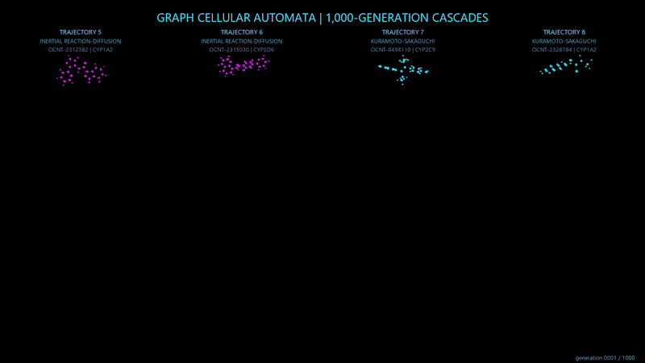
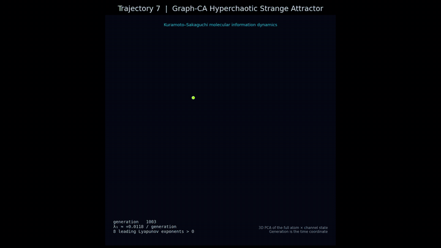
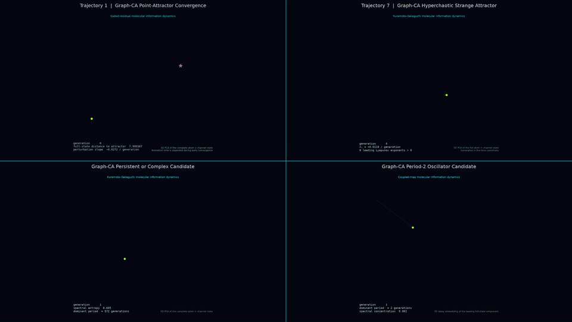
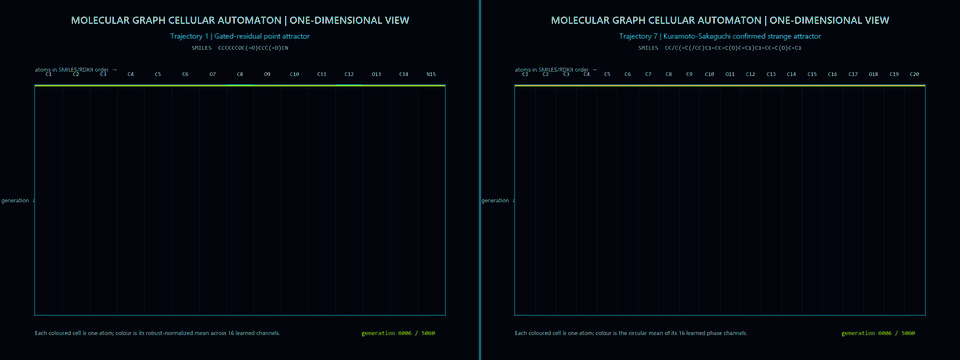

# Strange Matter Engine method report

## Status and document policy

This is the permanent, version-independent method report for the Strange Matter Engine entry in the OpenADMET CYP Inhibition Blind Challenge. Its path remains stable. Whenever a new leading model replaces the submitted model, this document is updated on `main` to identify and describe that model, while versioned result directories preserve the historical artifacts.

**Current production candidate:** Update-Scale-Refined Credible-Interval-Aligned Endpoint-Aligned Cross-Validated CYP-Specialist Graph Cellular Automata (USR-CIA-EA-CV-CYP-GCA v1)

**Previously submitted models:** DS-GCAE v1, CFT-DS-GCAE v1, CV-CYP-GCA v1, EA-CV-CYP-GCA v1, and CIA-EA-CV-CYP-GCA v1

**Challenge track:** Direct Inhibition, regression

**Predicted endpoints:** CYP1A2, CYP2C9, CYP2D6, and CYP3A4 direct-inhibition pIC50

**Primary validation metric:** Macro-Averaged Soft-Threshold Relative Absolute Error (MA-ST-RAE), lower is better

## Scientific objective

Strange Matter Engine tests whether learned cellular-automata dynamics on molecular graphs can provide a useful and interpretable representation for CYP inhibition prediction. Atoms are cells, chemical bonds define local neighbourhoods, and the same transition function is applied recurrently across generations. The full dynamical trajectory contributes to the molecular representation rather than serving only as an intermediate calculation.

The model predicts one continuous pIC50 value for each molecule and CYP context. Time-dependent inhibition classification is a separate challenge track and is not included in this submission.

## Molecular representation

Each SMILES string is converted to a bonded molecular graph. Atom inputs contain chemical descriptors selected during training-only hyperparameter searches, including combinations of periodic, valence, electronic, ring, and local-neighbour properties. Bond descriptors carry the chemical relationship between adjacent atoms. CYP identity is supplied as task context so that the same molecular encoder can support the four direct-inhibition endpoints.

No blinded-test activity labels were loaded. The blinded molecules were used only after model selection, when the frozen checkpoints generated the final predictions.

## Graph cellular-automata members

Every ensemble member follows the same general computation:

1. Chemical atom features initialise a fixed number of dynamical channels.
2. Bond-conditioned messages pass information between directly bonded atoms.
3. A shared local transition rule updates all atom states recurrently for the selected number of generations.
4. Statistics from several points in the trajectory form a molecular dynamical fingerprint.
5. A CYP-conditioned differentiable ridge readout maps the fingerprint to predicted pIC50.

USR-CIA-EA-CV-CYP-GCA screened the retained credible-interval-aligned transition-rule specialists separately for each CYP at 0.75, 1.00, and 1.25 times their established recurrent update scales. The final systems contain FitzHugh-Nagumo, Gray-Scott, conservative graph flux, damped symplectic, and delayed-memory members. Each CYP retains only the rules and update scales selected by its own scaffold cross-validation. The repeated local update and bonded neighbourhood remain present in every member, and prediction combination occurs after each selected member has completed its Graph-CA trajectory and ridge prediction.

## Learning and ridge readout

Backpropagation through time optimises the parameters of each graph cellular automaton. Adam updates those nonlinear CA parameters. The final linear readout is genuine ridge regression: its coefficients are obtained through a regularised differentiable linear solve rather than by treating an ordinary Adam-trained linear layer as ridge regression. Gradients through that solve allow the prediction loss to shape the preceding CA dynamics.

Trajectory pooling includes final-state means and variances, time-averaged states, temporal variance, and state-change energy. Multiscale pooling extends this representation with information collected over several temporal windows. The resulting representation retains information about both terminal behaviour and transient dynamics.

## Model selection and validation

Hyperparameter searches were performed using scaffold-aware partitions of the labelled training data. Search dimensions included atom-feature profiles, generation count, dynamical-channel count, learning rate, ridge penalty, CA regularisation, update scale, support fraction, batch size, bond-message temperature, initial-state scaling and noise, gradient clipping, pooling choices, and transition-rule-specific parameters.

MA-ST-RAE was the primary promotion and selection metric. RMSE, MAE, R-squared, Spearman correlation, and Kendall correlation were retained as secondary diagnostics. Final metric uncertainty was estimated with 1,000 bootstrap resamples. The challenge-blinded test set did not participate in hyperparameter tuning, early stopping, seed selection, rule weighting, ensemble blending, or dynamical-regime selection.

## EA-CV-CYP-GCA v1 construction

EA-CV-CYP-GCA aligns CYP specialisation throughout cellular-automata training. Four independent systems were trained, one each for CYP1A2, CYP2C9, CYP2D6, and CYP3A4. Support targets, query targets, backpropagation loss, early stopping, and the differentiable ridge solve contained observations from the active CYP only. The preceding CV-CYP-GCA implementation used endpoint-specific evaluation and final ridge fitting while its recurrent backpropagation batches retained shared four-endpoint supervision. Endpoint alignment removes that training-selection mismatch and produces genuinely endpoint-specific molecular dynamics.

All ten transition rules were screened for every endpoint using the established configuration and a CYP-directed alternative that varied chemical features, trajectory length, and ridge regularisation. The three leading rule/configuration pairs per CYP advanced to five-fold scaffold confirmation with two training seeds. Sparse ridge subset selection used out-of-fold predictions and endpoint ST-RAE, while the reserved scaffold holdout remained sealed.

| Endpoint | Selected transition rules | Final ridge penalty |
|---|---|---:|
| CYP1A2 | FitzHugh-Nagumo, Gray-Scott, conservative graph flux | 1000 |
| CYP2C9 | Gray-Scott, damped symplectic | 100 |
| CYP2D6 | Delayed memory, FitzHugh-Nagumo | 1000 |
| CYP3A4 | Damped symplectic, FitzHugh-Nagumo, delayed memory | 100 |

Each selected rule contributes ten frozen predictions per blind molecule, comprising five scaffold folds and two training seeds. Predictions are averaged within a rule, after which the saved CYP-specific ridge state produces the final pIC50 value.

## USR-CIA-EA-CV-CYP-GCA v1 construction

The current system retains CIA-EA-CV-CYP-GCA's endpoint-specific recurrent training, smooth credible-interval loss, differentiable ridge solve, scaffold separation, and sparse out-of-fold rule selection. It refines the magnitude of each recurrent cellular-state transition by screening 0.75, 1.00, and 1.25 times every retained rule's established update scale. Scale selection used two scaffold folds, followed by five-fold confirmation with two seeds and leakage-safe sparse ridge subset selection. The sealed holdout remained inaccessible until every scale, rule subset, and ridge penalty had been fixed.

| Endpoint | Selected transition rules and update-scale multipliers | Final ridge penalty |
|---|---|---:|
| CYP1A2 | Conservative graph flux 1.25, FitzHugh-Nagumo 1.00, Gray-Scott 1.25 | 1000 |
| CYP2C9 | Gray-Scott 0.75, damped symplectic 1.00 | 100 |
| CYP2D6 | FitzHugh-Nagumo 1.25, delayed memory 1.00 | 1000 |
| CYP3A4 | Damped symplectic 0.75 | 100 |

Each retained rule contributes ten frozen predictions per blind molecule, comprising five scaffold folds and two training seeds. Predictions are averaged within each rule before the saved endpoint-specific sparse ridge state generates the final pIC50.

## Validation results

| Metric | Result |
|---|---:|
| Point MA-ST-RAE | **0.748039** |
| Bootstrap MA-ST-RAE mean | **0.748534** |
| MA-ST-RAE 95% bootstrap interval | 0.709822 to 0.789700 |
| RMSE | 0.845606 pIC50 |
| Macro MAE, bootstrap mean | 0.617964 pIC50 |
| Macro R-squared, bootstrap mean | 0.294774 |
| Macro Spearman rho, bootstrap mean | 0.534683 |
| Macro Kendall tau, bootstrap mean | 0.383997 |

Endpoint point ST-RAE values were:

| Endpoint | ST-RAE |
|---|---:|
| CYP1A2 | 0.818155 |
| CYP2C9 | 0.709644 |
| CYP2D6 | 0.943724 |
| CYP3A4 | 0.520633 |

On the same sealed validation set, DS-GCAE v1 achieved point MA-ST-RAE 0.784156 and RMSE 0.867775, CFT-DS-GCAE achieved 0.773895 and 0.858630, CV-CYP-GCA achieved 0.768985 and 0.862535, EA-CV-CYP-GCA achieved 0.754503 and 0.852280, and CIA-EA-CV-CYP-GCA achieved 0.748490 and 0.847738. USR-CIA-EA-CV-CYP-GCA improved the preceding internal leader by 0.000451 MA-ST-RAE and 0.002132 pIC50 RMSE. Its overlapping bootstrap interval indicates an incremental improvement.

The EA-CV-CYP-GCA submission returned organiser-calculated MA-ST-RAE 1.0071, macro MAE 1.0778, macro R-squared -0.0715, macro Spearman rho 0.5345, and macro Kendall tau 0.3750. CIA-EA-CV-CYP-GCA subsequently returned MA-ST-RAE 1.0075, macro MAE 1.0781, macro R-squared -0.0716, macro Spearman rho 0.5379, and macro Kendall tau 0.3788, at rank 102 of 112 when recorded. These aggregate results supply external evaluation only; blinded labels remain unavailable and no leaderboard values enter training. USR-CIA-EA-CV-CYP-GCA has not yet received organiser-calculated metrics.

## Blinded inference and submission

Frozen inference ran on all 750 blinded challenge molecules and produced 3,000 finite USR-CIA-EA-CV-CYP-GCA predictions, one for every molecule and CYP endpoint. For each endpoint, five scaffold folds and two seeds were averaged within every selected rule before the saved CYP-specific ridge state generated the final pIC50. The inference manifest records `labels_loaded: false`, successful schema validation, the selected rules, and the exact submission columns.

The current regression submission contains exactly 750 rows and the six required columns in the official order:

```text
SMILES
Molecule_Name
CYP1A2_pIC50_direct_inhibition
CYP2C9_pIC50_direct_inhibition
CYP2D6_pIC50_direct_inhibition
CYP3A4_pIC50_direct_inhibition
```

The submission contains no missing or non-finite predictions, no duplicate molecule identifiers, and preserves the blinded test-set molecule and SMILES alignment.

## Dynamical analysis

The project stores trajectory-derived diagnostics and, for selected runs, richer trajectory archives to support downstream study of information flow, convergence, oscillation, recurrence, transient structure, perturbation sensitivity, and candidate attractor regimes. These diagnostics did not influence challenge model selection.

The first visual below follows four bond-free molecular Graph-CA trajectories through 1,000 generations. Atom colour records the evolving local state, allowing molecular information flow to be inspected directly across several transition-rule families.

<p align="center">
  <a href="results/ds_gcae_1000_generation_pymol/trajectories_05_06_07_08_four_column_atom_cascade.mp4">
    
  </a>
</p>

<p align="center"><em>Select the moving preview to open the full-resolution four-trajectory video.</em></p>

Long-horizon analysis subsequently extended 20 complete atom-by-channel states through 5,000 generations. Trajectories 7 and 8 showed bounded recurrent dynamics, robust positive renormalized divergence, eight positive leading Lyapunov exponents in float64, and attraction towards a common invariant distribution from 64 displaced starting states. Together, these measurements provide strong computational evidence of high-dimensional, hyperchaotic strange attractors within the trained Graph-CA model.

The second visual presents trajectory 7 in a Lorenz-style reduced phase space. The full circularly embedded atom-by-channel state is projected onto three PCA coordinates, generation supplies animation time, and the fading trail exposes the bounded recurrent geometry.

<p align="center">
  <a href="results/long_horizon_attractor_campaign_v1/videos/trajectory_07_hyperchaotic_strange_attractor.mp4">
    
  </a>
</p>

<p align="center"><em>Select the moving preview to open the full 45-second strange-attractor video. Complete trajectories, perturbation histories, Lyapunov spectra, basin tests, and figures are retained in <a href="results/long_horizon_attractor_campaign_v1">the long-horizon campaign archive</a>.</em></p>

The third film places four long-horizon regimes on a synchronized 2 × 2 canvas. The upper-left panel shows gated-residual contraction towards a point attractor; the upper-right panel shows the confirmed Kuramoto–Sakaguchi hyperchaotic strange attractor; the lower-left panel shows persistent complex Kuramoto–Sakaguchi motion; and the lower-right panel shows a coupled-map period-two oscillator candidate. Generation acts as the shared time coordinate, while the fading trajectories reveal the different geometries explored in reduced state space.

<p align="center">
  <a href="results/long_horizon_attractor_campaign_v1/videos/four_graph_ca_dynamical_regimes_2x2.mp4">
    
  </a>
</p>

<p align="center"><em>The animation plays directly in this report. Select it to open the synchronized 30-second, 4K MP4.</em></p>

The fourth film expresses two complete molecular trajectories as one-dimensional cellular-automaton space-time diagrams. Atoms appear as columns in SMILES/RDKit order and successive generations descend as coloured rows. Cellular updates continue to use the true bonded molecular graph. The left panel is the gated-residual point attractor, whose atom states rapidly form stable vertical bands. The right panel is the confirmed Kuramoto–Sakaguchi strange attractor, whose changing colour structure records persistent nonlinear information flow across 5,000 generations.

<p align="center">
  <a href="results/long_horizon_attractor_campaign_v1/videos/point_and_strange_molecular_1d_cellular_automata_side_by_side_tall.mp4">
    
  </a>
</p>

<p align="center"><em>The animation plays directly in this report. Select it to open the full-resolution 30-second molecular space-time MP4.</em></p>

The follow-up [structure–dynamics campaign](results/structure_dynamics_publication_v1/README.md) evaluated 258 held-out molecule–CYP cases using repeated Benettin renormalisation after a 1,000-generation burn-in, alongside 187 causal interventions on trajectories 7 and 8. Lower algebraic connectivity showed the strongest univariate association with the largest Lyapunov exponent, with Spearman rho -0.235 and a scaffold-cluster bootstrap 95% interval from -0.352 to -0.118. Molecular weight, graph diameter, mean shortest path, heavy-atom count, graph density, and several three-dimensional shape descriptors were also examined. The strongest intervention changed a single bond in trajectory 8 from single to double and increased its exponent by 0.00367 per generation; several ring-opening interventions reduced instability in trajectory 7. The model receives atom and bond features without Cartesian coordinates, so the three-dimensional descriptors are treated as structural correlates, while frozen-model bond and feature interventions provide the direct computational tests.

## Reproducibility and artifacts

The current candidate artifacts are retained in [`results/production_update_scale_refined_credible_interval_ea_cv_cyp_gca_v1`](results/production_update_scale_refined_credible_interval_ea_cv_cyp_gca_v1). Important files include:

- [`update_scale_refined_credible_interval_ea_cv_cyp_gca_submission.csv`](results/production_update_scale_refined_credible_interval_ea_cv_cyp_gca_v1/update_scale_refined_credible_interval_ea_cv_cyp_gca_submission.csv), the challenge-ready regression file;
- [`study_summary.json`](results/production_update_scale_refined_credible_interval_ea_cv_cyp_gca_v1/study_summary.json), the cross-validation selection parameters and sealed validation report;
- [`screening_summary.json`](results/production_update_scale_refined_credible_interval_ea_cv_cyp_gca_v1/screening_summary.json), the bounded update-scale screen;
- [`reserved_holdout_predictions.csv`](results/production_update_scale_refined_credible_interval_ea_cv_cyp_gca_v1/reserved_holdout_predictions.csv), the sealed validation predictions;
- [`inference_manifest.json`](results/production_update_scale_refined_credible_interval_ea_cv_cyp_gca_v1/inference_manifest.json), the frozen inference and schema-validation record; and
- [`scripts/run_cv_cyp_specialist_gca.py`](scripts/run_cv_cyp_specialist_gca.py), the resumable training, validation, and inference runner.

Production training and inference used an NVIDIA GeForce RTX 5070 Ti through CUDA. The shared implementation also supports CPU execution for inspection and forward-only analysis. Environment files, training scripts, saved checkpoints, validation tables, figures, and PDF reports are committed in this repository.

## Limitations

The validation estimates arise from one challenge dataset and its scaffold-aware partitions. CYP2D6 remains the weakest endpoint by ST-RAE. The preceding blind results demonstrate that local validation can substantially overestimate performance on the challenge distribution. USR-CIA-EA-CV-CYP-GCA produced sealed point MA-ST-RAE 0.748039 and RMSE 0.845606 pIC50, compared with 0.748490 and 0.847738 for CIA-EA-CV-CYP-GCA. The bootstrap intervals overlap substantially, and the measured improvement requires organiser evaluation on the hidden test labels.

## Update history

| Date | Leading model or candidate | Change |
|---|---|---|
| 29 August 2026 | DS-GCAE v1 | Created the permanent method report and documented the first frozen regression submission. |
| 29 August 2026 | CFT-DS-GCAE v1 candidate | Added nested target-specific ridge stacking after the first blind result; generated a new label-free submission candidate. |
| 31 August 2026 | CV-CYP-GCA v1 candidate | Trained independent nonlinear Graph-CA systems for each CYP, selected sparse transition-rule subsets, and generated a validated blind regression submission. |
| 1 September 2026 | EA-CV-CYP-GCA v1 candidate | Aligned recurrent backpropagation and differentiable ridge batches with the active CYP, reran all ten rules, improved sealed validation, and generated a validated blind submission. |
| 2 September 2026 | CIA-EA-CV-CYP-GCA v1 candidate | Aligned recurrent training with experimental credible intervals, improved sealed MA-ST-RAE to 0.748490 and RMSE to 0.847738 pIC50, and generated a label-blind submission. |
| 9 September 2026 | USR-CIA-EA-CV-CYP-GCA v1 candidate | Refined recurrent update scales, improved sealed MA-ST-RAE to 0.748039 and RMSE to 0.845606 pIC50, and generated a schema-validated label-blind submission. |
