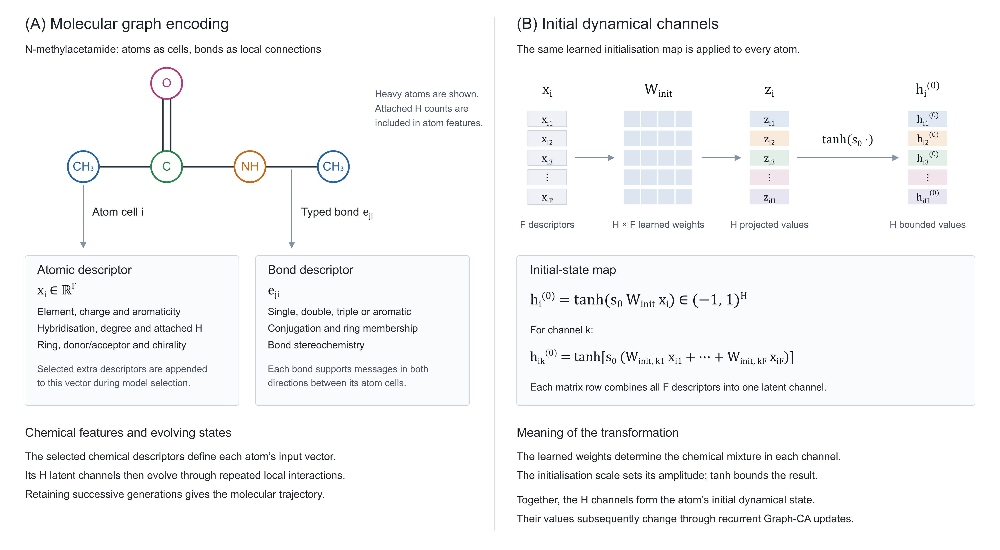
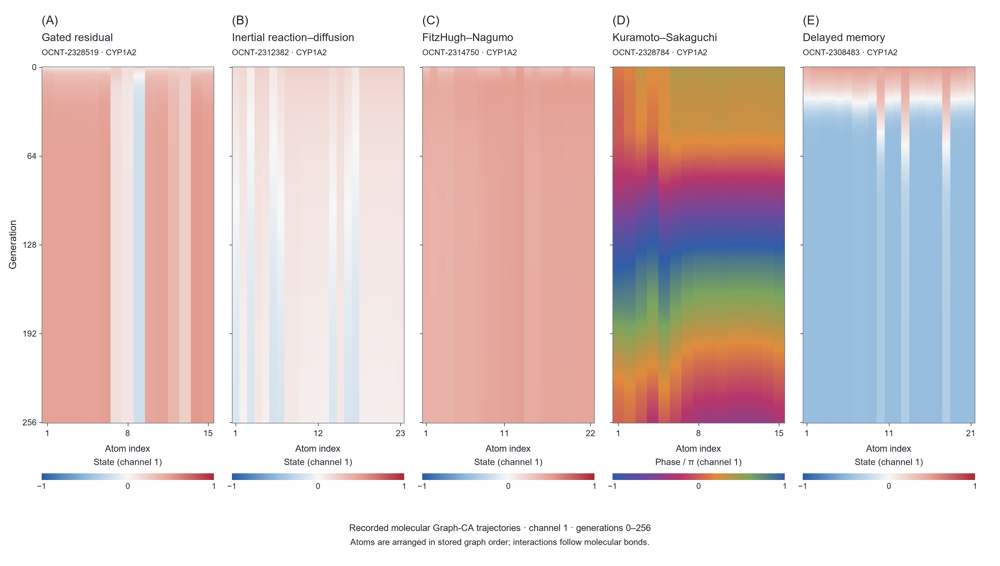

# Molecular Space-Time: Emergent Prediction from Local Interactions in an Evolved Graph Cellular Automaton

**Anthony Nash, PhD**

**Independent Researcher, Warwickshire, United Kingdom**

**info@acnash.co.uk**

## Abstract

Complex systems frequently acquire global properties through repeated local interactions. We investigate this principle on molecular graphs by treating atoms as cellular-automaton cells, typed covalent bonds as local neighbourhoods, and recurrent hidden states as symbolic cellular variables. A shared nonlinear transition rule transforms each atom from information available locally at every generation. The complete atom-by-generation history defines **molecular space-time**, from which a global molecular representation is formed only after the local dynamics have unfolded. Three learning levels were compared while retaining this construction: a fixed-rule Graph-CA trained by backpropagation through time with a differentiable ridge readout; a hybrid genetic algorithm that evolved discrete Graph-CA structure while backpropagation fitted continuous parameters; and genetic programming that evolved the symbolic cellular update equation itself. The 2026 OpenADMET CYP Inhibition Challenge supplied a blind external test across CYP1A2, CYP2C9, CYP2D6, and CYP3A4. Official blind MA-ST-RAE decreased from 1.0092 for the fixed-rule system to 1.0020 for the genetic algorithm and 0.9946 for genetic programming. The corresponding macro Spearman correlations were 0.5345, 0.5444, and 0.5498. Long-horizon trajectories also exhibited contraction, periodic candidates, persistent complex motion, and two bounded Kuramoto–Sakaguchi trajectories satisfying the operational Lyapunov and basin tests used here for hyperchaotic strange attractors. The results show that chemically useful global representations can emerge from local, recurrent molecular interactions and that evolving the local rule can modestly improve external prediction. They also establish molecular space-time as an analysable dynamical object whose regimes can be compared with molecular structure and behaviour.

**Keywords:** cellular automata; complex systems; emergence; genetic programming; graph dynamics; molecular representation; nonlinear dynamics

## 1. Introduction

Cellular automata provide a precise setting in which repeated local interactions generate system-level structure. Uniform rules on simple cell states can produce fixed configurations, oscillators, propagating structures, long transients, computational universality, and transitions between ordered and disordered behaviour [1, 2, 3]. Reaction and diffusion provide a related physical example in which local kinetics and spatial coupling form macroscopic patterns [4]. These systems motivate a molecular question: can a graph of locally interacting atomic cells form a global representation that is useful for predicting chemical behaviour?

A molecular graph supplies an irregular cellular domain. Atoms define cells, covalent bonds define neighbourhoods, and atom and bond descriptors specify chemically informed initial conditions. Learned graph cellular automata extend cellular-automaton computation to arbitrary graph topology while preserving shared local updates [5]. Neural cellular automata likewise show that recurrent hidden channels can acquire functional roles through local computation without receiving individually prescribed meanings [6]. Molecular message-passing networks already aggregate bonded neighbourhood information for property prediction [7]. The present construction makes the trajectory generated by recurrent local interactions the primary representation.

We call this trajectory **molecular space-time**. At generation $t$, each atom occupies a point in a learned state space. Typed bonds constrain the messages that can alter that state, and a shared nonlinear rule advances the entire molecular graph to generation $t+1$. Retaining every atom state across generations produces a discrete computational history. A molecular fingerprint is derived from its transient, multiscale, and terminal organization. The fingerprint is therefore a global property assembled through local interaction and distributed across atoms and computational time.

The transition rule determines which histories the system can express. We studied three progressively more flexible methods while holding the molecular-space-time principle constant. The first used fixed transition-rule families whose continuous parameters were trained by backpropagation through time and whose trajectory features entered a differentiable ridge regression. The second used a genetic algorithm to evolve discrete Graph-CA structure, including the rule family, trajectory depth, state width, feature profile, and temporal observables, while retaining backpropagation for continuous weights. The third used genetic programming to evolve the symbolic transition equation itself. Genetic algorithms operate over encoded parameter or design vectors, whereas genetic programming applies selection, crossover, and mutation to executable symbolic structures [8,9]. This distinction allows the local molecular law, and therefore the family of molecular space-time trajectories, to become an object of search.

The 2026 OpenADMET CYP Inhibition Challenge provided an external validation task. Cytochrome P450 enzymes influence the metabolism and clearance of many medicines, and inhibition can contribute to clinically important drug interactions [10]. The challenge required direct-inhibition pIC50 predictions for CYP1A2, CYP2C9, CYP2D6, and CYP3A4 from molecular structure, followed by evaluation against concealed labels. We use the challenge as a rigorous assay of whether locally generated trajectory representations contain information about molecular behaviour. The scientific focus is the emergence and dynamics of the representation; CYP450 inhibition supplies the independently scored application.

The retained trajectories also permit direct dynamical analysis. Cellular-automaton and nonlinear-dynamics studies distinguish contraction, periodicity, complex recurrence, sensitive dependence, and chaotic attractors through measurable properties [1, 2, 3, 11, 12, 13]. We consequently propagated frozen Graph-CA systems for thousands of generations and analysed recurrence, spectra, perturbation growth, Lyapunov exponents, and attraction basins. This connects predictive utility with a second question: whether molecular space-time contains reproducible dynamical regimes whose occurrence depends on molecular graph structure and local transition rules.

## 2. Materials and Methods

### 2.1. Dataset and Prediction Task

The study used the primary direct-inhibition dataset released for the 2026 OpenADMET CYP Inhibition Blind Challenge. It comprised 4,905 unique compounds represented by a molecule identifier and a SMILES string. Experimental direct-inhibition pIC50 values were provided for four major drug-metabolising cytochrome P450 isoforms: CYP1A2, CYP2C9, CYP2D6, and CYP3A4. Here, pIC50 denotes the negative base-10 logarithm of the half-maximal inhibitory concentration expressed in molar units. Each reported measurement was accompanied by lower and upper uncertainty bounds and an estimated standard deviation from the fitted concentration–response experiment.

The response matrix was incomplete because compounds were not necessarily measured against every CYP isoform. The dataset contained 6,525 observed compound–CYP pairs, distributed as summarised in Table 1.

**Table 1. Number of observed direct-inhibition pIC50 measurements for each CYP isoform.**

| CYP isoform | Compounds with an observed direct-inhibition pIC50 |
|---|---:|
| CYP1A2 | 1,412 |
| CYP2C9 | 1,285 |
| CYP2D6 | 1,493 |
| CYP3A4 | 2,335 |
| **Total** | **6,525** |

Each observed compound–CYP pair constituted one supervised regression example. EA-CV-CYP-GCA aligned each independent nonlinear Graph-CA system with one isoform throughout recurrent backpropagation, differentiable ridge fitting, validation, and checkpoint selection. A missing endpoint was a compound–CYP combination for which no experimental direct-inhibition pIC50 value was reported. These values were retained as missing and contributed neither targets nor loss terms. The single-concentration, time-dependent-inhibition, and Emax datasets distributed with the challenge were outside the scope of this direct-inhibition study.

To assess generalisation beyond closely related chemistry, compounds were grouped by their standardised Bemis–Murcko scaffold before data partitioning. A fixed 20% subset of scaffold groups was reserved as a sealed holdout, leaving 5,216 observed compound–CYP pairs for model fitting and internal selection and 1,309 pairs for final validation. No scaffold group occurred in both partitions. Hyperparameter selection was conducted within the fitting pool, while the reserved scaffold holdout remained unused until final evaluation.

The challenge test set contained 750 additional compounds for which all direct-inhibition labels were withheld. The trained system was required to generate four finite pIC50 predictions for each compound, giving 3,000 blinded compound–CYP predictions in total. Blinded compounds and their unreleased outcomes were excluded from parameter estimation, hyperparameter selection, early stopping, and dynamical candidate selection. Predictive evaluation followed the challenge formulation: the primary measure was the macro-averaged soft-threshold relative absolute error across the four CYP isoforms, with each isoform weighted equally and predictions falling within the reported experimental uncertainty interval assigned zero error. Conventional regression statistics were retained as complementary measures of predictive agreement.

### 2.2. Molecular Graph Representation

SMILES strings underwent RDKit structure cleanup, including normalization of standard functional-group and charge representations, before being reduced to the largest organic fragment, sanitized, and converted to canonical isomeric SMILES. Each standardized molecule was represented as a graph $G=(V,E)$, where every heavy atom $i\in V$ was a cellular-automata cell and every covalent bond defined two directed message-passing edges, $j\rightarrow i$ and $i\rightarrow j$. The predictive input, meaning the information supplied to the model to generate a pIC50 prediction, comprised the standardized two-dimensional graph connectivity, atom and bond descriptors, and CYP context; it contained no molecular geometry.

The baseline atom encoding contained one-hot element identity for H, C, N, O, F, P, S, Cl, Br, I, and other elements; for example, with this ordering carbon was encoded as $(0,1,0,0,0,0,0,0,0,0,0)$ and oxygen as $(0,0,0,1,0,0,0,0,0,0,0)$. Further descriptors comprised formal charge; aromaticity; sp, sp2, sp3, and other hybridization states; degree; total attached hydrogens; ring membership; hydrogen-bond donor and acceptor status; and tetrahedral chirality. Training-only model selection, meaning comparison of alternative feature profiles using only the fitting data and its internal validation partitions, could extend this encoding with five chemically organised feature groups summarised in Table 2. The sealed holdout and blinded challenge set played no part in that selection.

**Table 2. Chemically organised atom-feature groups considered during training-only model selection.** A feature group is a named collection of related atom-level descriptors that was added to the baseline encoding as one candidate block.

| Feature group | Atom-level quantities |
|---|---|
| Periodic | Atomic number, atomic mass, covalent radius, van der Waals radius, outer electrons, period, group, and approximate atomic volume |
| Valence | Total and implicit valence, heavy-atom degree, radical electrons, and absolute formal charge |
| Electronic | Pauling electronegativity, approximate polarizability, heteroatom and halogen indicators, conjugated-bond fraction, first ionization energy, electron affinity, and missing-property indicator |
| Ring geometry | Number of rings containing the atom and indicators for ring sizes 3, 4, 5, 6, 7, and 8 or greater |
| Local environment | Mean neighbouring electronegativity, electronegativity difference from the neighbourhood, mean neighbouring atomic number, and mean neighbouring formal charge |

The selected feature profile was stored with every frozen checkpoint, preserving the exact feature names and order required for inference. Continuous quantities were scaled by fixed chemically meaningful constants during graph construction. Bond vector $e_{ji}$ contained one-hot single, double, triple, or aromatic identity, conjugation, ring membership, and three stereochemical indicators. The same bond vector was attached to both directed representations of an undirected bond.

Each of the four CYP endpoints was a distinct prediction task defined by the direct-inhibition pIC50 for one isoform. The endpoints were represented by a one-hot context vector $c$. Consequently, a molecule retained one chemical graph while its cellular-automata trajectory and readout were conditioned on CYP1A2, CYP2C9, CYP2D6, or CYP3A4. For efficient GPU calculation, several molecule–CYP examples were placed in one batch without creating bonds between different molecules. Each atom could therefore exchange messages only with atoms in its own molecular graph.

Figure 1A illustrates how atomic descriptors and typed bonds define the connected molecular Graph-CA. Additional feature groups selected from Table 2 form part of the atomic input vector and are retained in the frozen feature profile.



**Figure 1. Molecular graph encoding and formation of the initial dynamical state.** **A**, N-methylacetamide illustrates the heavy-atom graph: each heavy atom forms a cellular-automaton cell, and each covalent bond supplies two directed message-passing edges. Attached hydrogen counts enter the atom descriptors. The atomic vector $x_i\in\mathbb{R}^{F}$ contains the baseline descriptors and any additional chemical feature groups selected during training-only model selection; the bond vector $e_{ji}$ encodes bond type, conjugation, ring membership, and stereochemistry. Colours identify atom categories and highlight the carbonyl carbon. **B**, the shared learned matrix $W_{\mathrm{init}}\in\mathbb{R}^{H\times F}$ projects each atomic descriptor vector into $H$ latent values. The scalar $s_0$ scales this projection, and the elementwise hyperbolic tangent produces $h_i^{(0)}=\tanh(s_0W_{\mathrm{init}}x_i)\in(-1,1)^H$. Each matrix row combines the chemical descriptors into one dynamical channel, as shown by the component-wise expression for channel $k$. The illustrated vector and matrix entries are schematic; their full dimensions depend on the selected feature profile and channel count. Recurrent local updates subsequently evolve these initial states, and the retained generations form the molecular space-time trajectory.

### 2.3. Nonlinear Graph Cellular Automaton

For atom $i$, the chemical input vector $x_i$ contained its fixed descriptors; for example, an aromatic sp2 carbon could be represented by a carbon element indicator, zero formal charge, an aromaticity indicator, an sp2-hybridization indicator, its degree, and its other listed atom properties. This input was mapped to an initial state with $H$ dynamical channels. These channels are $H$ learned real-valued coordinates that evolve at every generation and may combine information from several chemical descriptors rather than corresponding one-to-one with named chemical properties:

```math
h_i^{(0)}=\tanh\!\left(s_0 W_{\mathrm{init}}x_i\right),
```

Here, $W_{\mathrm{init}}$ maps the fixed descriptor vector $x_i$ into $H$ values, so $h_i^{(0)}\in\mathbb{R}^{H}$ is atom $i$'s complete $H$-channel dynamical state at generation zero. The superscript $(0)$ denotes the initial generation and is distinct from the channel count $H$. The scalar $s_0$ is the initialization scale: it multiplies the projected input before the hyperbolic tangent and therefore controls the initial state magnitude and degree of saturation. A shared local rule was then applied recurrently for $T$ generations. The parameters of this rule were tied across atoms and generations, making the construction a graph recurrent neural network with cellular-automata locality.

Figure 1B shows this initialisation step and expands the matrix projection for an individual channel. Each row of $W_{\mathrm{init}}$ forms a learned combination of the $F$ input descriptors, establishing the $H$ initial coordinates before the first recurrent generation.

At generation $t$, the message from neighbour $j$ to atom $i$ was

```math
g_{ji}=\sigma\!\left(\frac{W_g e_{ji}}{\theta_b}\right),
\qquad
m_{ji}^{(t)}=g_{ji}\odot W_n h_j^{(t)}+W_e e_{ji},
```

Here, $\sigma(z)=1/(1+\exp(-z))$ is the logistic sigmoid applied elementwise. The subscript $n$ in $W_n$ denotes *neighbour*: $W_n$ is a learned linear map applied to the neighbouring state $h_j^{(t)}\in\mathbb{R}^{H}$, which is atom $j$'s dynamical state at generation $t$. The learned maps $W_e$ and $W_g$ respectively transform the bond description and generate a channel-wise bond gate. The positive bond temperature $\theta_b$ controls gate sharpness: a smaller value makes sigmoid gates more decisive, whereas a larger value moves them towards one half. The symbol $\odot$ denotes elementwise multiplication. Incoming messages and neighbouring states were degree-normalized by averaging over the number of neighbours, preventing atoms with more bonds from acquiring larger aggregate values merely because of their degree:

```math
a_i^{(t)}=\frac{1}{|N(i)|}\sum_{j\in N(i)}m_{ji}^{(t)},
\qquad
\bar h_i^{(t)}=\frac{1}{|N(i)|}\sum_{j\in N(i)}h_j^{(t)}.
```
Here, $N(i)$ is the set of atoms directly bonded to atom $i$, and $|N(i)|$ is the number of those neighbours. The state $h_i^{(t)}$ belongs to atom $i$ itself, whereas $\bar h_i^{(t)}$ is the mean state of its directly bonded neighbours. Chemical identity and CYP context entered every generation through a common reaction drive:

```math
r_i^{(t)}=\tanh\!\left(
W_s h_i^{(t)}+a_i^{(t)}+W_x x_i+W_c c+b
\right).
```

The common reaction drive $r_i^{(t)}\in\mathbb{R}^{H}$ is the candidate state change calculated for every atom and rule from the atom's present state $h_i^{(t)}$, its aggregated bond-conditioned neighbour message $a_i^{(t)}$, its fixed chemical input $x_i$, and the CYP context $c$. The learned maps $W_s$, $W_x$, and $W_c$ project their respective inputs into $H$ channels, and $b\in\mathbb{R}^{H}$ is a learned bias. The submitted ensemble, introduced above as a collection of independently trained Graph-CA predictors, used five transition rules sharing this bonded message and reaction calculation.

**Gated residual.** Inspired by gating in recurrent neural networks [14], this rule allows every atom and channel to retain its current value or accept a learned fraction of the newly proposed reaction (Figure 2A). The gate is recalculated from the local molecular state at every generation:

```math
\alpha_i^{(t)}=\sigma\!\left(W_\alpha
[h_i^{(t)},a_i^{(t)},x_i,c]\right),
\qquad
h_i^{(t+1)}=(1-s\alpha_i^{(t)})\odot h_i^{(t)}
+s\alpha_i^{(t)}\odot r_i^{(t)},
```

Here, $\alpha_i^{(t)}\in(0,1)^H$ is atom $i$'s channel-wise acceptance gate; $W_\alpha$ is a learned map from the concatenated vector $[h_i^{(t)},a_i^{(t)},x_i,c]$ to $H$ gate values; square brackets denote concatenation; and $s>0$ is the update scale. The product $s\alpha_i^{(t)}$ was capped at one in each channel, $1$ denotes the $H$-component all-ones vector, and $\odot$ denotes elementwise multiplication. Thus, each new channel value is a weighted mixture of its previous value $h_i^{(t)}$ and proposed reaction $r_i^{(t)}$.

**Inertial reaction–diffusion.** This rule combines local reaction–diffusion, whose classical formulation couples reaction kinetics to spatial exchange [4], with a momentum-like velocity state [15] (Figure 2B). The reaction term drives local change, the graph-diffusion term exchanges state with bonded neighbours, and restoring and damping terms control growth:

```math
f_i^{(t)}=r_i^{(t)}+D\odot(\bar h_i^{(t)}-h_i^{(t)})-R\odot h_i^{(t)},
```

```math
v_i^{(t+1)}=\eta\gamma\odot v_i^{(t)}+\delta\odot f_i^{(t)},
\qquad
h_i^{(t+1)}=\tanh\!\left(h_i^{(t)}+\delta\odot v_i^{(t+1)}\right).
```

Here, $f_i^{(t)}\in\mathbb{R}^{H}$ is the total force-like drive; $r_i^{(t)}$ is the common reaction drive; $\bar h_i^{(t)}-h_i^{(t)}$ is the graph-diffusion gradient between the neighbour mean and atom $i$; and $D,R\in\mathbb{R}_{\geq0}^{H}$ are channel-wise diffusion and restoring strengths. The auxiliary velocity $v_i^{(t)}\in\mathbb{R}^{H}$, initialized to zero, carries change between generations. The vectors $\gamma,\delta\in\mathbb{R}^{H}$ are channel-wise damping and step size, while the scalar $\eta$ is the inertial multiplier. These quantities were constrained to stable ranges by sigmoid or softplus transformations, and $\tanh$ bounded the updated state.

**FitzHugh–Nagumo.** Adapted from the classical excitable-system model [16,17], this rule divides the state into a fast excitation subsystem and a slower recovery subsystem (Figure 2C). Their interaction can create threshold responses, pulses, and oscillatory relaxation, while learned chemical drive and graph diffusion condition those behaviours on the molecule:

```math
\Delta u_i^{(t)}=u_i^{(t)}-\frac{(u_i^{(t)})^3}{3}-v_i^{(t)}
+\kappa_s\tanh(W_u r_i^{(t)})+D_u(\bar u_i^{(t)}-u_i^{(t)}),
```

```math
\Delta v_i^{(t)}=\epsilon\left[u_i^{(t)}+q-v_i^{(t)}+0.1\tanh(W_v r_i^{(t)})\right]
+D_v(\bar v_i^{(t)}-v_i^{(t)}),
```
The two channel groups were then advanced together:

```math
h_i^{(t+1)}=\tanh\!\left(
[u_i^{(t)}+s\Delta u_i^{(t)},\;v_i^{(t)}+s\Delta v_i^{(t)}]
\right).
```

Here, $u_i^{(t)},v_i^{(t)}\in\mathbb{R}^{H/2}$ are the excitation and recovery halves of $h_i^{(t)}$; $\bar u_i^{(t)}$ and $\bar v_i^{(t)}$ are their respective means over $N(i)$; and $\Delta u_i^{(t)}$ and $\Delta v_i^{(t)}$ are their proposed increments. The learned maps $W_u$ and $W_v$ project the $H$-channel reaction drive into the corresponding half-state. The scalar $\kappa_s$ scales chemical stimulation, $D_u,D_v\geq0$ control graph diffusion, $\epsilon>0$ sets the recovery timescale, $q$ offsets recovery, $0.1$ is the fixed recovery-drive coefficient, and $s>0$ is the integration step. Square brackets concatenate the two updated half-states, and $\tanh$ bounds the resulting $H$-channel state.

**Kuramoto–Sakaguchi.** Adapted from coupled phase-oscillator theory [18,19], this rule treats every dynamical channel as a wrapped phase $\phi_i^{(t)}=\pi h_i^{(t)}$ (Figure 2D). Bond-gated coupling encourages neighbouring phases to coordinate, while chemical and CYP information determine each atom's intrinsic phase velocity:

```math
q_i^{(t)}=\frac{1}{|N(i)|}\sum_{j\in N(i)}
g_{ji}\odot\sin\!\left(\phi_j^{(t)}-\phi_i^{(t)}-\psi\right),
```

```math
\phi_i^{(t+1)}=\phi_i^{(t)}+s\left[
\omega_i^{(t)}+Kq_i^{(t)}\right],
\qquad
\omega_i^{(t)}=A\tanh(W_\omega r_i^{(t)}).
```
Here, $\phi_i^{(t)}\in[-\pi,\pi)^H$ is atom $i$'s phase vector; $q_i^{(t)}\in\mathbb{R}^{H}$ is its mean bond-gated phase-coupling signal; $N(i)$ and $|N(i)|$ denote its bonded-neighbour set and size; $g_{ji}\in(0,1)^H$ is the bond gate; and $\sin$ and $\odot$ act elementwise. The phase lag $\psi$ shifts the preferred phase relationship, $K$ is the coupling strength, and $s$ is the integration step. The chemically conditioned natural-frequency vector is $\omega_i^{(t)}\in\mathbb{R}^{H}$, where $W_\omega$ is learned, $r_i^{(t)}$ is the common reaction drive, and $A$ sets the frequency scale. The updated phase was wrapped modulo $2\pi$ into $[-\pi,\pi)$ and divided by $\pi$ to return $h_i^{(t+1)}$ to $[-1,1]$. The phase lag, coupling strength, and frequency scale were selected during training-only hyperparameter search.

**Delayed memory.** Drawing upon delay-differential dynamical systems [20], this rule makes the next state depend upon both the present calculation and an earlier point in the retained trajectory (Figure 2E). It can therefore represent lagged feedback and history-dependent responses that a present-state-only rule cannot express. A rule-specific delay $d$ selected the preceding state, and the new drive combined the current reaction, a learned transformation of the current and delayed states, and explicit delayed-state feedback:

```math
\tilde r_i^{(t)}=\tanh\!\left(W_d[r_i^{(t)},h_i^{(t-d)}]\right),
```

```math
h_i^{(t+1)}=\tanh\!\left(
(1-\zeta s)h_i^{(t)}+s\left[(1-\mu)r_i^{(t)}
+\mu\tilde r_i^{(t)}+\kappa_d(h_i^{(t-d)}-h_i^{(t)})\right]
\right).
```
Here, $h_i^{(t-d)}\in\mathbb{R}^{H}$ is atom $i$'s state $d$ generations earlier, with the earliest available retained state used when $t<d$; $\tilde r_i^{(t)}\in\mathbb{R}^{H}$ is the delay-conditioned reaction; $W_d$ is a learned map from the concatenation $[r_i^{(t)},h_i^{(t-d)}]$ to $H$ values; and $\tanh$ bounds both the delayed reaction and updated state. The scalar $\mu\in[0,1]$ mixes the present reaction $r_i^{(t)}$ with the delayed reaction, $\kappa_d$ controls feedback from the difference $h_i^{(t-d)}-h_i^{(t)}$, $\zeta$ controls damping of the present state, $s>0$ is the update scale, and $1$ in $(1-\mu)$ is the scalar multiplicative identity. The delay and these coefficients were determined from the rule-specific search space.

Each trajectory was pooled into a molecular fingerprint containing the final atom-state mean and variance, the time-averaged atom state, the temporal variance of the molecular mean state, and mean state-change energy. The multiscale variant appended molecular mean states at 12.5%, 25%, 50%, 75%, and 100% of the trajectory. CYP-specific readout features were formed by combining the endpoint one-hot vector with endpoint-gated copies of the dynamical fingerprint.



**Figure 2. One-dimensional displays of molecular cellular evolution under five transition rules.** **A**, gated residual (`OCNT-2328519`); **B**, inertial reaction–diffusion (`OCNT-2312382`); **C**, FitzHugh–Nagumo (`OCNT-2314750`); **D**, Kuramoto–Sakaguchi (`OCNT-2328784`); and **E**, delayed memory (`OCNT-2308483`). All five recorded trajectories are conditioned on CYP1A2. Columns represent heavy atoms in their stored graph order, and rows show successive generations from 0 at the top to 256 at the bottom. Local interactions follow the molecular bonds; the horizontal arrangement is a display of the graph cells. Panels A, B, C, and E show the first dynamical channel, $h_{i1}^{(t)}$, on a common blue–white–red scale from $-1$ to $1$. Panel D shows the first wrapped phase divided by $\pi$, $\phi_{i1}^{(t)}/\pi$, using a cyclic scale whose endpoints represent the same phase. Every displayed generation is retained, and colours are drawn from the recorded states without per-panel amplitude rescaling. These examples come from distinct molecules and trained systems and illustrate their observed evolution; they are not a matched comparison of rule effects on a single molecule. Each panel displays one channel of the full atom-by-channel trajectory.

### 2.4. Learning the Molecular Space-Time Representation

#### 2.4.1. Fixed-rule Graph-CA with backpropagation

The fixed-rule reference was the Credible-Interval-Aligned Endpoint-Aligned Cross-Validated CYP-Specialist Graph Cellular Automaton, abbreviated CIA-EA-CV-CYP-GCA. Each nonlinear Graph-CA expert was optimized by backpropagation through time. Adam updated the initialization, bonded-message, reaction, and transition-rule parameters with a cosine learning-rate schedule, gradient clipping, and an L2 penalty on cellular-automata weights. The differentiation path extended through every retained generation, so the molecular prediction supplied credit to all local updates that contributed to the trajectory fingerprint. Generation count, dynamical-channel count, atom-feature profile, learning rate, ridge penalty, update scale, support fraction, batch size, bond temperature, initialization scale and noise, pooling design, and rule-specific dynamical constants were selected using labelled development data alone.

CIA-EA-CV-CYP-GCA trained four independent nonlinear systems, one for each CYP isoform. Every support/query ridge solve, backpropagation loss, early-stopping decision, and checkpoint promotion used observations from the active CYP only. A smooth credible-interval penalty complemented mean squared error by penalizing predictions lying outside the reported experimental interval. All ten transition-rule families were screened for each endpoint using two scaffold folds. The three leading rule-configuration pairs per endpoint advanced to five-fold scaffold confirmation with two training seeds. Sparse ridge subset selection was performed from out-of-fold predictions before the sealed holdout was evaluated. The final CYP1A2 system combined FitzHugh-Nagumo, Gray-Scott, and conservative graph flux; CYP2C9 combined Gray-Scott and damped symplectic; CYP2D6 combined delayed memory and FitzHugh-Nagumo; and CYP3A4 combined damped symplectic, FitzHugh-Nagumo, and delayed memory.

#### 2.4.2. Differentiable ridge readout

Training batches were divided by molecule into support and query subsets. The Graph-CA generated fingerprint matrix $F_s$ for the support molecules, which was standardized column-wise to $Z_s$. With centered targets $y_s-\bar y_s$, the ridge coefficients were obtained by the closed-form differentiable solve [21]

```math
\beta=\left(Z_s^{\mathsf T}Z_s+\lambda I\right)^{-1}
Z_s^{\mathsf T}(y_s-\bar y_s).
```

For query fingerprint $f_q$, prediction was

```math
\widehat y_q=\bar y_s+
\left(\frac{f_q-\bar F_s}{s_F}\right)^{\mathsf T}\beta,
```

where $\bar F_s$ and $s_F$ were the support feature mean and scale. The intercept was excluded from the ridge penalty. The linear solve remained connected to the Graph-CA computation graph, allowing query loss gradients to pass through $\beta$ and into every recurrent generation. A Hermitian pseudoinverse implemented the same ridge objective when highly correlated trajectory statistics made the normal equations numerically singular.

This support–query construction trained the nonlinear cellular automaton to produce fingerprints that generalized beyond the observations used to solve the current ridge layer. At the end of training, a final ridge state was fitted from all permitted fitting observations and stored with the selected Graph-CA checkpoint. Early stopping and checkpoint promotion used MA-ST-RAE on the relevant scaffold-held-out development fold. RMSE was recorded as a secondary optimization diagnostic.

#### 2.4.3. Evolutionary-strategy comparator

We also specified a derivative-free comparator, ES-EA-CV-CYP-GCA, that preserved the molecular graph, chemical encodings, recurrent transition rules, retained trajectories, scaffold partitions, and analytic ridge readout used by EA-CV-CYP-GCA. Mirrored parameter perturbations were evaluated on the GPU in antithetic pairs. For every candidate, the Graph-CA generated support and query fingerprints, ridge coefficients were solved analytically from support observations, and query error supplied the evolutionary fitness. Paired fitness differences estimated an update direction for the nonlinear Graph-CA parameters, with Adam-style moment accumulation applied outside automatic differentiation. This design isolated the effect of nonlinear-parameter training because the representation, readout, and data-separation protocol remained fixed. The sealed holdout and blind labels were excluded from evolutionary fitness and checkpoint selection. EA-CV-CYP-GCA trained by backpropagation through time remained the primary submitted method while the evolutionary comparator was assessed.

The optimizer campaign fixed the Graph-CA to the canonical CYP3A4 damped-symplectic expert with 16 hidden channels, 32 recurrent generations, periodic-electronic atom features, typed-bond messages, multiscale trajectory pooling, update scale 0.25, support fraction 0.6, and ridge penalty 0.1. Thirty-two evolutionary configurations varied population size from 32 to 128, Gaussian perturbation scale from 0.005 to 0.08, evolutionary learning rate from 0.0005 to 0.01, batch size from 256 to 1,600 molecules, random or activity-stratified batch composition, and four stopping policies. Each configuration was screened on two scaffold folds. The five leading settings advanced to five-fold confirmation with two independent seeds, giving 64 screening runs and 50 confirmation runs. Five CUDA workers executed the 114 runs. The fixed backpropagation-trained expert's original two-fold screening result supplied the matched development reference; evolutionary confirmation quantified performance across the broader fold and seed set. No evolutionary configuration was evaluated on the sealed holdout or blind challenge set.

#### 2.4.4. Hybrid genetic Graph-CA structure search

We next applied a genetic algorithm to the discrete architecture of the CYP3A4 specialist while retaining backpropagation through time for continuous parameter estimation. Each genome encoded the transition-rule family, recurrent depth, hidden-state width, atom-feature profile, trajectory-pooling design, degree normalization, chemical-feature gating, initial-state anchoring, channel-adaptive timescales, and optional trajectory observables. The rule families available to the search were damped symplectic, FitzHugh-Nagumo, and delayed memory. Recurrent depth took values of 16, 32, 64, or 128 generations, hidden width took values of 8, 16, or 24 channels, and atom encodings ranged from periodic-electronic features to the comprehensive chemical profile. Numerical optimizer settings remained fixed at their established rule-specific values.

Four genetic generations each contained 24 unique structures. Uniform crossover, tournament selection with groups of three, and independent per-gene mutation probability 0.25 generated successive populations. Every structure was trained by backpropagation on two scaffold development folds under a 35-epoch maximum budget, giving 192 screening runs. The four leading evolved structures and the canonical reference advanced to five-fold, two-seed confirmation under an 80-epoch maximum budget, giving 50 additional runs and 242 runs overall. Development MA-ST-RAE was the genetic fitness and RMSE was the secondary diagnostic. Five CUDA workers evaluated independent candidates concurrently.

The selected genome used a FitzHugh-Nagumo transition rule, 128 recurrent generations, 24 hidden channels, comprehensive atom features, multiscale trajectory pooling, unit degree normalization, dynamic observables, and multiscale transition-energy summaries. Chemical-feature gating, initial-state anchoring, channel-adaptive timescales, multi-lag recurrence, temporal extrema, and directional-flux summaries were inactive. Its continuous Graph-CA weights were trained through backpropagation, and its analytic ridge readout remained differentiable. The sealed holdout and blind labels were excluded from genetic fitness, parent selection, crossover, mutation, early stopping, and confirmation.

#### 2.4.5. Genetic programming of the local transition rule

The leading GP-CIA-EA-CV-CYP-GCA method evolved executable symbolic programs for the CYP3A4 cellular update while retaining the selected hybrid-search Graph-CA configuration. The fixed configuration used 128 recurrent generations, 24 hidden channels, comprehensive atom features, multiscale trajectory pooling, dynamic observables, and multiscale transition-energy summaries. Genetic programming therefore isolated changes to the local update equation from changes to graph encoding, state dimension, or training protocol.

The program terminals were the learned reaction signal $r_i^{(t)}$, the current state $h_i^{(t)}$, the bonded-neighbour difference $\bar h_i^{(t)}-h_i^{(t)}$, and the delayed-state difference $h_i^{(t-d)}-h_i^{(t)}$. Bounded differentiable primitives comprised addition, subtraction, multiplication, averaging, negation, hyperbolic tangent, sine, and fixed scaling. Candidate expression trees were limited to depth four. Tournament selection, subtree crossover, subtree mutation, and point mutation generated successive populations, while a small parsimony term discouraged expression growth unsupported by predictive fitness. Four generations of 24 programs were screened on two scaffold folds. Five finalists then underwent five-fold, two-seed confirmation, producing 242 CUDA training runs.

Every symbolic candidate defined one shared local rule for a complete model evaluation. That rule was held fixed while it generated trajectories for all molecules in the candidate's training and validation folds. Continuous message, reaction, and projection weights were then fitted by backpropagation through time, and the differentiable ridge layer was solved from support observations. The candidate fitness was scaffold-validation MA-ST-RAE, with RMSE as a secondary diagnostic. Selection changed the rule between candidate programs and genetic generations; a rule did not mutate during the trajectory of an individual ligand. This separation allowed genetic programming to search the algebra of local interaction while gradient training adapted its continuous realization.

The selected program was the depth-one expression

```math
u_i^{(t)}=\frac{1}{2}\left(r_i^{(t)}+\bar h_i^{(t)}-h_i^{(t)}\right),
```

which averages the learned reaction drive with the bonded-neighbour state difference. The resulting update couples local reaction to graph diffusion directly. Recurrent application of this evolved expression generated the molecular space-time trajectory subsequently summarized by multiscale pooling and the differentiable ridge readout. Genetic programming follows the established principle of evolving executable symbolic structures through selection and recombination [8].

#### 2.4.6. Final validation and blinded inference

Model development used five scaffold-grouped folds within the fitting pool. The sealed holdout defined above was opened once after expert and endpoint-specific sparse ridge selection. The hybrid genetic CYP3A4 structure and genetic-programming rule were each frozen after five-fold, two-seed development confirmation before a single sealed evaluation. Evaluation used the primary and complementary metrics specified in Section 2.1, with final uncertainty estimated from 1,000 bootstrap resamples.

After model freezing, each selected rule generated predictions from five scaffold folds and two seeds for every blinded molecule–CYP pair. Predictions were averaged within each rule before the saved endpoint-specific ridge combination generated the final pIC50 values. HGS-CIA-EA-CV-CYP-GCA retained the frozen CIA-EA-CV-CYP-GCA predictions for CYP1A2, CYP2C9, and CYP2D6 and replaced CYP3A4 with the ten-checkpoint genetically selected specialist. GP-CIA-EA-CV-CYP-GCA used the same three frozen CIA endpoint ensembles and replaced CYP3A4 with the ten-checkpoint genetic-programming ensemble. Concealed challenge labels were never loaded during development or local validation.

### 2.5. Long-Horizon Dynamical Analysis

#### 2.5.1. Targeted discovery of candidate attractor regimes

Dynamical analysis was performed after predictive training, using frozen model parameters and fixed molecular graphs. Candidate selection therefore changed neither the regression model nor its validation score. The objective was to concentrate long-horizon computation on trajectories showing sustained motion, recurrent geometry, broad frequency content, and sensitivity to small perturbations.

An initial screen was calculated from the complete atom-by-channel validation trajectories. For trajectory $H_t$, the molecular mean state was calculated at each generation, and late-time motion was measured from the mean Euclidean step length over the second half of the observed sequence. Recurrence was assessed over lags from 2 to 64 generations by comparing the mean lagged state distance with the distance expected from the accumulated mean step length. The smallest normalized lagged distance defined the recurrence ratio. Spectral entropy was calculated from the non-zero-frequency Fourier power of each state channel and averaged across channels. A screening score combined these quantities:

```math
S = \frac{v_{\mathrm{late}}\left(1 + H_{\mathrm{spectral}}\right)}{R_{\mathrm{recurrence}}},
```

where $v_{\mathrm{late}}$ is late-time motion, $H_{\mathrm{spectral}}$ is normalized spectral entropy, and $R_{\mathrm{recurrence}}$ is the recurrence ratio. This score acted as a computational targeting device rather than a definition of chaos. Candidates were drawn from gated residual, delayed memory, inertial reaction–diffusion, Kuramoto–Sakaguchi, and FitzHugh–Nagumo transition-rule families so that the long-horizon analysis included contracting, oscillatory, recurrent, and expanding regimes.

Twenty complete molecular states were propagated through 5,000 frozen cellular-automata generations. Every atom and every dynamical channel was retained at every generation. The first 1,000 generations were treated as burn-in for late-time diagnostics. Ten representative cases were subjected to detailed phase-space analysis, including principal-component projections, recurrence plots, frequency spectra, correlation-dimension estimates, and nearest-neighbour divergence curves. Principal-component coordinates were used exclusively for visualization; all perturbation and Lyapunov calculations operated in the full atom-by-channel state space.

#### 2.5.2. Direct perturbation screen

Each detailed case was paired with eight independently oriented full-state perturbations of Euclidean magnitude $10^{-5}$. Reference and companion states were advanced under the same frozen transition rule, molecular graph, bond features, atom features, and CYP context. Their separation was recorded across the trajectory. Replicated early separation across perturbation directions was used to prioritize candidates for renormalized analysis. Trajectories 7 and 8, corresponding to `OCNT-0494110` conditioned on CYP2C9 and `OCNT-2328784` conditioned on CYP1A2, showed the clearest replicated expanding response and were advanced to the confirmatory tests below.

#### 2.5.3. Circular state-space distance

The Kuramoto–Sakaguchi state is phase-like and wrapped to the interval $[-1,1]$. Differences were consequently measured on the circular state space. For reference state $h$ and companion state $h'$, the elementwise circular difference was

```math
\Delta(h',h) = \frac{1}{\pi}\mathrm{atan2}\!\left[
\sin\!\left(\pi(h'-h)\right),
\cos\!\left(\pi(h'-h)\right)
\right],
```

and full-state separation was $d=\lVert\Delta(h',h)\rVert_2$. This prevented an apparent jump across the phase boundary from being interpreted as physical divergence.

#### 2.5.4. Confirmatory protocols

The numerical settings for the confirmatory and population experiments are summarized below. A repeat denotes an independently oriented initial perturbation or orthogonal perturbation basis, as appropriate to the calculation.

| Analysis | Burn-in generations | Measured generations | Renormalization or sampling interval | Perturbation scale | Repeats |
|---|---:|---:|---|---|---:|
| Largest Lyapunov exponent | 1,000 | 4,000 | 10 | $10^{-4}$, $10^{-5}$, and $10^{-6}$ | 8 per scale and molecule |
| Float64 Lyapunov spectrum | 1,000 | 4,000 | 5, 10, and 20 | $10^{-7}$ | 2 per interval and molecule |
| Attraction basin | 1,000 | 6,000 | Sampled every 10 | Displacement radii 0.1, 0.5, 1.0, and 2.0 | 8 per radius and molecule |
| Population and structural interventions | 1,000 | 2,000 | 10 | $10^{-7}$ | 2 per system |

#### 2.5.5. Renormalized largest Lyapunov exponent

Persistent local instability was tested with a Benettin-style repeated-renormalization calculation. A companion state was placed at distance $\varepsilon$ from the post-burn-in reference state, and both states were advanced for each interval $\tau$. The circular separation $d_k$ was measured, its logarithmic expansion was recorded, and the companion was returned to distance $\varepsilon$ along the observed separation direction. The largest Lyapunov exponent was estimated as

```math
\lambda_1 = \frac{1}{K\tau}
\sum_{k=1}^{K}\log\!\left(\frac{d_k}{\varepsilon}\right).
```

The complete design produced 48 estimates. Repeated renormalization tested whether divergence was continually regenerated after local separations had been returned to the same small scale.

#### 2.5.6. Float64 Lyapunov spectrum

The leading Lyapunov spectrum was calculated in double precision using eight simultaneous orthogonal perturbation vectors. After each propagation block, the full-state circular difference vectors were assembled into a matrix and subjected to reduced QR decomposition. The logarithms of the absolute diagonal elements of the resulting upper-triangular matrix supplied the local expansion rates, while the orthonormal basis supplied the renormalized companion directions. Stability across the intervals and repeats listed above was used to distinguish persistent multidirectional expansion from numerical precision effects or a single unstable direction.

#### 2.5.7. Boundedness and attraction-basin test

Attraction towards a common invariant set was tested by initiating float64 trajectories at the full-state displacement radii listed above. The complete design contained 64 displaced trajectories.

Boundedness was monitored directly from the maximum absolute state. Convergence at the distributional level was evaluated after circular embedding of every state as concatenated sine and cosine coordinates. Distances between early and late trajectory distributions and the reference invariant distribution were estimated over 32 random one-dimensional projections, providing a sliced distribution distance suitable for the high-dimensional state space. A late-to-early distance ratio below one indicated movement towards the reference distribution. Nearest-reference-cloud distance was retained as a complementary finite-sampling diagnostic.

#### 2.5.8. Population-level structure–dynamics analysis

The candidate analysis was followed by a broader test of whether molecular structure was associated with the strength of the learned instability. A scaffold-held-out population of 256 molecule–CYP cases was sampled evenly across CYP1A2, CYP2C9, CYP2D6, and CYP3A4, with 64 cases per endpoint. Sampling was stratified across quartiles of the initial dynamical screening score. The two established leading candidates were added explicitly, producing 258 evaluated cases under the population protocol above.

Molecular descriptors comprised molecular weight, calculated logP, topological polar surface area, hydrogen-bond donors and acceptors, rotatable bonds, ring composition, aromatic and heteroatom fractions, formal charge, fraction sp3, and bond-type counts. Graph descriptors comprised atom and bond counts, cyclomatic number, density, degree moments, adjacency spectral radius, algebraic connectivity, largest Laplacian eigenvalue, graph diameter, and mean shortest-path length. Reproducible ETKDG conformers were generated with seed 260830 and MMFF relaxation to calculate radius of gyration, asphericity, eccentricity, inertial shape factor, and spherocity. Cartesian coordinates were absent from the Graph-CA input, so three-dimensional descriptors were interpreted as structural correlates rather than direct dynamical inputs.

Univariate associations with the largest Lyapunov exponent were measured using Spearman correlation and Benjamini–Hochberg correction within each analysis scope. Confidence intervals were calculated from 2,000 bootstrap resamples of complete Bemis–Murcko scaffold clusters. Multivariate reproducibility was assessed with five-fold scaffold-grouped cross-validation using Elastic Net and Extra Trees regression. Held-out permutation importance quantified the contribution of each descriptor while preserving scaffold separation between training and evaluation folds.

#### 2.5.9. Frozen-model structural interventions

Causal computational tests were performed on trajectories 7 and 8 while retaining all learned weights, the transition rule, the CYP context, and all parameters of the Lyapunov calculation. Each undirected molecular bond was represented by two directed message-passing edges. Bond deletion removed both directions of a selected connection. Bond-identity interventions replaced its single, double, triple, or aromatic edge encoding with each alternative identity. Ring-opening interventions removed a selected ring connection and suppressed the ring-membership atom encoding. Atom-feature interventions ablated one chemically interpretable group at a time: elemental identity, charge and aromaticity, hybridization, local valence, donor–acceptor state, chirality, or neighbouring-atom chemistry.

The intervention campaign comprised 187 modified and baseline systems evaluated with the population protocol. Effect size was defined as the change in the mean largest Lyapunov exponent relative to the corresponding unmodified molecule–CYP baseline. Positive values indicated faster exponential divergence, while negative values indicated slower divergence. The complete workflow, retained numerical tables, and publication figures are available in the [structure–dynamics campaign archive](../results/structure_dynamics_publication_v1/README.md).

## 3. Results

### 3.1. Internal Predictive Evaluation

The fixed-rule CIA-EA-CV-CYP-GCA reference was evaluated once on the sealed scaffold holdout containing 1,309 molecule-CYP observations. Its point MA-ST-RAE was 0.748490 and its RMSE was 0.847738 pIC50. Across 1,000 bootstrap resamples, mean MA-ST-RAE was 0.749064 with a 95% interval from 0.710791 to 0.789424. Endpoint ST-RAE values were 0.816136 for CYP1A2, 0.713018 for CYP2C9, 0.936774 for CYP2D6, and 0.528032 for CYP3A4.

The evolutionary-strategy campaign completed 114 development runs. On the matched two-fold screen, its strongest configuration achieved MA-ST-RAE 0.638768 and RMSE 0.803659 pIC50, while the backpropagation-trained fixed Graph-CA achieved MA-ST-RAE 0.626897. Five-fold, two-seed confirmation selected an evolutionary configuration with population 128, perturbation scale 0.02, evolutionary learning rate 0.01, activity-stratified batches of 256 molecules, and the patient stopping policy. Its mean confirmation MA-ST-RAE was 0.659505 and its mean RMSE was 0.817985 pIC50. The evolutionary strategy demonstrated derivative-free training of the recurrent Graph-CA, while its development score did not warrant sealed or blind evaluation.

The hybrid genetic campaign completed 242 runs. The selected genome used a FitzHugh-Nagumo rule, 128 generations, 24 hidden channels, comprehensive atom features, multiscale pooling, dynamic observables, and multiscale transition-energy summaries. Across five folds and two seeds it achieved development MA-ST-RAE 0.596981 ± 0.042987 and RMSE 0.781116 ± 0.035890 pIC50. On the sealed holdout, HGS-CIA-EA-CV-CYP-GCA achieved point MA-ST-RAE 0.743723 and RMSE 0.841572 pIC50. Its CYP3A4 ST-RAE was 0.508964.

The genetic-programming campaign also completed 242 runs. The selected symbolic rule, $\operatorname{mean}(\mathrm{reaction},\mathrm{neighbour\_delta})$, achieved development MA-ST-RAE 0.598075 and RMSE 0.772706 pIC50 across five folds and two seeds. Its sealed point MA-ST-RAE was 0.745824 and RMSE was 0.848265 pIC50, with CYP3A4 ST-RAE 0.517368. The 1,000-resample bootstrap mean MA-ST-RAE was 0.746602 with a 95% interval from 0.708890 to 0.788464. The symbolic rule therefore finished between the fixed-rule and genetic-structure systems on sealed MA-ST-RAE while providing the lowest development RMSE among the compared genetic searches.

**Table 3. Internal comparison of Graph-CA learning strategies.** Development values describe scaffold-held-out model selection and are not directly interchangeable across all rows because the fixed-rule and evolutionary-strategy figures use the matched CYP3A4 screen, whereas the genetic searches use five-fold, two-seed confirmation. Sealed values describe the four-endpoint ensemble.

| Method | Local-rule treatment | Development MA-ST-RAE | Sealed MA-ST-RAE | Sealed RMSE, pIC50 |
|---|---|---:|---:|---:|
| CIA-EA-CV-CYP-GCA | Fixed rule families, continuous weights by backpropagation | 0.626897 on matched CYP3A4 screen | 0.748490 | 0.847738 |
| ES-EA-CV-CYP-GCA | Fixed rule and structure, continuous weights by evolution strategy | 0.659505 ± 0.0430 | Not advanced | Not advanced |
| HGS-CIA-EA-CV-CYP-GCA | Discrete structure evolved by genetic algorithm | **0.596981 ± 0.0430** | **0.743723** | **0.841572** |
| GP-CIA-EA-CV-CYP-GCA | Symbolic local equation evolved by genetic programming | 0.598075 | 0.745824 | 0.848265 |

### 3.2. Blind Challenge Evaluation

The challenge organisers calculated blind metrics after each frozen submission against labels that were inaccessible throughout training, selection, sealed evaluation, and inference. Table 4 reports the official results without leaderboard positions, which vary as the field changes. All three submissions contained predictions for the same 750 blinded molecules and four CYP endpoints.

**Table 4. Official blind OpenADMET CYP Inhibition Challenge results for the three submitted Graph-CA variants.** Lower values are favourable for MA-ST-RAE and macro MAE; higher values are favourable for macro R-squared, Spearman rho, and Kendall tau.

| Official blind metric | Fixed-rule CIA-EA-CV-CYP-GCA | Genetic algorithm HGS-CIA-EA-CV-CYP-GCA | Genetic programming GP-CIA-EA-CV-CYP-GCA |
|---|---:|---:|---:|
| MA-ST-RAE | 1.0092 | 1.0020 | **0.9946** |
| Macro MAE, pIC50 | 1.0789 | 1.0745 | **1.0688** |
| Macro R-squared | -0.0744 | -0.0724 | **-0.0656** |
| Macro Spearman rho | 0.5345 | 0.5444 | **0.5498** |
| Macro Kendall tau | 0.3762 | 0.3840 | **0.3878** |

Genetic programming produced the strongest blind value for every reported metric. Relative to the fixed-rule reference, its MA-ST-RAE decreased by 0.0146, macro MAE decreased by 0.0101 pIC50, Spearman rho increased by 0.0153, and Kendall tau increased by 0.0116. The hybrid genetic structure search occupied an intermediate position on all five blind measures. The improvement is modest and consistent across error and rank-association metrics.

### 3.3. Nonlinear Dynamics in Molecular Space-Time


**Figure 3. Four long-horizon Graph-CA dynamical behaviours.** **A**, the gated-residual trajectory of `OCNT-2328519` conditioned on CYP1A2 contracts towards a point attractor. **B**, the confirmed Kuramoto–Sakaguchi strange attractor for `OCNT-0494110` conditioned on CYP2C9 continues to explore a bounded recurrent region. **C**, the Kuramoto–Sakaguchi trajectory of `OCNT-0495493` conditioned on CYP2D6 forms a persistent or complex candidate with late motion 0.148, spectral entropy 0.605, a dominant timescale of approximately 572 generations, and positive finite-time divergence. This candidate has not undergone the definitive Lyapunov-spectrum and basin-replication tests applied to panel B. Kuramoto phase channels were circularly embedded before projection. **D**, the coupled-map trajectory of `OCNT-0495275` conditioned on CYP3A4 forms a period-two oscillator candidate with spectral concentration 0.802. The mature oscillator is shown from generation 1,000 through generation 5,000 using a three-coordinate delay embedding of its leading full-state component; magenta and cyan markers identify its alternating states. Panels A–C contain generations 0 through 5,000. Colour records computational time using the colourblind-safe Viridis scale. These coordinates visualize learned atom-by-channel state-space dynamics rather than Cartesian molecular motion. Cyberpunk animations show the [point attractor](../results/long_horizon_attractor_campaign_v1/videos/trajectory_01_point_attractor_convergence.mp4), [strange attractor](../results/long_horizon_attractor_campaign_v1/videos/trajectory_07_hyperchaotic_strange_attractor.mp4), [persistent or complex candidate](../results/long_horizon_attractor_campaign_v1/videos/trajectory_kuramoto_persistent_complex_candidate.mp4), and [period-two oscillator candidate](../results/long_horizon_attractor_campaign_v1/videos/trajectory_coupled_map_period2_oscillator_candidate.mp4).


**Figure 4. Independent evidence for the Graph-CA strange-attractor classification.** **A**, repeated perturbation and renormalization continually regenerated positive largest Lyapunov exponents at perturbation magnitudes from $10^{-6}$ to $10^{-4}$; all 48 replicated estimates were positive. **B**, the first eight Lyapunov exponents were positive for both definitively tested trajectories, indicating expansion along several independent state-space directions. **C**, the largest exponent remained positive and stable when the renormalization interval was changed from 5 to 10 and 20 generations. **D**, all 64 replicated initial-condition perturbations remained bounded, while late-to-early distribution-distance ratios below one showed approach towards the attracting distribution across four perturbation radii. Error bars in panels A–C show standard deviations across repeated calculations; horizontal black lines mark zero divergence, and the dashed line in panel D marks equal late and early distance. Bounded basin behaviour together with continually regenerated sensitive dependence and a positive Lyapunov spectrum satisfies the operational criteria used here for a hyperchaotic strange attractor. A vector version is available as [PDF](../results/long_horizon_attractor_campaign_v1/figures/18_strange_attractor_evidence_plate.pdf).


**Figure 5. Molecular information cascades generated by the four Graph-CA trajectories in Figure 3.** Each panel shows the complete retained cascade at generation 5,000, with the corresponding RDKit 2D molecular structure shown directly beneath it. At every generation, the molecule was rotated slightly and displaced downwards while all earlier atom positions were retained, producing the continuous atom ribbons used in the accompanying molecular space-time videos. Cyan-to-magenta colour records the contemporaneous mean atom state across the 16 dynamical channels after robust normalization within each trajectory. The cascade therefore depicts learned chemical-information evolution across the bonded molecular graph rather than molecular translation through physical space. **A**, gated-residual point attractor. **B**, confirmed Kuramoto–Sakaguchi strange attractor. **C**, Kuramoto–Sakaguchi persistent or complex candidate. **D**, coupled-map period-two oscillator candidate. Bonds are omitted from the cascades to reveal the accumulated atom-state structure. A high-resolution PDF version is available [here](../results/long_horizon_attractor_campaign_v1/figures/19_four_graph_ca_terminal_atom_cascades.pdf).

#### 3.3.1. Population-level dynamical screen

The final production model for each transition rule retained dynamical summaries for 1,309 validation trajectories, giving 13,090 short-horizon screens. Point-attractor candidates satisfied late motion below $10^{-4}$ and a final step below $10^{-5}$. Oscillator candidates combined recurrence ratio below 0.25 with spectral concentration above 0.5. Remaining trajectories were assigned to a persistent or complex screening class. These three columns are mutually exclusive. Strange-attractor confirmation was evaluated separately using the 5,000-generation perturbation, renormalized divergence, Lyapunov-spectrum, and basin-replication protocol.

**Table 5. Population-level classification screen for frozen Graph-CA trajectories.** Confirmed strange attractors form a tested subset of the persistent or complex screen.

| Transition rule | Screened | Point-attractor candidates | Oscillator candidates | Persistent or complex | Confirmed strange attractors |
|---|---:|---:|---:|---:|---:|
| Gated residual | 1,309 | 0 | 0 | 1,309 | 0 |
| Delayed memory | 1,309 | 0 | 0 | 1,309 | 0 |
| Inertial reaction–diffusion | 1,309 | 0 | 0 | 1,309 | 0 |
| Gray–Scott | 1,309 | 0 | 0 | 1,309 | 0 |
| Coupled map | 1,309 | 0 | 1,309 | 0 | 0 |
| Activator–inhibitor | 1,309 | 0 | 0 | 1,309 | 0 |
| FitzHugh–Nagumo | 1,309 | 0 | 0 | 1,309 | 0 |
| Kuramoto–Sakaguchi | 1,309 | 0 | 0 | 1,309 | 2 |
| Damped symplectic | 1,309 | 0 | 0 | 1,309 | 0 |
| Conservative graph flux | 1,309 | 1,309 | 0 | 0 | 0 |
| **Total** | **13,090** | **1,309** | **1,309** | **10,472** | **2** |

The two confirmed strange attractors are a subset of the Kuramoto–Sakaguchi persistent or complex screen. Both candidates selected for definitive testing passed the full confirmation protocol. The coupled-map population comprises 1,309 oscillator-screen candidates; definitive long-horizon periodicity testing remains required before describing them as true oscillators. The full machine-readable table is available in the [dynamical population summary](../results/long_horizon_attractor_campaign_v1/validation_dynamics_population_summary.csv).

## 4. Discussion

### 4.1. Emergence from Local Molecular Interactions

The useful molecular description in this model is produced across cells and generations. Fixed chemical descriptors establish the initial condition, typed bonds delimit each local neighbourhood, and the same cellular rule transforms every atom using its own state and messages from directly bonded neighbours. The readout receives a summary of the resulting trajectory. The complete molecular fingerprint is distributed across atomic states and computational time. The predictive representation is consequently a system-level organization generated by the microdynamics and evaluated at the molecular scale, consistent with operational accounts of emergence in complex adaptive systems [22, 23].

The blind challenge supplies evidence that this distributed organization carries chemically relevant information. All three submitted systems retained moderate rank association with experimental pIC50 despite scaffold separation during internal selection and complete exclusion of blind labels. The symbolic genetic-programming rule produced the strongest external result, with improvements across all five official measures. The absolute blind errors and negative macro R-squared values also delimit the present predictive capability. The contribution is therefore a validated mechanism for constructing and studying an emergent representation, accompanied by a modest predictive gain when the local rule itself evolves.

The relation between local rule and global performance is central. Backpropagation adapted continuous weights within prescribed transition families. The hybrid genetic algorithm expanded the search to discrete architecture and trajectory-observable choices. Genetic programming expanded it again to the algebra of the local update. The blind sequence, from fixed rule to genetic structure search to symbolic rule search, improved consistently. This pattern suggests that constraints imposed at the local-interaction level propagate through molecular space-time and alter the information available globally. The selected GP expression is compact: it averages reaction with bonded-neighbour difference. Its performance indicates that a concise reaction-diffusion coupling can be more useful than a larger hand-selected formula for this endpoint and training regime.

### 4.2. Molecular Space-Time as a Dynamical Object

Molecular space-time records how an encoded molecule changes under recurrent local computation. Its coordinates represent learned cellular state rather than Cartesian motion or directly measured physical variables. Statistical information can be quantified without assigning semantic identity to each coordinate [24]. Here, a coordinate acquires operational significance through its causal role in bonded messages, subsequent state transitions, the trajectory fingerprint, and the final prediction. This interpretation remains computational and model-specific.

The long-horizon experiments show that the recurrent model supports several forms of global organization. Frozen systems produced contraction toward a point attractor, period-two candidates, persistent complex motion, and two bounded Kuramoto–Sakaguchi trajectories with repeatedly positive largest Lyapunov exponents, multiple positive spectrum components, and attraction-basin evidence. These results demonstrate that identical local architecture can produce distinct global regimes as molecular topology, cellular initial condition, CYP context, and transition family vary.

The classification used full-state perturbations, repeated renormalization, Lyapunov spectra, and basin replication [11, 12, 13]. These quantitative tests distinguish chaos from visual persistence or colour variation. The two confirmed cases satisfy the operational criteria defined in Section 2.5. The broader persistent or complex class remains a screening category. Further work should test additional candidates, quantify finite-size and numerical-precision effects, and evaluate whether regime assignments reproduce across independently trained checkpoints.

### 4.3. Implications for Complex Systems and Drug Discovery

The CYP450 task is one instance of a more general construction. A graph defines a population of locally coupled cells, a transition law creates a history, and a readout tests whether a global observable can be recovered from that history. Molecular graphs are especially useful because local connectivity is chemically meaningful and external measurements permit quantitative validation. The same framework could be applied to solubility, permeability, binding, reactivity, or other graph-level properties while preserving the distinction between local dynamics and global behaviour.

The connection to drug discovery lies in the ability to inspect the representation as a dynamical system. Structure-dynamics association and frozen-model bond interventions provide routes for asking which local graph features alter stability, recurrence, or sensitivity. A mature version of this analysis could determine whether particular chemical motifs repeatedly select contracting, oscillatory, complex, or chaotic regimes and whether those regimes relate to chemical properties. Such relationships would need prospective validation across datasets and independently trained models before they could serve as reliable chemical descriptors.

The evolutionary-strategy comparator adds a useful boundary condition. Derivative-free optimization successfully trained a functional Graph-CA, while backpropagation produced the stronger matched development score. Genetic search was more effective when it changed the discrete structure or symbolic equation and retained gradient-based fitting for continuous parameters. This division of labour is consistent with the different search spaces: gradients provide detailed local credit across recurrent generations, and population methods explore architectural or algebraic alternatives whose changes are discontinuous.

### 4.4. Limitations and Future Tests

The challenge contains 4,905 labelled compounds and four related endpoints, and the blind metrics indicate substantial residual error. Genetic evolution was applied to the CYP3A4 specialist while the other three endpoint ensembles were inherited from the fixed-rule system. A larger study should evolve local rules independently for every endpoint and test whether a shared evolved rule can transfer across tasks.

The emergence claim is operational: a global predictive representation is assembled by repeated local interactions. Stronger causal tests should measure how endpoint information accumulates with generation number, compare intact trajectories with temporally shuffled and bond-disconnected controls, ablate local message pathways, and quantify directed information transfer across bonds. These experiments would distinguish gains from recurrent depth from gains that depend specifically on organized local interaction.

The dynamical taxonomy also requires expansion. Candidate regimes should be tested across longer horizons, multiple floating-point precisions, independent initial perturbations, and retrained models. Correlation dimension, entropy-rate estimates, recurrence-network measures, and computational-mechanics descriptions could complement Lyapunov analysis [13]. The objective is a reproducible map from local molecular rules and graph structure to global dynamical regimes and measured chemical behaviour.

## 5. Conclusions

Repeated local interactions between chemically encoded atomic cells generated molecular representations with measurable predictive information. The resulting molecular space-time was distributed across atoms and recurrent generations and was available both to a predictive readout and to direct nonlinear-dynamical analysis.

Three blind submissions tested how the level of evolutionary freedom affected this representation. The fixed-rule backpropagation system achieved MA-ST-RAE 1.0092, the hybrid genetic structure search achieved 1.0020, and genetic programming of the symbolic local transition rule achieved 0.9946. The same ordering occurred for macro MAE, R-squared, Spearman correlation, and Kendall correlation. Evolving the local rule therefore produced a small, consistent improvement in external performance while preserving the cellular-automaton construction.

The retained histories exhibited contracting, periodic-candidate, persistent-complex, and confirmed strange-attractor regimes. This range of global behaviour arose from local interactions constrained by molecular connectivity. Molecular space-time consequently provides a framework for linking chemical graph structure, emergent dynamics, and molecular-property prediction. Future work should evolve rules across all endpoints, strengthen causal tests of distributed information formation, and establish which dynamical regimes recur across molecular classes and independent training runs.

## Author Contributions

A.N conceived the study, developed and implemented the computational methodology, conducted the experiments, analysed and interpreted the results, prepared the figures, and wrote and revised the manuscript. AI was used to prepare the code. 

## Funding

This research received no external funding.

## Data Availability

The dataset analysed in this study were provided through the 2026 OpenADMET CYP Inhibition Challenge and are available subject to the challenge organiser's access conditions. 

## Code Availability

Source code, trained model configurations and scripts required to reproduce the reported analyses are available at https://github.com/acnash/Strange-Matter-Engine.git

## References

1. Wolfram S. Statistical mechanics of cellular automata. *Reviews of Modern Physics*. 1983;55(3):601–644. doi: [10.1103/RevModPhys.55.601](https://doi.org/10.1103/RevModPhys.55.601).
2. Wolfram S. Universality and complexity in cellular automata. *Physica D: Nonlinear Phenomena*. 1984;10(1–2):1–35. doi: [10.1016/0167-2789(84)90245-8](https://doi.org/10.1016/0167-2789(84)90245-8).
3. Langton CG. Computation at the edge of chaos: phase transitions and emergent computation. *Physica D: Nonlinear Phenomena*. 1990;42(1–3):12–37. doi: [10.1016/0167-2789(90)90064-V](https://doi.org/10.1016/0167-2789(90)90064-V).
4. Turing AM. The chemical basis of morphogenesis. *Philosophical Transactions of the Royal Society B*. 1952;237(641):37–72. doi: [10.1098/rstb.1952.0012](https://doi.org/10.1098/rstb.1952.0012).
5. Grattarola D, Livi L, Alippi C. Learning graph cellular automata. *Advances in Neural Information Processing Systems*. 2021;34:20983–20994. [https://proceedings.neurips.cc/paper/2021/hash/af87f7cdcda223c41c3f3ef05a3aaeea-Abstract.html](https://proceedings.neurips.cc/paper/2021/hash/af87f7cdcda223c41c3f3ef05a3aaeea-Abstract.html).
6. Mordvintsev A, Randazzo E, Niklasson E, Levin M. Growing neural cellular automata. *Distill*. 2020;5(2). doi: [10.23915/distill.00023](https://doi.org/10.23915/distill.00023).
7. Gilmer J, Schoenholz SS, Riley PF, Vinyals O, Dahl GE. Neural message passing for quantum chemistry. *Proceedings of Machine Learning Research*. 2017;70:1263–1272. [https://proceedings.mlr.press/v70/gilmer17a.html](https://proceedings.mlr.press/v70/gilmer17a.html).
8. Goldberg DE. *Genetic Algorithms in Search, Optimization, and Machine Learning*. Reading, MA: Addison-Wesley; 1989.
9. Koza JR. *Genetic Programming: On the Programming of Computers by Means of Natural Selection*. Cambridge, MA: MIT Press; 1992.
10. Zanger UM, Schwab M. Cytochrome P450 enzymes in drug metabolism: regulation of gene expression, enzyme activities, and impact of genetic variation. *Pharmacology & Therapeutics*. 2013;138(1):103–141. doi: [10.1016/j.pharmthera.2012.12.007](https://doi.org/10.1016/j.pharmthera.2012.12.007).
11. Benettin G, Galgani L, Giorgilli A, Strelcyn JM. Lyapunov characteristic exponents for smooth dynamical systems and for Hamiltonian systems; a method for computing all of them. Part 1: theory. *Meccanica*. 1980;15:9–20. doi: [10.1007/BF02128236](https://doi.org/10.1007/BF02128236).
12. Oseledec VI. A multiplicative ergodic theorem: Lyapunov characteristic numbers for dynamical systems. *Transactions of the Moscow Mathematical Society*. 1968;19:197–231.
13. Crutchfield JP, Young K. Inferring statistical complexity. *Physical Review Letters*. 1989;63(2):105–108. doi: [10.1103/PhysRevLett.63.105](https://doi.org/10.1103/PhysRevLett.63.105).
14. Cho K, van Merriënboer B, Gulcehre C, et al. Learning phrase representations using RNN encoder-decoder for statistical machine translation. In: *Proceedings of the 2014 Conference on Empirical Methods in Natural Language Processing*. 2014:1724–1734. doi: [10.3115/v1/D14-1179](https://doi.org/10.3115/v1/D14-1179).
15. Polyak BT. Some methods of speeding up the convergence of iteration methods. *USSR Computational Mathematics and Mathematical Physics*. 1964;4(5):1–17. doi: [10.1016/0041-5553(64)90137-5](https://doi.org/10.1016/0041-5553(64)90137-5).
16. FitzHugh R. Impulses and physiological states in theoretical models of nerve membrane. *Biophysical Journal*. 1961;1(6):445–466. doi: [10.1016/S0006-3495(61)86902-6](https://doi.org/10.1016/S0006-3495(61)86902-6).
17. Nagumo J, Arimoto S, Yoshizawa S. An active pulse transmission line simulating nerve axon. *Proceedings of the IRE*. 1962;50(10):2061–2070. doi: [10.1109/JRPROC.1962.288235](https://doi.org/10.1109/JRPROC.1962.288235).
18. Kuramoto Y. *Chemical Oscillations, Waves, and Turbulence*. Berlin: Springer; 1984. doi: [10.1007/978-3-642-69689-3](https://doi.org/10.1007/978-3-642-69689-3).
19. Sakaguchi H, Kuramoto Y. A soluble active rotator model showing phase transitions via mutual entrainment. *Progress of Theoretical Physics*. 1986;76(3):576–581. doi: [10.1143/PTP.76.576](https://doi.org/10.1143/PTP.76.576).
20. Hale JK, Verduyn Lunel SM. *Introduction to Functional Differential Equations*. New York: Springer; 1993. doi: [10.1007/978-1-4612-4342-7](https://doi.org/10.1007/978-1-4612-4342-7).
21. Hoerl AE, Kennard RW. Ridge regression: biased estimation for nonorthogonal problems. *Technometrics*. 1970;12(1):55–67. doi: [10.1080/00401706.1970.10488634](https://doi.org/10.1080/00401706.1970.10488634).
22. Gershenson C. Emergence in Artificial Life. *Artificial Life*. 2023;29(2):153–167. doi: [10.1162/artl_a_00397](https://doi.org/10.1162/artl_a_00397).
23. Bedau MA. Artificial life: organization, adaptation and complexity from the bottom up. *Trends in Cognitive Sciences*. 2003;7(11):505–512. doi: [10.1016/j.tics.2003.09.012](https://doi.org/10.1016/j.tics.2003.09.012).
24. Shannon CE. A mathematical theory of communication. *Bell System Technical Journal*. 1948;27:379–423, 623–656. doi: [10.1002/j.1538-7305.1948.tb01338.x](https://doi.org/10.1002/j.1538-7305.1948.tb01338.x); [10.1002/j.1538-7305.1948.tb00917.x](https://doi.org/10.1002/j.1538-7305.1948.tb00917.x).
