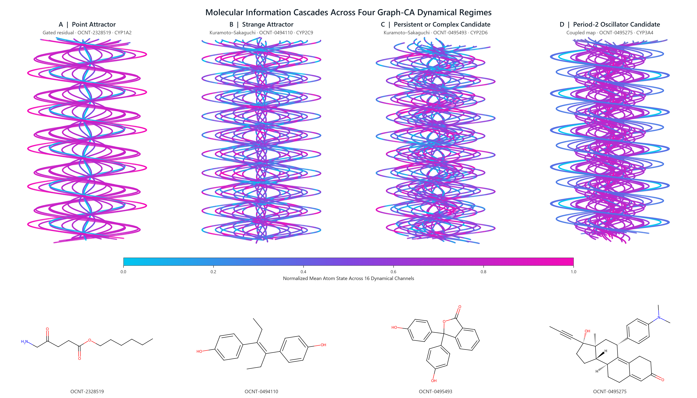

# Molecule Space-Time: Predicting Cytochrome P450 Inhibition with a Nonlinear Graph Cellular Automaton

**Anthony Nash, PhD**

**Independent Researcher, Warwickshire, United Kingdom**

**info@acnash.co.uk**

## Abstract

Cytochrome P450 (CYP) inhibition is a major consideration in drug discovery because it can alter drug metabolism and contribute to clinically significant drug–drug interactions. The 2026 OpenADMET CYP Inhibition Challenge provides a blinded setting in which to evaluate computational prediction of direct-inhibition pIC50 across four CYP isoforms. Here, we introduce a molecular graph cellular automaton that represents atoms as cells, chemical bonds as local neighbourhoods, and molecular computation, meaning the transformation and integration of chemically encoded information by the graph, as the repeated evolution of a shared, learned transition rule. Our approach retains the complete sequence of atom states and uses both transient properties measured during its evolution and terminal properties measured at its final generation to predict CYP inhibition. We call this evolving representation **molecule space-time**: the joint description of molecular structure and its learned progression through computational time. The latest Credible-Interval-Aligned Endpoint-Aligned Cross-Validated CYP-Specialist Graph Cellular Automata system, CIA-EA-CV-CYP-GCA, combined isoform-specific recurrent training with a smooth experimental-interval loss and achieved sealed-holdout MA-ST-RAE 0.7485 and RMSE 0.8477 pIC50. The preceding EA-CV-CYP-GCA OpenADMET blind evaluation returned MA-ST-RAE 1.0071, macro MAE 1.0778, macro R-squared -0.0715, macro Spearman rho 0.5345, and macro Kendall tau 0.3750. As a secondary objective, we investigated the nonlinear dynamics contained within molecule space-time by extending selected trajectories over thousands of generations and examining convergence, recurrence, periodicity, perturbation sensitivity, strange-attractor candidates, and possible chaotic behaviour. This analysis confirmed two bounded Kuramoto–Sakaguchi trajectories with continually regenerated positive Lyapunov exponents and multidirectional expansion. The framework treats prediction and dynamical exploration as complementary views of the same learned molecular process, offering a route toward CYP inhibition models whose internal evolution can be measured, visualised, and studied as a nonlinear system.

## Introduction

The 2026 OpenADMET CYP Inhibition Blind Challenge asks participants to predict direct-inhibition pIC50 values for CYP1A2, CYP2C9, CYP2D6, and CYP3A4 from molecular structure, with performance assessed against an unseen test set. Cytochrome P450 enzymes govern the oxidative metabolism of many medicines, and their inhibition can slow drug clearance, increase systemic exposure, alter the metabolism of co-administered compounds, and contribute to clinically important drug–drug interactions [1]. Reliable computational prediction can therefore help medicinal chemists identify liabilities earlier, prioritize experiments, and guide molecular design before more expensive laboratory studies are undertaken.

Our immediate objective in the competition is to produce four useful CYP-specific predictions for every blinded molecule while preserving strict separation between training, model selection, validation, and the hidden challenge set. We approach this as a supervised regression problem in which atom-level chemical descriptors are propagated through the bonded molecular graph, pooled into trajectory fingerprints, and mapped to pIC50 by a differentiable ridge readout. Several transition rules and temporal scales, meaning trajectories evolved for different numbers of cellular-automata generations, are combined in an ensemble of independently trained Graph-CA predictors so that complementary forms of local molecular computation can contribute to the final prediction.

Established approaches to molecular-property prediction include descriptor-based quantitative structure–activity relationship models [2], random forests [3] and gradient-boosted trees [4], message-passing graph neural networks [5], graph transformers [6], three-dimensional equivariant neural networks [7], and pretrained molecular foundation models [8]. These architectures provide strong and extensively studied competitive baselines. The present work instead examines a comparatively novel question: whether the aesthetic and dynamical character of information itself can become a useful molecular representation when complex global patterns emerge from repeated local decisions.

We encode each drug as a connected cellular automaton in which atoms are cells, covalent bonds define neighbourhoods, atom descriptors provide the initial information, and a shared transition rule determines how every atom responds to its neighbours at each generation. Bond identity controls the passage of information through single, double, triple, and aromatic connections. This construction retains the defining cellular-automata principle that global behaviour arises from repeated local interactions [9,10], while replacing the regular lattice of a classical cellular automaton with the irregular bonded graph of a molecule.

Wolfram's qualitative classification provides a useful vocabulary for the behaviours that cellular automata can produce [9,10]. Class I systems settle into a homogeneous fixed state; Class II systems form stable or periodic structures; Class III systems generate aperiodic, chaos-like activity; and Class IV systems support persistent localized structures and complex interactions often associated with the boundary between order and disorder. A learned molecular graph cellular automaton does not map automatically onto these lattice-based classes, although the classification motivates measurable analogues including point attractors, oscillations, persistent complex motion, sensitivity to perturbation, and bounded strange attractors.

We regard the method's near-term prospects against highly optimized molecular-learning systems as modest, and its scientific purpose extends beyond leaderboard position. The retained atom-by-channel trajectories allow us to ask how chemical information moves through a ligand, how molecular topology shapes that motion, and whether minute changes to the starting state are repeatedly amplified while the trajectory remains confined to an attracting region. As demonstrated here, particular molecular structures and CYP-conditioned encodings produce bounded trajectories with continually regenerated positive Lyapunov exponents and multidirectional expansion, interpreted through the established theory and numerical estimation of Lyapunov spectra [11,12]. These strange-attractor dynamics connect molecular structure, local information processing, and emergent behaviour within a single predictive cellular-automata framework.

## Materials and Methods

### Dataset and Prediction Task

The study used the primary direct-inhibition dataset released for the 2026 OpenADMET CYP Inhibition Blind Challenge. It comprised 4,905 unique compounds represented by a molecule identifier and a SMILES string. Experimental direct-inhibition pIC50 values were provided for four major drug-metabolising cytochrome P450 isoforms: CYP1A2, CYP2C9, CYP2D6, and CYP3A4. Here, pIC50 denotes the negative base-10 logarithm of the half-maximal inhibitory concentration expressed in molar units. Each reported measurement was accompanied by lower and upper uncertainty bounds and an estimated standard deviation from the fitted concentration–response experiment.

The response matrix was incomplete because compounds were not necessarily measured against every CYP isoform. The dataset contained 6,525 observed compound–CYP pairs, distributed as summarised in Table 1.

**Table 1. Number of observed direct-inhibition pIC50 measurements for each CYP isoform.**

| CYP isoform | Compounds with an observed direct-inhibition pIC50 |
|---|---:|
| CYP1A2 | 1,412 |
| CYP2C9 | 1,285 |
| CYP2D6 | 1,493 |
| CYP3A4 | 2,335 |
| **Total** | **6,525** |

Each observed compound–CYP pair constituted one supervised regression example. DS-GCAE and CFT-DS-GCAE learned a shared CYP-conditioned mapping. CV-CYP-GCA used independent endpoint models with shared four-endpoint supervision inside recurrent training batches. EA-CV-CYP-GCA aligned each independent nonlinear Graph-CA system with one isoform throughout recurrent backpropagation, differentiable ridge fitting, validation, and checkpoint selection. CIA-EA-CV-CYP-GCA retained this endpoint alignment and additionally trained selected cellular-automata experts against the experimental credible intervals used by the challenge metric. A missing endpoint was a compound–CYP combination for which no experimental direct-inhibition pIC50 value was reported. These values were retained as missing and contributed neither targets nor loss terms. The single-concentration, time-dependent-inhibition, and Emax datasets distributed with the challenge were outside the scope of this direct-inhibition study.

To assess generalisation beyond closely related chemistry, compounds were grouped by their standardised Bemis–Murcko scaffold before data partitioning. A fixed 20% subset of scaffold groups was reserved as a sealed holdout, leaving 5,216 observed compound–CYP pairs for model fitting and internal selection and 1,309 pairs for final validation. No scaffold group occurred in both partitions. Hyperparameter selection was conducted within the fitting pool, while the reserved scaffold holdout remained unused until final evaluation.

The challenge test set contained 750 additional compounds for which all direct-inhibition labels were withheld. The trained system was required to generate four finite pIC50 predictions for each compound, giving 3,000 blinded compound–CYP predictions in total. Blinded compounds and their unreleased outcomes were excluded from parameter estimation, hyperparameter selection, early stopping, and dynamical candidate selection. Predictive evaluation followed the challenge formulation: the primary measure was the macro-averaged soft-threshold relative absolute error across the four CYP isoforms, with each isoform weighted equally and predictions falling within the reported experimental uncertainty interval assigned zero error. Conventional regression statistics were retained as complementary measures of predictive agreement.

### Molecular Graph Representation

SMILES strings underwent RDKit structure cleanup, including normalization of standard functional-group and charge representations, before being reduced to the largest organic fragment, sanitized, and converted to canonical isomeric SMILES. Each standardized molecule was represented as a graph $G=(V,E)$, where every heavy atom $i\in V$ was a cellular-automata cell and every covalent bond defined two directed message-passing edges, $j\rightarrow i$ and $i\rightarrow j$. The predictive input, meaning the information supplied to the model to generate a pIC50 prediction, comprised the standardized two-dimensional graph connectivity, atom and bond descriptors, and CYP context; it contained no molecular geometry.

The baseline atom encoding contained one-hot element identity for H, C, N, O, F, P, S, Cl, Br, I, and other elements; for example, with this ordering carbon was encoded as $(0,1,0,0,0,0,0,0,0,0,0)$ and oxygen as $(0,0,0,1,0,0,0,0,0,0,0)$. Further descriptors comprised formal charge; aromaticity; sp, sp2, sp3, and other hybridization states; degree; total attached hydrogens; ring membership; hydrogen-bond donor and acceptor status; and tetrahedral chirality. Training-only model selection, meaning comparison of alternative feature profiles using only the fitting data and its internal validation partitions, could extend this encoding with five chemically organised feature groups summarised in Table 2. The sealed holdout and blinded challenge set played no part in that selection.

**Table 2. Chemically organised atom-feature groups considered during training-only model selection.** A feature group is a named collection of related atom-level descriptors that was added to the baseline encoding as one candidate block.

| Feature group | Atom-level quantities |
|---|---|
| Periodic | Atomic number, atomic mass, covalent radius, van der Waals radius, outer electrons, period, group, and approximate atomic volume |
| Valence | Total and implicit valence, heavy-atom degree, radical electrons, and absolute formal charge |
| Electronic | Pauling electronegativity, approximate polarizability, heteroatom and halogen indicators, conjugated-bond fraction, first ionization energy, electron affinity, and missing-property indicator |
| Ring geometry | Number of rings containing the atom and indicators for ring sizes 3, 4, 5, 6, 7, and 8 or greater |
| Local environment | Mean neighbouring electronegativity, electronegativity difference from the neighbourhood, mean neighbouring atomic number, and mean neighbouring formal charge |

The selected feature profile was stored with every frozen checkpoint, preserving the exact feature names and order required for inference. Continuous quantities were scaled by fixed chemically meaningful constants during graph construction. Bond vector $e_{ji}$ contained one-hot single, double, triple, or aromatic identity, conjugation, ring membership, and three stereochemical indicators. The same bond vector was attached to both directed representations of an undirected bond.

Each of the four CYP endpoints was a distinct prediction task defined by the direct-inhibition pIC50 for one isoform. The endpoints were represented by a one-hot context vector $c$. Consequently, a molecule retained one chemical graph while its cellular-automata trajectory and readout were conditioned on CYP1A2, CYP2C9, CYP2D6, or CYP3A4. For efficient GPU calculation, several molecule–CYP examples were placed in one batch without creating bonds between different molecules. Each atom could therefore exchange messages only with atoms in its own molecular graph.

### Nonlinear Graph Cellular Automaton

For atom $i$, the chemical input vector $x_i$ contained its fixed descriptors; for example, an aromatic sp2 carbon could be represented by a carbon element indicator, zero formal charge, an aromaticity indicator, an sp2-hybridization indicator, its degree, and its other listed atom properties. This input was mapped to an initial state with $H$ dynamical channels. These channels are $H$ learned real-valued coordinates that evolve at every generation and may combine information from several chemical descriptors rather than corresponding one-to-one with named chemical properties:

```math
h_i^{(0)}=\tanh\!\left(s_0 W_{\mathrm{init}}x_i\right),
```

Here, $W_{\mathrm{init}}$ maps the fixed descriptor vector $x_i$ into $H$ values, so $h_i^{(0)}\in\mathbb{R}^{H}$ is atom $i$'s complete $H$-channel dynamical state at generation zero. The superscript $(0)$ denotes the initial generation and is distinct from the channel count $H$. The scalar $s_0$ is the initialization scale: it multiplies the projected input before the hyperbolic tangent and therefore controls the initial state magnitude and degree of saturation. A shared local rule was then applied recurrently for $T$ generations. The parameters of this rule were tied across atoms and generations, making the construction a graph recurrent neural network with cellular-automata locality.

At generation $t$, the message from neighbour $j$ to atom $i$ was

```math
g_{ji}=\sigma\!\left(\frac{W_g e_{ji}}{\theta_b}\right),
\qquad
m_{ji}^{(t)}=g_{ji}\odot W_n h_j^{(t)}+W_e e_{ji},
```

Here, $\sigma(z)=1/(1+\exp(-z))$ is the logistic sigmoid applied elementwise. The subscript $n$ in $W_n$ denotes *neighbour*: $W_n$ is a learned linear map applied to the neighbouring state $h_j^{(t)}\in\mathbb{R}^{H}$, which is atom $j$'s dynamical state at generation $t$. The learned maps $W_e$ and $W_g$ respectively transform the bond description and generate a channel-wise bond gate. The positive bond temperature $\theta_b$ controls gate sharpness: a smaller value makes sigmoid gates more decisive, whereas a larger value moves them towards one half. The symbol $\odot$ denotes elementwise multiplication. Incoming messages and neighbouring states were degree-normalized by averaging over the number of neighbours, preventing atoms with more bonds from acquiring larger aggregate values merely because of their degree:

```math
a_i^{(t)}=\frac{1}{|N(i)|}\sum_{j\in N(i)}m_{ji}^{(t)},
\qquad
\bar h_i^{(t)}=\frac{1}{|N(i)|}\sum_{j\in N(i)}h_j^{(t)}.
```
Here, $N(i)$ is the set of atoms directly bonded to atom $i$, and $|N(i)|$ is the number of those neighbours. The state $h_i^{(t)}$ belongs to atom $i$ itself, whereas $\bar h_i^{(t)}$ is the mean state of its directly bonded neighbours. Chemical identity and CYP context entered every generation through a common reaction drive:

```math
r_i^{(t)}=\tanh\!\left(
W_s h_i^{(t)}+a_i^{(t)}+W_x x_i+W_c c+b
\right).
```

The common reaction drive $r_i^{(t)}\in\mathbb{R}^{H}$ is the candidate state change calculated for every atom and rule from the atom's present state $h_i^{(t)}$, its aggregated bond-conditioned neighbour message $a_i^{(t)}$, its fixed chemical input $x_i$, and the CYP context $c$. The learned maps $W_s$, $W_x$, and $W_c$ project their respective inputs into $H$ channels, and $b\in\mathbb{R}^{H}$ is a learned bias. The submitted ensemble, introduced above as a collection of independently trained Graph-CA predictors, used five transition rules sharing this bonded message and reaction calculation.

**Gated residual.** Inspired by gating in recurrent neural networks [13], this rule allows every atom and channel to retain its current value or accept a learned fraction of the newly proposed reaction. The gate is recalculated from the local molecular state at every generation:

```math
\alpha_i^{(t)}=\sigma\!\left(W_\alpha
[h_i^{(t)},a_i^{(t)},x_i,c]\right),
\qquad
h_i^{(t+1)}=(1-s\alpha_i^{(t)})\odot h_i^{(t)}
+s\alpha_i^{(t)}\odot r_i^{(t)},
```

Here, $\alpha_i^{(t)}\in(0,1)^H$ is atom $i$'s channel-wise acceptance gate; $W_\alpha$ is a learned map from the concatenated vector $[h_i^{(t)},a_i^{(t)},x_i,c]$ to $H$ gate values; square brackets denote concatenation; and $s>0$ is the update scale. The product $s\alpha_i^{(t)}$ was capped at one in each channel, $1$ denotes the $H$-component all-ones vector, and $\odot$ denotes elementwise multiplication. Thus, each new channel value is a weighted mixture of its previous value $h_i^{(t)}$ and proposed reaction $r_i^{(t)}$.

**Inertial reaction–diffusion.** This rule combines local reaction–diffusion, whose classical formulation couples reaction kinetics to spatial exchange [14], with a momentum-like velocity state [15]. The reaction term drives local change, the graph-diffusion term exchanges state with bonded neighbours, and restoring and damping terms control growth:

```math
f_i^{(t)}=r_i^{(t)}+D\odot(\bar h_i^{(t)}-h_i^{(t)})-R\odot h_i^{(t)},
```

```math
v_i^{(t+1)}=\eta\gamma\odot v_i^{(t)}+\delta\odot f_i^{(t)},
\qquad
h_i^{(t+1)}=\tanh\!\left(h_i^{(t)}+\delta\odot v_i^{(t+1)}\right).
```

Here, $f_i^{(t)}\in\mathbb{R}^{H}$ is the total force-like drive; $r_i^{(t)}$ is the common reaction drive; $\bar h_i^{(t)}-h_i^{(t)}$ is the graph-diffusion gradient between the neighbour mean and atom $i$; and $D,R\in\mathbb{R}_{\geq0}^{H}$ are channel-wise diffusion and restoring strengths. The auxiliary velocity $v_i^{(t)}\in\mathbb{R}^{H}$, initialized to zero, carries change between generations. The vectors $\gamma,\delta\in\mathbb{R}^{H}$ are channel-wise damping and step size, while the scalar $\eta$ is the inertial multiplier. These quantities were constrained to stable ranges by sigmoid or softplus transformations, and $\tanh$ bounded the updated state.

**FitzHugh–Nagumo.** Adapted from the classical excitable-system model [16,17], this rule divides the state into a fast excitation subsystem and a slower recovery subsystem. Their interaction can create threshold responses, pulses, and oscillatory relaxation, while learned chemical drive and graph diffusion condition those behaviours on the molecule:

```math
\Delta u_i^{(t)}=u_i^{(t)}-\frac{(u_i^{(t)})^3}{3}-v_i^{(t)}
+\kappa_s\tanh(W_u r_i^{(t)})+D_u(\bar u_i^{(t)}-u_i^{(t)}),
```

```math
\Delta v_i^{(t)}=\epsilon\left[u_i^{(t)}+q-v_i^{(t)}+0.1\tanh(W_v r_i^{(t)})\right]
+D_v(\bar v_i^{(t)}-v_i^{(t)}),
```
The two channel groups were then advanced together:

```math
h_i^{(t+1)}=\tanh\!\left(
[u_i^{(t)}+s\Delta u_i^{(t)},\;v_i^{(t)}+s\Delta v_i^{(t)}]
\right).
```

Here, $u_i^{(t)},v_i^{(t)}\in\mathbb{R}^{H/2}$ are the excitation and recovery halves of $h_i^{(t)}$; $\bar u_i^{(t)}$ and $\bar v_i^{(t)}$ are their respective means over $N(i)$; and $\Delta u_i^{(t)}$ and $\Delta v_i^{(t)}$ are their proposed increments. The learned maps $W_u$ and $W_v$ project the $H$-channel reaction drive into the corresponding half-state. The scalar $\kappa_s$ scales chemical stimulation, $D_u,D_v\geq0$ control graph diffusion, $\epsilon>0$ sets the recovery timescale, $q$ offsets recovery, $0.1$ is the fixed recovery-drive coefficient, and $s>0$ is the integration step. Square brackets concatenate the two updated half-states, and $\tanh$ bounds the resulting $H$-channel state.

**Kuramoto–Sakaguchi.** Adapted from coupled phase-oscillator theory [18,19], this rule treats every dynamical channel as a wrapped phase $\phi_i^{(t)}=\pi h_i^{(t)}$. Bond-gated coupling encourages neighbouring phases to coordinate, while chemical and CYP information determine each atom's intrinsic phase velocity:

```math
q_i^{(t)}=\frac{1}{|N(i)|}\sum_{j\in N(i)}
g_{ji}\odot\sin\!\left(\phi_j^{(t)}-\phi_i^{(t)}-\psi\right),
```

```math
\phi_i^{(t+1)}=\phi_i^{(t)}+s\left[
\omega_i^{(t)}+Kq_i^{(t)}\right],
\qquad
\omega_i^{(t)}=A\tanh(W_\omega r_i^{(t)}).
```
Here, $\phi_i^{(t)}\in[-\pi,\pi)^H$ is atom $i$'s phase vector; $q_i^{(t)}\in\mathbb{R}^{H}$ is its mean bond-gated phase-coupling signal; $N(i)$ and $|N(i)|$ denote its bonded-neighbour set and size; $g_{ji}\in(0,1)^H$ is the bond gate; and $\sin$ and $\odot$ act elementwise. The phase lag $\psi$ shifts the preferred phase relationship, $K$ is the coupling strength, and $s$ is the integration step. The chemically conditioned natural-frequency vector is $\omega_i^{(t)}\in\mathbb{R}^{H}$, where $W_\omega$ is learned, $r_i^{(t)}$ is the common reaction drive, and $A$ sets the frequency scale. The updated phase was wrapped modulo $2\pi$ into $[-\pi,\pi)$ and divided by $\pi$ to return $h_i^{(t+1)}$ to $[-1,1]$. The phase lag, coupling strength, and frequency scale were selected during training-only hyperparameter search.

**Delayed memory.** Drawing upon delay-differential dynamical systems [20], this rule makes the next state depend upon both the present calculation and an earlier point in the retained trajectory. It can therefore represent lagged feedback and history-dependent responses that a present-state-only rule cannot express. A rule-specific delay $d$ selected the preceding state, and the new drive combined the current reaction, a learned transformation of the current and delayed states, and explicit delayed-state feedback:

```math
\tilde r_i^{(t)}=\tanh\!\left(W_d[r_i^{(t)},h_i^{(t-d)}]\right),
```

```math
h_i^{(t+1)}=\tanh\!\left(
(1-\zeta s)h_i^{(t)}+s\left[(1-\mu)r_i^{(t)}
+\mu\tilde r_i^{(t)}+\kappa_d(h_i^{(t-d)}-h_i^{(t)})\right]
\right).
```
Here, $h_i^{(t-d)}\in\mathbb{R}^{H}$ is atom $i$'s state $d$ generations earlier, with the earliest available retained state used when $t<d$; $\tilde r_i^{(t)}\in\mathbb{R}^{H}$ is the delay-conditioned reaction; $W_d$ is a learned map from the concatenation $[r_i^{(t)},h_i^{(t-d)}]$ to $H$ values; and $\tanh$ bounds both the delayed reaction and updated state. The scalar $\mu\in[0,1]$ mixes the present reaction $r_i^{(t)}$ with the delayed reaction, $\kappa_d$ controls feedback from the difference $h_i^{(t-d)}-h_i^{(t)}$, $\zeta$ controls damping of the present state, $s>0$ is the update scale, and $1$ in $(1-\mu)$ is the scalar multiplicative identity. The delay and these coefficients were determined from the rule-specific search space.

Each trajectory was pooled into a molecular fingerprint containing the final atom-state mean and variance, the time-averaged atom state, the temporal variance of the molecular mean state, and mean state-change energy. The multiscale variant appended molecular mean states at 12.5%, 25%, 50%, 75%, and 100% of the trajectory. CYP-specific readout features were formed by combining the endpoint one-hot vector with endpoint-gated copies of the dynamical fingerprint.

### Machine-Learning Training and Validation

The predictive campaign evaluated DS-GCAE, CFT-DS-GCAE, CV-CYP-GCA, EA-CV-CYP-GCA, and the latest Credible-Interval-Aligned Endpoint-Aligned Cross-Validated CYP-Specialist Graph Cellular Automata system, abbreviated CIA-EA-CV-CYP-GCA. Each nonlinear Graph-CA expert was optimized by backpropagation through time. Adam updated the initialization, message, reaction, and transition-rule parameters with a cosine learning-rate schedule, gradient clipping, and an L2 penalty on cellular-automata weights. Generation count, dynamical-channel count, atom-feature profile, learning rate, ridge penalty, update scale, support fraction, batch size, bond temperature, initialization scale and noise, pooling design, rule-specific dynamical constants, and credible-interval loss weight were selected using labelled development data alone.

#### Differentiable ridge readout

Training batches were divided by molecule into support and query subsets. The Graph-CA generated fingerprint matrix $F_s$ for the support molecules, which was standardized column-wise to $Z_s$. With centered targets $y_s-\bar y_s$, the ridge coefficients were obtained by the closed-form differentiable solve

```math
\beta=\left(Z_s^{\mathsf T}Z_s+\lambda I\right)^{-1}
Z_s^{\mathsf T}(y_s-\bar y_s).
```

For query fingerprint $f_q$, prediction was

```math
\widehat y_q=\bar y_s+
\left(\frac{f_q-\bar F_s}{s_F}\right)^{\mathsf T}\beta,
```

where $\bar F_s$ and $s_F$ were the support feature mean and scale. The intercept was excluded from the ridge penalty. The linear solve remained connected to the Graph-CA computation graph, allowing query loss gradients to pass through $\beta$ and into every recurrent generation. A Hermitian pseudoinverse implemented the same ridge objective when highly correlated trajectory statistics made the normal equations numerically singular.

This support–query construction trained the nonlinear cellular automaton to produce fingerprints that generalized beyond the observations used to solve the current ridge layer. At the end of training, a final ridge state was fitted from all permitted fitting observations and stored with the selected Graph-CA checkpoint. Early stopping and checkpoint promotion used MA-ST-RAE on the relevant scaffold-held-out development fold. RMSE was recorded as a secondary optimization diagnostic.

#### Dual-scale expert ensemble

Five transition-rule families entered the submission: gated residual, delayed memory, inertial reaction–diffusion, Kuramoto–Sakaguchi, and FitzHugh–Nagumo. The original expert family contributed one frozen seed from each rule. The multiscale family averaged seeds 1701, 2909, and 4211 within each rule before combining rules. This design yielded ten expert signals per molecule–CYP pair: five original predictions and five seed-averaged multiscale predictions, derived from 20 frozen checkpoint evaluations.

The first submitted method, DS-GCAE, combined these signals through a fixed global blend. The original family contributed 42.5% of the final prediction and assigned equal weight to its five rules. The multiscale family contributed 57.5% and used rule weights of 0.1036, 0.1999, 0.1966, 0.2447, and 0.2552 for gated residual, delayed memory, inertial reaction–diffusion, Kuramoto–Sakaguchi, and FitzHugh–Nagumo, respectively. These weights were shared across all four CYP endpoints. Thus, DS-GCAE and CFT-DS-GCAE used the same underlying bonded-graph cellular-automata experts and differed in how their frozen predictions were combined.

#### Cross-fitted target-specific stacking

A separate standardized ridge stack was fitted for each CYP endpoint using the ten expert signals. Ridge penalties $0.01, 0.1, 1, 10, 100,$ and $1000$ were compared inside nested scaffold-grouped folds using endpoint ST-RAE. Each outer-fold prediction was generated by a stack whose penalty and parameters had been selected without that fold. An optional affine calibration

```math
\widehat y_{\mathrm{cal}}=a\widehat y+b
```

was assessed with calibration penalties of 0, 1, 10, 100, 1000, and an identity option. Calibration training also used out-of-fold predictions. The selected final penalties were 1000 for CYP1A2 and CYP2D6 and 100 for CYP2C9 and CYP3A4. Identity calibration, $a=1$ and $b=0$, was selected for all four endpoints.

#### Final validation and blinded inference

Model development used five scaffold-grouped folds within the fitting pool. The sealed holdout defined above was opened once after expert and stack selection. Evaluation used the primary and complementary metrics specified in the Dataset and Prediction Task subsection, with final uncertainty estimated from 1,000 bootstrap resamples.

After model freezing, the 20 expert checkpoints generated ten aligned signals for each blinded molecule–CYP pair. Four target-specific stacks produced the continuous pIC50 values, and the selected identity calibrations left them unchanged.

#### Endpoint-aligned cross-validated CYP-specialist training

EA-CV-CYP-GCA trained four independent nonlinear systems, one for each CYP isoform. Every support/query ridge solve, backpropagation loss, early-stopping decision, and checkpoint promotion used observations from the active CYP only. This alignment corrected the preceding CV-CYP-GCA training regime, in which endpoint-specific validation and final readouts were paired with recurrent training batches that still contained all four endpoints. All ten transition rules were screened for each endpoint using two scaffold folds. The three leading rule/configuration pairs per endpoint advanced to five-fold scaffold confirmation with two training seeds. Sparse ridge subset selection was performed from out-of-fold predictions before the sealed holdout was evaluated.

The final CYP1A2 system combined conservative graph flux, delayed memory, and Gray-Scott. CYP2C9 combined damped symplectic and activator-inhibitor. CYP2D6 combined delayed memory and FitzHugh-Nagumo. CYP3A4 combined Gray-Scott, damped symplectic, and coupled map. Each retained rule supplied predictions from five scaffold folds and two seeds, which were averaged before the saved endpoint-specific ridge combination.

#### Credible-interval-aligned endpoint training

CIA-EA-CV-CYP-GCA retained the endpoint-specific recurrent systems, scaffold separation, differentiable ridge solve, and sparse out-of-fold rule selection of EA-CV-CYP-GCA. For every retained transition-rule specialist, recurrent training compared credible-interval loss weights of 0, 0.25, 0.50, and 0.75. The zero setting reproduced endpoint-aligned mean-squared-error training. Positive settings combined squared pIC50 error with a differentiable distance from the reported lower and upper credible bounds. For prediction $\widehat y$, lower bound $l$, upper bound $u$, and temperature $\tau=0.05$, the smooth interval distance was

```math
d_{\tau}(\widehat y,l,u)=
\tau\log\left(1+\exp\left(\frac{l-\widehat y}{\tau}\right)\right)
+\tau\log\left(1+\exp\left(\frac{\widehat y-u}{\tau}\right)\right).
```

With interval weight $\alpha$, the recurrent query loss was

```math
L=(1-\alpha)L_{\mathrm{MSE}}+\alpha\,\frac{1}{n}
\sum_{k=1}^{n}d_{\tau}(\widehat y_k,l_k,u_k)^2.
```

Selection used endpoint ST-RAE across two scaffold folds. The selected loss configuration for each rule then advanced to five-fold confirmation with two seeds, followed by leakage-safe sparse ridge subset selection. The sealed holdout was opened once after all loss weights, rule subsets, and ridge penalties had been fixed. The final CYP1A2 system combined Gray–Scott, FitzHugh–Nagumo, and conservative graph flux. CYP2C9 combined Gray–Scott and damped symplectic. CYP2D6 combined delayed memory and FitzHugh–Nagumo. CYP3A4 combined damped symplectic and delayed memory. Complete blind inference used the frozen systems and did not load blind labels.

### Long-Horizon Dynamical Analysis

#### Targeted discovery of candidate attractor regimes

Dynamical analysis was performed after predictive training, using frozen model parameters and fixed molecular graphs. Candidate selection therefore changed neither the regression model nor its validation score. The objective was to concentrate long-horizon computation on trajectories showing sustained motion, recurrent geometry, broad frequency content, and sensitivity to small perturbations.

An initial screen was calculated from the complete atom-by-channel validation trajectories. For trajectory $H_t$, the molecular mean state was calculated at each generation, and late-time motion was measured from the mean Euclidean step length over the second half of the observed sequence. Recurrence was assessed over lags from 2 to 64 generations by comparing the mean lagged state distance with the distance expected from the accumulated mean step length. The smallest normalized lagged distance defined the recurrence ratio. Spectral entropy was calculated from the non-zero-frequency Fourier power of each state channel and averaged across channels. A screening score combined these quantities:

```math
S = \frac{v_{\mathrm{late}}\left(1 + H_{\mathrm{spectral}}\right)}{R_{\mathrm{recurrence}}},
```

where $v_{\mathrm{late}}$ is late-time motion, $H_{\mathrm{spectral}}$ is normalized spectral entropy, and $R_{\mathrm{recurrence}}$ is the recurrence ratio. This score acted as a computational targeting device rather than a definition of chaos. Candidates were drawn from gated residual, delayed memory, inertial reaction–diffusion, Kuramoto–Sakaguchi, and FitzHugh–Nagumo transition-rule families so that the long-horizon analysis included contracting, oscillatory, recurrent, and expanding regimes.

Twenty complete molecular states were propagated through 5,000 frozen cellular-automata generations. Every atom and every dynamical channel was retained at every generation. The first 1,000 generations were treated as burn-in for late-time diagnostics. Ten representative cases were subjected to detailed phase-space analysis, including principal-component projections, recurrence plots, frequency spectra, correlation-dimension estimates, and nearest-neighbour divergence curves. Principal-component coordinates were used exclusively for visualization; all perturbation and Lyapunov calculations operated in the full atom-by-channel state space.

#### Direct perturbation screen

Each detailed case was paired with eight independently oriented full-state perturbations of Euclidean magnitude $10^{-5}$. Reference and companion states were advanced under the same frozen transition rule, molecular graph, bond features, atom features, and CYP context. Their separation was recorded across the trajectory. Replicated early separation across perturbation directions was used to prioritize candidates for renormalized analysis. Trajectories 7 and 8, corresponding to `OCNT-0494110` conditioned on CYP2C9 and `OCNT-2328784` conditioned on CYP1A2, showed the clearest replicated expanding response and were advanced to the confirmatory tests below.

#### Circular state-space distance

The Kuramoto–Sakaguchi state is phase-like and wrapped to the interval $[-1,1]$. Differences were consequently measured on the circular state space. For reference state $h$ and companion state $h'$, the elementwise circular difference was

```math
\Delta(h',h) = \frac{1}{\pi}\mathrm{atan2}\!\left[
\sin\!\left(\pi(h'-h)\right),
\cos\!\left(\pi(h'-h)\right)
\right],
```

and full-state separation was $d=\lVert\Delta(h',h)\rVert_2$. This prevented an apparent jump across the phase boundary from being interpreted as physical divergence.

#### Confirmatory protocols

The numerical settings for the confirmatory and population experiments are summarized below. A repeat denotes an independently oriented initial perturbation or orthogonal perturbation basis, as appropriate to the calculation.

| Analysis | Burn-in generations | Measured generations | Renormalization or sampling interval | Perturbation scale | Repeats |
|---|---:|---:|---|---|---:|
| Largest Lyapunov exponent | 1,000 | 4,000 | 10 | $10^{-4}$, $10^{-5}$, and $10^{-6}$ | 8 per scale and molecule |
| Float64 Lyapunov spectrum | 1,000 | 4,000 | 5, 10, and 20 | $10^{-7}$ | 2 per interval and molecule |
| Attraction basin | 1,000 | 6,000 | Sampled every 10 | Displacement radii 0.1, 0.5, 1.0, and 2.0 | 8 per radius and molecule |
| Population and structural interventions | 1,000 | 2,000 | 10 | $10^{-7}$ | 2 per system |

#### Renormalized largest Lyapunov exponent

Persistent local instability was tested with a Benettin-style repeated-renormalization calculation. A companion state was placed at distance $\varepsilon$ from the post-burn-in reference state, and both states were advanced for each interval $\tau$. The circular separation $d_k$ was measured, its logarithmic expansion was recorded, and the companion was returned to distance $\varepsilon$ along the observed separation direction. The largest Lyapunov exponent was estimated as

```math
\lambda_1 = \frac{1}{K\tau}
\sum_{k=1}^{K}\log\!\left(\frac{d_k}{\varepsilon}\right).
```

The complete design produced 48 estimates. Repeated renormalization tested whether divergence was continually regenerated after local separations had been returned to the same small scale.

#### Float64 Lyapunov spectrum

The leading Lyapunov spectrum was calculated in double precision using eight simultaneous orthogonal perturbation vectors. After each propagation block, the full-state circular difference vectors were assembled into a matrix and subjected to reduced QR decomposition. The logarithms of the absolute diagonal elements of the resulting upper-triangular matrix supplied the local expansion rates, while the orthonormal basis supplied the renormalized companion directions. Stability across the intervals and repeats listed above was used to distinguish persistent multidirectional expansion from numerical precision effects or a single unstable direction.

#### Boundedness and attraction-basin test

Attraction towards a common invariant set was tested by initiating float64 trajectories at the full-state displacement radii listed above. The complete design contained 64 displaced trajectories.

Boundedness was monitored directly from the maximum absolute state. Convergence at the distributional level was evaluated after circular embedding of every state as concatenated sine and cosine coordinates. Distances between early and late trajectory distributions and the reference invariant distribution were estimated over 32 random one-dimensional projections, providing a sliced distribution distance suitable for the high-dimensional state space. A late-to-early distance ratio below one indicated movement towards the reference distribution. Nearest-reference-cloud distance was retained as a complementary finite-sampling diagnostic.

#### Population-level structure–dynamics analysis

The candidate analysis was followed by a broader test of whether molecular structure was associated with the strength of the learned instability. A scaffold-held-out population of 256 molecule–CYP cases was sampled evenly across CYP1A2, CYP2C9, CYP2D6, and CYP3A4, with 64 cases per endpoint. Sampling was stratified across quartiles of the initial dynamical screening score. The two established leading candidates were added explicitly, producing 258 evaluated cases under the population protocol above.

Molecular descriptors comprised molecular weight, calculated logP, topological polar surface area, hydrogen-bond donors and acceptors, rotatable bonds, ring composition, aromatic and heteroatom fractions, formal charge, fraction sp3, and bond-type counts. Graph descriptors comprised atom and bond counts, cyclomatic number, density, degree moments, adjacency spectral radius, algebraic connectivity, largest Laplacian eigenvalue, graph diameter, and mean shortest-path length. Reproducible ETKDG conformers were generated with seed 260830 and MMFF relaxation to calculate radius of gyration, asphericity, eccentricity, inertial shape factor, and spherocity. Cartesian coordinates were absent from the Graph-CA input, so three-dimensional descriptors were interpreted as structural correlates rather than direct dynamical inputs.

Univariate associations with the largest Lyapunov exponent were measured using Spearman correlation and Benjamini–Hochberg correction within each analysis scope. Confidence intervals were calculated from 2,000 bootstrap resamples of complete Bemis–Murcko scaffold clusters. Multivariate reproducibility was assessed with five-fold scaffold-grouped cross-validation using Elastic Net and Extra Trees regression. Held-out permutation importance quantified the contribution of each descriptor while preserving scaffold separation between training and evaluation folds.

#### Frozen-model structural interventions

Causal computational tests were performed on trajectories 7 and 8 while retaining all learned weights, the transition rule, the CYP context, and all parameters of the Lyapunov calculation. Each undirected molecular bond was represented by two directed message-passing edges. Bond deletion removed both directions of a selected connection. Bond-identity interventions replaced its single, double, triple, or aromatic edge encoding with each alternative identity. Ring-opening interventions removed a selected ring connection and suppressed the ring-membership atom encoding. Atom-feature interventions ablated one chemically interpretable group at a time: elemental identity, charge and aromaticity, hybridization, local valence, donor–acceptor state, chirality, or neighbouring-atom chemistry.

The intervention campaign comprised 187 modified and baseline systems evaluated with the population protocol. Effect size was defined as the change in the mean largest Lyapunov exponent relative to the corresponding unmodified molecule–CYP baseline. Positive values indicated faster exponential divergence, while negative values indicated slower divergence. The complete workflow, retained numerical tables, and publication figures are available in the [structure–dynamics campaign archive](../results/structure_dynamics_publication_v1/README.md).

## Results and Discussion

### CYP pIC50 Predictions

#### Sealed internal validation

CIA-EA-CV-CYP-GCA was evaluated once on the sealed scaffold holdout containing 1,309 molecule–CYP observations. Its point MA-ST-RAE was 0.7485. Across 1,000 bootstrap resamples, mean MA-ST-RAE was 0.7491 with a 95% interval from 0.7108 to 0.7894. RMSE was 0.8477 pIC50. The complementary bootstrap macro metrics were MAE 0.6184 pIC50, R-squared 0.2934, Spearman rho 0.5397, and Kendall tau 0.3874.

| Metric | CIA-EA-CV-CYP-GCA | EA-CV-CYP-GCA | CV-CYP-GCA | CFT-DS-GCAE | DS-GCAE |
|---|---:|---:|---:|---:|---:|
| Point MA-ST-RAE | **0.7485** | 0.7545 | 0.7690 | 0.7739 | 0.7842 |
| Bootstrap mean MA-ST-RAE | **0.7491** | 0.7551 | 0.7697 | 0.7749 | 0.7850 |
| 95% bootstrap interval | 0.7108–0.7894 | 0.7177–0.7970 | 0.7320–0.8127 | 0.7356–0.8193 | 0.7464–0.8274 |
| RMSE, pIC50 | **0.8477** | 0.8523 | 0.8625 | 0.8586 | 0.8678 |
| Bootstrap macro MAE, pIC50 | **0.6184** | 0.6218 | 0.6296 | 0.6323 | 0.6387 |
| Bootstrap macro R-squared | **0.2934** | 0.2864 | 0.2694 | 0.2754 | 0.2706 |
| Bootstrap macro Spearman rho | **0.5397** | 0.5327 | 0.5218 | 0.5184 | 0.5098 |
| Bootstrap macro Kendall tau | **0.3874** | 0.3816 | 0.3715 | 0.3699 | 0.3626 |

The four credible-interval-aligned systems produced point ST-RAE values of 0.8161 for CYP1A2, 0.7130 for CYP2C9, 0.9368 for CYP2D6, and 0.5280 for CYP3A4. CYP2D6 presented the largest residual difficulty on the sealed holdout, while CYP3A4 gave the strongest endpoint result. Credible-interval alignment improved point MA-ST-RAE by 0.0060 and RMSE by 0.0045 pIC50 relative to EA-CV-CYP-GCA.

#### OpenADMET blind challenge evaluation

The challenge organisers calculated the official metrics after submission against labels that remained unavailable during model development. The first submission used the dual-scale Graph-CA ensemble (DS-GCAE) and was recorded at rank 80 of 89. The second used CFT-DS-GCAE and was initially recorded at rank 82 of 90. The CV-CYP-GCA submission returned MA-ST-RAE 1.0171. The EA-CV-CYP-GCA submission stood at rank 99 of 111 on 1 September 2026 and improved every reported blind metric relative to CV-CYP-GCA. Changing leaderboard membership makes rank a time-specific snapshot, while metric values provide the direct comparison between submitted prediction files. CIA-EA-CV-CYP-GCA awaits organiser evaluation.

| Official blind metric | DS-GCAE | CFT-DS-GCAE | CV-CYP-GCA | EA-CV-CYP-GCA |
|---|---:|---:|---:|---:|
| MA-ST-RAE | 1.0132 | 1.0120 | 1.0171 | **1.0071** |
| Macro MAE | 1.0893 | 1.0861 | 1.0848 | **1.0778** |
| Macro R-squared | -0.0827 | -0.0766 | -0.0840 | **-0.0715** |
| Macro Spearman rho | 0.4751 | 0.4892 | 0.5180 | **0.5345** |
| Macro Kendall tau | 0.3323 | 0.3424 | 0.3637 | **0.3750** |

EA-CV-CYP-GCA improved all five official blind metrics relative to CV-CYP-GCA. The gap between sealed internal and blind performance indicates that calibration and generalisation across the hidden chemical distribution remain important limitations. These leaderboard results represent externally calculated challenge outcomes rather than metrics reconstructed from locally available labels.

### Nonlinear Dynamics in Molecular Space-Time


**Figure 1. Four long-horizon Graph-CA dynamical behaviours.** **A**, the gated-residual trajectory of `OCNT-2328519` conditioned on CYP1A2 contracts towards a point attractor. **B**, the confirmed Kuramoto–Sakaguchi strange attractor for `OCNT-0494110` conditioned on CYP2C9 continues to explore a bounded recurrent region. **C**, the Kuramoto–Sakaguchi trajectory of `OCNT-0495493` conditioned on CYP2D6 forms a persistent or complex candidate with late motion 0.148, spectral entropy 0.605, a dominant timescale of approximately 572 generations, and positive finite-time divergence. This candidate has not undergone the definitive Lyapunov-spectrum and basin-replication tests applied to panel B. Kuramoto phase channels were circularly embedded before projection. **D**, the coupled-map trajectory of `OCNT-0495275` conditioned on CYP3A4 forms a period-two oscillator candidate with spectral concentration 0.802. The mature oscillator is shown from generation 1,000 through generation 5,000 using a three-coordinate delay embedding of its leading full-state component; magenta and cyan markers identify its alternating states. Panels A–C contain generations 0 through 5,000. Colour records computational time using the colourblind-safe Viridis scale. These coordinates visualize learned atom-by-channel state-space dynamics rather than Cartesian molecular motion. Cyberpunk animations show the [point attractor](../results/long_horizon_attractor_campaign_v1/videos/trajectory_01_point_attractor_convergence.mp4), [strange attractor](../results/long_horizon_attractor_campaign_v1/videos/trajectory_07_hyperchaotic_strange_attractor.mp4), [persistent or complex candidate](../results/long_horizon_attractor_campaign_v1/videos/trajectory_kuramoto_persistent_complex_candidate.mp4), and [period-two oscillator candidate](../results/long_horizon_attractor_campaign_v1/videos/trajectory_coupled_map_period2_oscillator_candidate.mp4).


**Figure 2. Independent evidence for the Graph-CA strange-attractor classification.** **A**, repeated perturbation and renormalization continually regenerated positive largest Lyapunov exponents at perturbation magnitudes from $10^{-6}$ to $10^{-4}$; all 48 replicated estimates were positive. **B**, the first eight Lyapunov exponents were positive for both definitively tested trajectories, indicating expansion along several independent state-space directions. **C**, the largest exponent remained positive and stable when the renormalization interval was changed from 5 to 10 and 20 generations. **D**, all 64 replicated initial-condition perturbations remained bounded, while late-to-early distribution-distance ratios below one showed approach towards the attracting distribution across four perturbation radii. Error bars in panels A–C show standard deviations across repeated calculations; horizontal black lines mark zero divergence, and the dashed line in panel D marks equal late and early distance. Bounded basin behaviour together with continually regenerated sensitive dependence and a positive Lyapunov spectrum satisfies the operational criteria used here for a hyperchaotic strange attractor. A vector version is available as [PDF](../results/long_horizon_attractor_campaign_v1/figures/18_strange_attractor_evidence_plate.pdf).



**Figure 3. Molecular information cascades generated by the four Graph-CA trajectories in Figure 1.** Each panel shows the complete retained cascade at generation 5,000, with the corresponding RDKit 2D molecular structure shown directly beneath it. At every generation, the molecule was rotated slightly and displaced downwards while all earlier atom positions were retained, producing the continuous atom ribbons used in the accompanying molecular space-time videos. Cyan-to-magenta colour records the contemporaneous mean atom state across the 16 dynamical channels after robust normalization within each trajectory. The cascade therefore depicts learned chemical-information evolution across the bonded molecular graph rather than molecular translation through physical space. **A**, gated-residual point attractor. **B**, confirmed Kuramoto–Sakaguchi strange attractor. **C**, Kuramoto–Sakaguchi persistent or complex candidate. **D**, coupled-map period-two oscillator candidate. Bonds are omitted from the cascades to reveal the accumulated atom-state structure. A high-resolution PDF version is available [here](../results/long_horizon_attractor_campaign_v1/figures/19_four_graph_ca_terminal_atom_cascades.pdf).

#### Population-level dynamical screen

The final production model for each transition rule retained dynamical summaries for 1,309 validation trajectories, giving 13,090 short-horizon screens. Point-attractor candidates satisfied late motion below $10^{-4}$ and a final step below $10^{-5}$. Oscillator candidates combined recurrence ratio below 0.25 with spectral concentration above 0.5. Remaining trajectories were assigned to a persistent or complex screening class. These three columns are mutually exclusive. Strange-attractor confirmation was evaluated separately using the 5,000-generation perturbation, renormalized divergence, Lyapunov-spectrum, and basin-replication protocol.

| Transition rule | Screened | Point-attractor candidates | Oscillator candidates | Persistent or complex | Confirmed strange attractors |
|---|---:|---:|---:|---:|---:|
| Gated residual | 1,309 | 0 | 0 | 1,309 | 0 |
| Delayed memory | 1,309 | 0 | 0 | 1,309 | 0 |
| Inertial reaction–diffusion | 1,309 | 0 | 0 | 1,309 | 0 |
| Gray–Scott | 1,309 | 0 | 0 | 1,309 | 0 |
| Coupled map | 1,309 | 0 | 1,309 | 0 | 0 |
| Activator–inhibitor | 1,309 | 0 | 0 | 1,309 | 0 |
| FitzHugh–Nagumo | 1,309 | 0 | 0 | 1,309 | 0 |
| Kuramoto–Sakaguchi | 1,309 | 0 | 0 | 1,309 | 2 |
| Damped symplectic | 1,309 | 0 | 0 | 1,309 | 0 |
| Conservative graph flux | 1,309 | 1,309 | 0 | 0 | 0 |
| **Total** | **13,090** | **1,309** | **1,309** | **10,472** | **2** |

The two confirmed strange attractors are a subset of the Kuramoto–Sakaguchi persistent or complex screen. Both candidates selected for definitive testing passed the full confirmation protocol. The coupled-map population comprises 1,309 oscillator-screen candidates; definitive long-horizon periodicity testing remains required before describing them as true oscillators. The full machine-readable table is available in the [dynamical population summary](../results/long_horizon_attractor_campaign_v1/validation_dynamics_population_summary.csv).

## Conclusions

We represented drug molecules as connected graph cellular automata in which atoms acted as cells, covalent bonds defined local neighbourhoods, and 16-channel atom states evolved through learned transition rules. Complete trajectories were pooled into molecular fingerprints and linked to CYP1A2, CYP2C9, CYP2D6, and CYP3A4 pIC50 values through differentiable ridge regression. Five transition-rule families and two temporal representations formed DS-GCAE, endpoint-specific cross-fitted ridge stacking produced CFT-DS-GCAE, independent endpoint models produced CV-CYP-GCA, endpoint-aligned recurrent backpropagation produced EA-CV-CYP-GCA, and experimental-interval-aligned recurrent training produced CIA-EA-CV-CYP-GCA. On the sealed scaffold holdout, CIA-EA-CV-CYP-GCA achieved MA-ST-RAE 0.7485 and RMSE 0.8477 pIC50. The preceding EA-CV-CYP-GCA official OpenADMET blind evaluation returned MA-ST-RAE 1.0071, providing the external benchmark against which the new submission will be assessed.

The retained cellular-automata histories also exposed several forms of emergent molecular information dynamics. Across 13,090 screened trajectories we observed contraction towards a point attractor, period-two oscillator candidates, persistent complex motion, and two Kuramoto–Sakaguchi trajectories that satisfied our operational tests for hyperchaotic strange attractors. Their perturbation sensitivity was continually regenerated after renormalization, their leading Lyapunov spectra contained several positive exponents, and perturbed initial conditions remained bounded while approaching the same attracting distribution. Structural association and intervention experiments further indicated that molecular connectivity and bond identity influence the strength of this instability.

The present predictive results leave considerable scope for improved calibration and generalisation, while the dynamical findings establish a practical framework for studying how local chemical interactions generate global computational behaviour. Future development will refine the predictive ensemble, expand confirmatory testing across more molecules and transition rules, and examine whether particular scaffolds, bond arrangements, or chemical encodings reproducibly select point, periodic, complex, or strange-attractor regimes. This combination of molecular prediction and measurable nonlinear dynamics offers a distinctive way to investigate the flow of chemical information through molecular graphs.

### Author contributions

A.N conceived the study, developed and implemented the computational methodology, conducted the experiments, analysed and interpreted the results, prepared the figures, and wrote and revised the manuscript. AI was used to prepare the code. 

### Funding

This research received no external funding.

### Data availability

The dataset analysed in this study were provided through the 2026 OpenADMET CYP Inhibition Challenge and are available subject to the challenge organiser's access conditions. 

### Code availability

Source code, trained model configurations and scripts required to reproduce the reported analyses are available at https://github.com/acnash/Strange-Matter-Engine.git

## Bibliography

1. Wienkers LC, Heath TG. Predicting in vivo drug interactions from in vitro drug discovery data. *Nature Reviews Drug Discovery*. 2005;4(10):825–833. doi: [10.1038/nrd1851](https://doi.org/10.1038/nrd1851).
2. Cherkasov A, Muratov EN, Fourches D, et al. QSAR modeling: where have you been? Where are you going to? *Journal of Medicinal Chemistry*. 2014;57(12):4977–5010. doi: [10.1021/jm4004285](https://doi.org/10.1021/jm4004285).
3. Breiman L. Random forests. *Machine Learning*. 2001;45:5–32. doi: [10.1023/A:1010933404324](https://doi.org/10.1023/A:1010933404324).
4. Chen T, Guestrin C. XGBoost: a scalable tree boosting system. In: *Proceedings of the 22nd ACM SIGKDD International Conference on Knowledge Discovery and Data Mining*. 2016:785–794. doi: [10.1145/2939672.2939785](https://doi.org/10.1145/2939672.2939785).
5. Gilmer J, Schoenholz SS, Riley PF, Vinyals O, Dahl GE. Neural message passing for quantum chemistry. *Proceedings of Machine Learning Research*. 2017;70:1263–1272. [https://proceedings.mlr.press/v70/gilmer17a.html](https://proceedings.mlr.press/v70/gilmer17a.html).
6. Ying C, Cai T, Luo S, et al. Do transformers really perform badly for graph representation? *Advances in Neural Information Processing Systems*. 2021;34:28877–28888. [https://proceedings.neurips.cc/paper/2021/hash/f1c1592588411002af340cbaedd6fc33-Abstract.html](https://proceedings.neurips.cc/paper/2021/hash/f1c1592588411002af340cbaedd6fc33-Abstract.html).
7. Satorras VG, Hoogeboom E, Welling M. E(n) equivariant graph neural networks. *Proceedings of Machine Learning Research*. 2021;139:9323–9332. [https://proceedings.mlr.press/v139/satorras21a.html](https://proceedings.mlr.press/v139/satorras21a.html).
8. Zhou G, Gao Z, Ding Q, et al. Uni-Mol: a universal 3D molecular representation learning framework. *International Conference on Learning Representations*. 2023. [https://openreview.net/forum?id=6K2RM6wVqKu](https://openreview.net/forum?id=6K2RM6wVqKu).
9. Wolfram S. Statistical mechanics of cellular automata. *Reviews of Modern Physics*. 1983;55(3):601–644. doi: [10.1103/RevModPhys.55.601](https://doi.org/10.1103/RevModPhys.55.601).
10. Wolfram S. Universality and complexity in cellular automata. *Physica D: Nonlinear Phenomena*. 1984;10(1–2):1–35. doi: [10.1016/0167-2789(84)90245-8](https://doi.org/10.1016/0167-2789(84)90245-8).
11. Benettin G, Galgani L, Giorgilli A, Strelcyn JM. Lyapunov characteristic exponents for smooth dynamical systems and for Hamiltonian systems; a method for computing all of them. Part 1: theory. *Meccanica*. 1980;15:9–20. doi: [10.1007/BF02128236](https://doi.org/10.1007/BF02128236).
12. Oseledec VI. A multiplicative ergodic theorem: Lyapunov characteristic numbers for dynamical systems. *Transactions of the Moscow Mathematical Society*. 1968;19:197–231.
13. Cho K, van Merriënboer B, Gulcehre C, et al. Learning phrase representations using RNN encoder–decoder for statistical machine translation. In: *Proceedings of the 2014 Conference on Empirical Methods in Natural Language Processing*. 2014:1724–1734. doi: [10.3115/v1/D14-1179](https://doi.org/10.3115/v1/D14-1179).
14. Turing AM. The chemical basis of morphogenesis. *Philosophical Transactions of the Royal Society B*. 1952;237(641):37–72. doi: [10.1098/rstb.1952.0012](https://doi.org/10.1098/rstb.1952.0012).
15. Polyak BT. Some methods of speeding up the convergence of iteration methods. *USSR Computational Mathematics and Mathematical Physics*. 1964;4(5):1–17. doi: [10.1016/0041-5553(64)90137-5](https://doi.org/10.1016/0041-5553(64)90137-5).
16. FitzHugh R. Impulses and physiological states in theoretical models of nerve membrane. *Biophysical Journal*. 1961;1(6):445–466. doi: [10.1016/S0006-3495(61)86902-6](https://doi.org/10.1016/S0006-3495(61)86902-6).
17. Nagumo J, Arimoto S, Yoshizawa S. An active pulse transmission line simulating nerve axon. *Proceedings of the IRE*. 1962;50(10):2061–2070. doi: [10.1109/JRPROC.1962.288235](https://doi.org/10.1109/JRPROC.1962.288235).
18. Kuramoto Y. *Chemical Oscillations, Waves, and Turbulence*. Berlin: Springer; 1984. doi: [10.1007/978-3-642-69689-3](https://doi.org/10.1007/978-3-642-69689-3).
19. Sakaguchi H, Kuramoto Y. A soluble active rotator model showing phase transitions via mutual entertainment. *Progress of Theoretical Physics*. 1986;76(3):576–581. doi: [10.1143/PTP.76.576](https://doi.org/10.1143/PTP.76.576).
20. Hale JK, Verduyn Lunel SM. *Introduction to Functional Differential Equations*. New York: Springer; 1993. doi: [10.1007/978-1-4612-4342-7](https://doi.org/10.1007/978-1-4612-4342-7).
