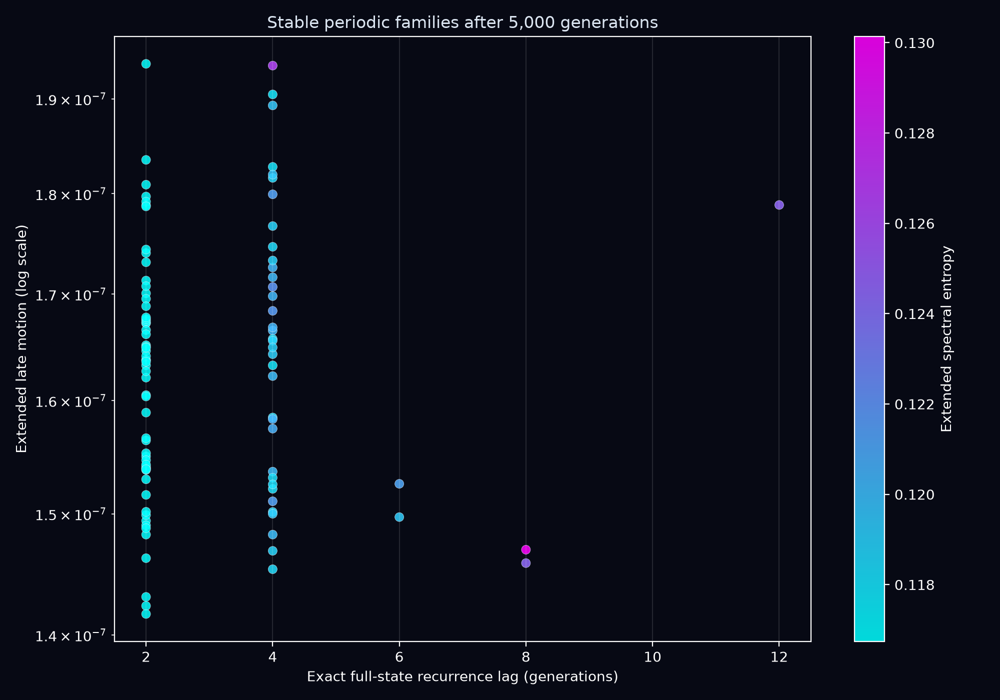
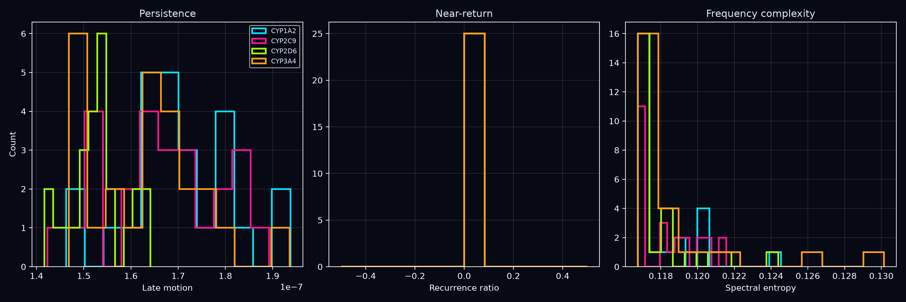
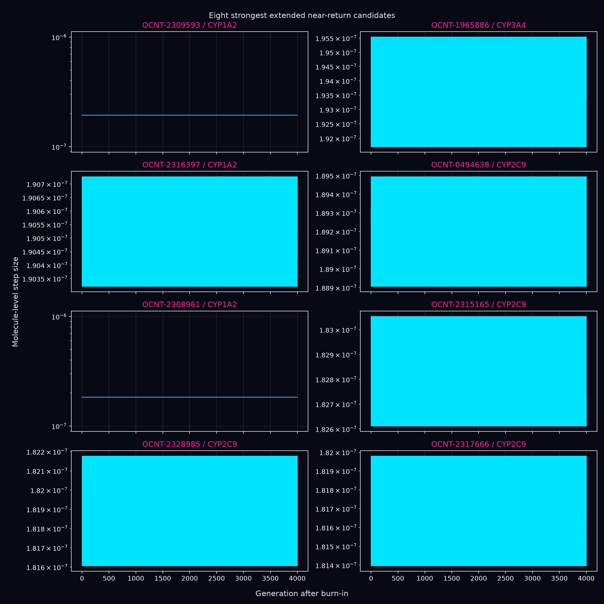
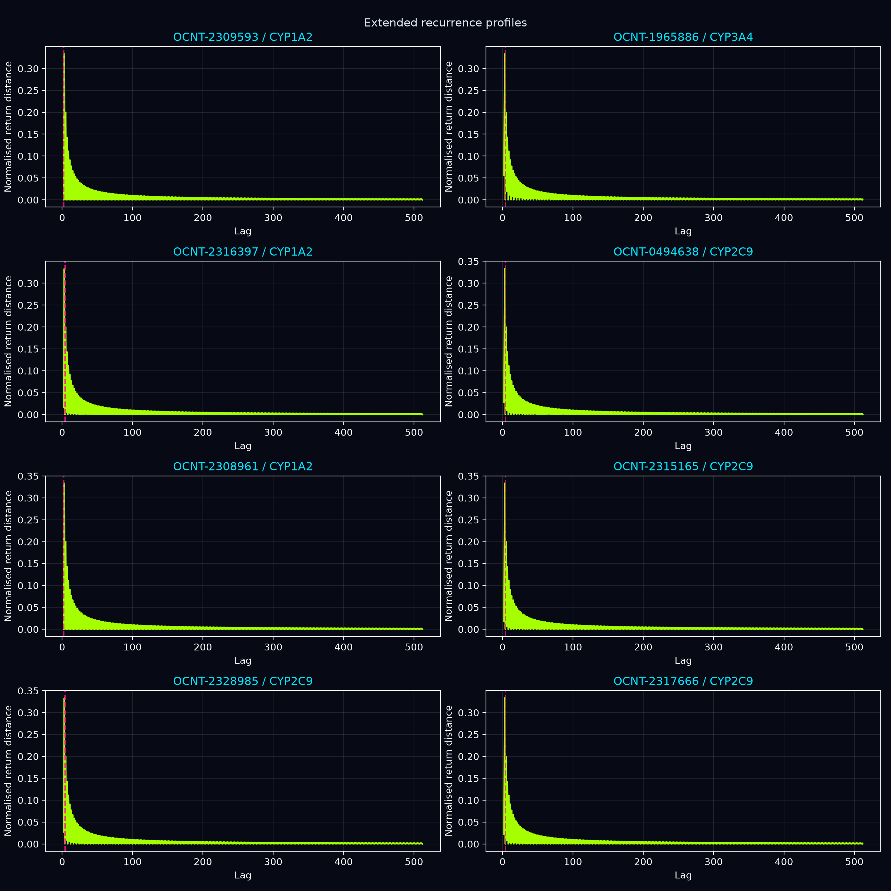
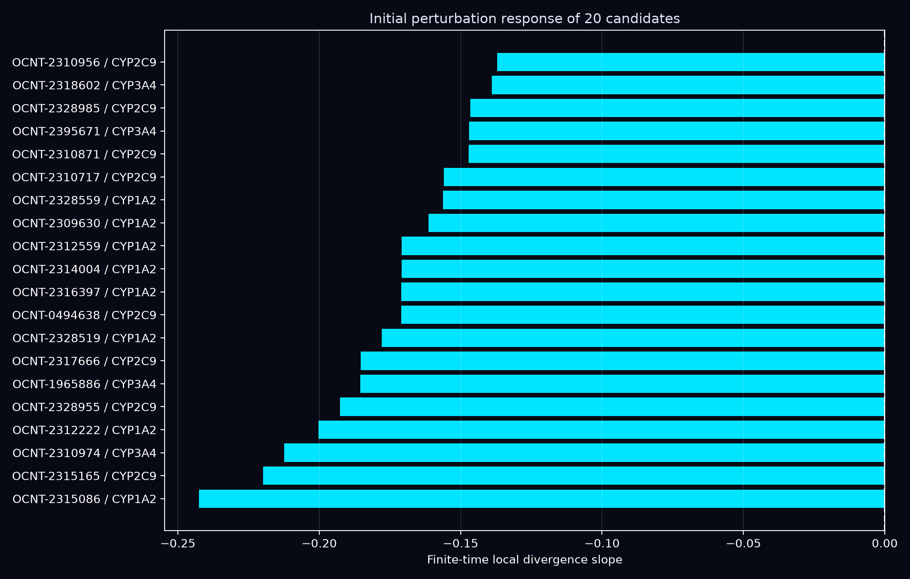

# Extended Coupled-Map Dynamical Screening

## Scope

The frozen production checkpoint `results/production_coupled_map_enhanced_v3/runs/final_model/model.pt` was applied for 5,000 generations to 100 selected validation molecule–CYP cases. The first 1,000 generations were discarded before long-horizon summaries were calculated. No model parameters were changed and no PyMOL files were produced.

CPU analysis time: 9.7 minutes.

## Candidate selection

Exactly 25 cases were selected for each CYP target. Selection used the union of five complementary short-trajectory rankings: persistent motion, low recurrence ratio, high spectral entropy, a periodic signature, and a complex recurrent signature. This prevents the screen from assuming that every interesting regime must maximize the same three measurements.

## Extended screening classes

These are candidate labels, not confirmed attractors:

- `stable_period_2_candidate`: 59
- `stable_period_4_candidate`: 36
- `stable_period_6_candidate`: 2
- `stable_period_8_candidate`: 2
- `stable_period_12_candidate`: 1

## Principal finding

All 100 complete atom-by-channel states returned exactly to a previously occupied state at float32 precision after the burn-in. The selected exact-return lags were:

- lag 2 generations: 59 cases
- lag 4 generations: 36 cases
- lag 6 generations: 2 cases
- lag 8 generations: 2 cases
- lag 12 generations: 1 case

Every trajectory had its strongest spectral component at a period of approximately two generations and an autocorrelation peak of 1.0. The longer exact-return lags show that some complete states require four or more updates to repeat even though a two-generation component dominates their spectra.

This behaviour is consistent with stable periodic families produced by the frozen coupled-map rule. It is not consistent with a strange attractor or sustained chaos in these selected cases.

Finite-time perturbation analysis was applied to 20 leading cases; 0 had a positive fitted local-divergence slope over generations 1–100.
The fitted slopes ranged from -0.2425 to -0.1371; all were negative and every measured separation contracted to the numerical floor.

The periodic classifications remain candidates because confirmation requires rerunning representative cases in float64, testing the smallest repeating lag directly, varying initial perturbations, and replicating the result across independently trained parameter sets. A positive finite-time slope would only be a screening signal for chaos; none was observed here.

The four CYP-separated bands seen at 16 generations are therefore best interpreted as distinct early transients. Over 5,000 generations, the selected cases collapse into a narrower collection of stable periodic regimes.

## Figures

## Files

- `selected_candidates.csv`: the original 16-generation screening values and selection reason.
- `extended_dynamics.csv`: all 5,000-generation summaries and candidate classifications.
- `priority_structures.csv`: 15 representative periodic candidates reserved for scientific review before any PyMOL generation.
- `extended_mean_trajectories.npz`: molecule-level mean trajectories only; no atom-level PyMOL data.
