# Prototype three: tuned 200-generation Graph-CA

## Executive summary

Prototype three successfully propagated an inertial reaction–diffusion Graph-CA for **200 generations**, screened six hyperparameter configurations, predicted every blinded molecule–CYP pair, and produced 20 PyMOL-ready molecular trajectories.

Its most compelling result is dynamical: the model generated long, curved excursions through latent state space before contracting strongly toward stable sinks. Perturbation analysis gave a negative finite-time local-divergence slope for every selected trajectory. This supports attractor-seeking dynamics and provides no evidence of a strange attractor or chaos in these examples.

Predictively, prototype three reached a grouped-validation RMSE of **0.959 pIC50**. Prototype one remains best at **0.869 pIC50**, followed by prototype two at **0.893 pIC50**. The additional generations enriched the dynamics but did not improve predictive accuracy in this fixed-budget run.

## 1. Experimental design

The final model retained the accepted eight-channel inertial reaction–diffusion rule and increased the rollout from 100 to 200 generations. Six configurations were screened on the same reproducible molecular subsets using 50-generation trajectories. This inexpensive first fidelity identified the optimisation settings to promote into the complete 200-generation run.

| Candidate | Graph-CA learning rate | Readout learning rate | Ridge strength | Clip norm | Tuning RMSE |
|---|---:|---:|---:|---:|---:|
| C1 | 0.0005 | 0.0015 | 0.0010 | 1.0 | 1.095 |
| C2 | 0.0010 | 0.0030 | 0.0010 | 1.0 | 1.088 |
| **C3** | **0.0020** | **0.0030** | **0.0010** | **1.0** | **1.071** |
| C4 | 0.0010 | 0.0030 | 0.0003 | 1.0 | 1.088 |
| C5 | 0.0010 | 0.0030 | 0.0030 | 1.0 | 1.088 |
| C6 | 0.0010 | 0.0030 | 0.0010 | 2.0 | 1.086 |

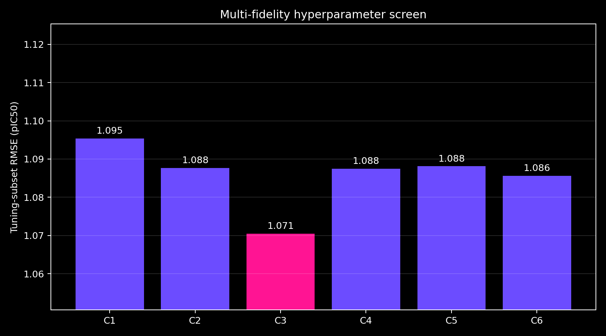

Candidate C3 was trained on all 5,216 fit observations and evaluated on all 1,309 grouped-validation observations. Six complete epochs were used because each epoch backpropagated through 200 graph generations. The best checkpoint was epoch 5.

## 2. Predicted versus experimental pIC50

| Quantity | Result |
|---|---:|
| Fit RMSE | 0.897 pIC50 |
| Grouped-validation RMSE | 0.959 pIC50 |
| Best epoch | 5 of 6 |
| Blinded molecule–CYP predictions | 3,000 |

The prediction scatter compares every available experimental measurement with its prediction. The diagonal represents perfect agreement.

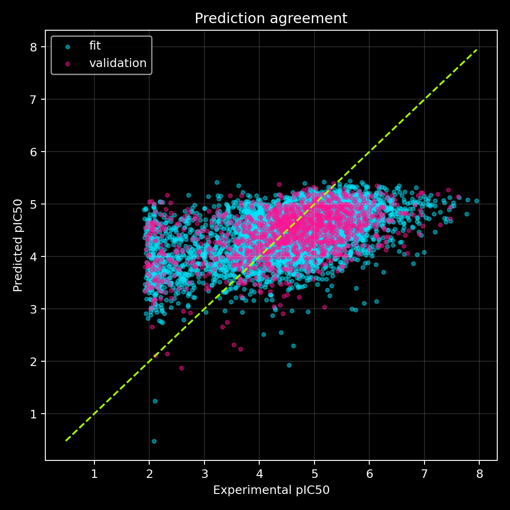

The residual distributions show where the model overpredicts or underpredicts each CYP.

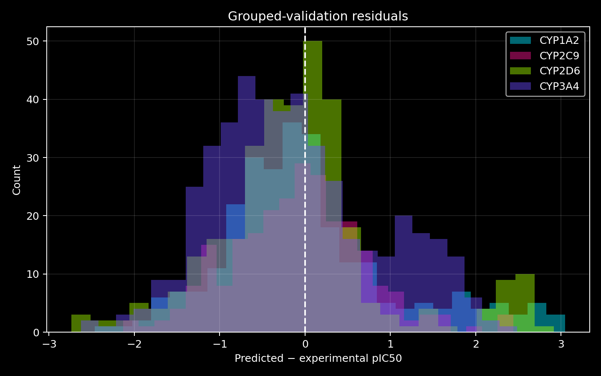

The learning curve shows continued improvement through epoch 5 followed by a validation increase at epoch 6. Restoring epoch 5 therefore prevented the last epoch from degrading the reported predictions.

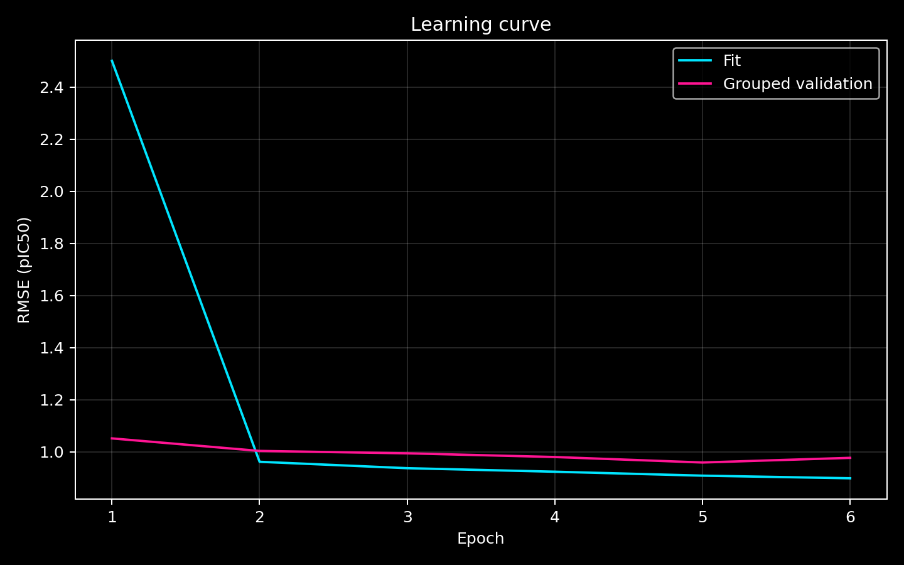

## 3. Comparison with prototypes one and two

| Model | Rule and rollout | Fit RMSE | Validation RMSE |
|---|---|---:|---:|
| Prototype 1 | Gated residual, 16 generations | **0.808** | **0.869** |
| Prototype 2 | Inertial reaction–diffusion, 100 generations | 0.835 | 0.893 |
| Prototype 3 | Tuned inertial reaction–diffusion, 200 generations | 0.897 | 0.959 |

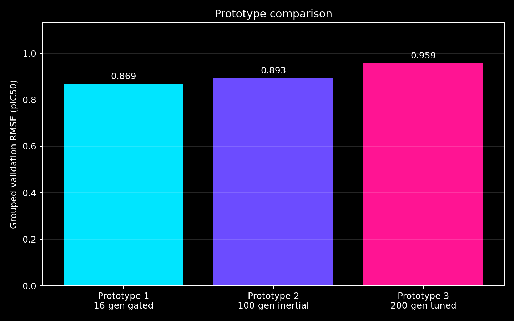

Prototype three was weaker for every CYP on this grouped split. Its largest deterioration relative to prototype one occurred for CYP3A4.

| CYP | Prototype 1 | Prototype 2 | Prototype 3 |
|---|---:|---:|---:|
| CYP1A2 | **0.980** | 1.003 | 1.038 |
| CYP2C9 | **0.710** | 0.701 | 0.771 |
| CYP2D6 | **0.975** | 0.987 | 0.999 |
| CYP3A4 | **0.795** | 0.848 | 0.974 |

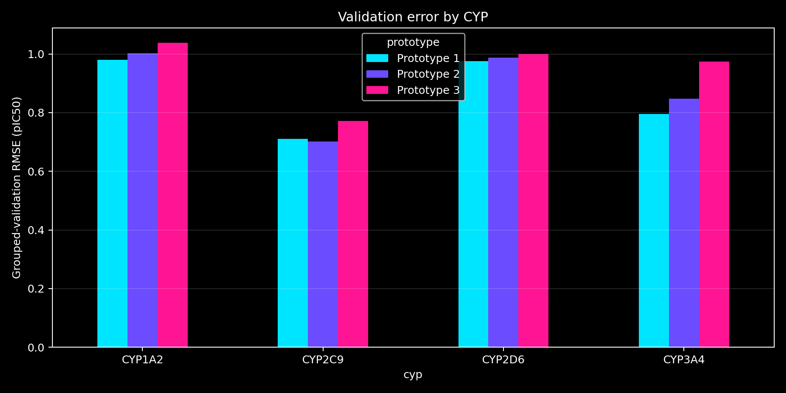

Prototype-three blinded predictions correlated **0.786** with prototype one and differed by a mean absolute **0.252 pIC50**. Its mean blinded prediction was 4.482 pIC50, compared with 4.596 for prototype one.

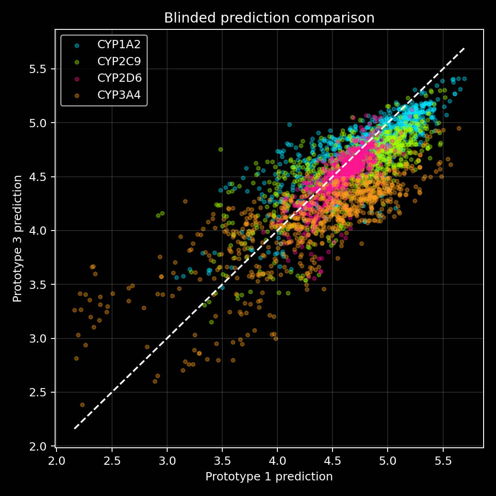

This comparison does not isolate generation count alone: prototype three also used tuned learning rates and a shorter six-epoch full-data budget. The result establishes that this particular 200-generation trained configuration is less predictive; it does not establish that every 200-generation model must be worse.

## 4. Dynamical analysis

### 4.1 Screening all trajectories

Every blinded trajectory was assessed using late motion, final step size, late amplitude, recurrence, curvature, and spectral concentration. Twenty cases were selected across recurrence, spectral, curved-path, and persistent-motion rankings.

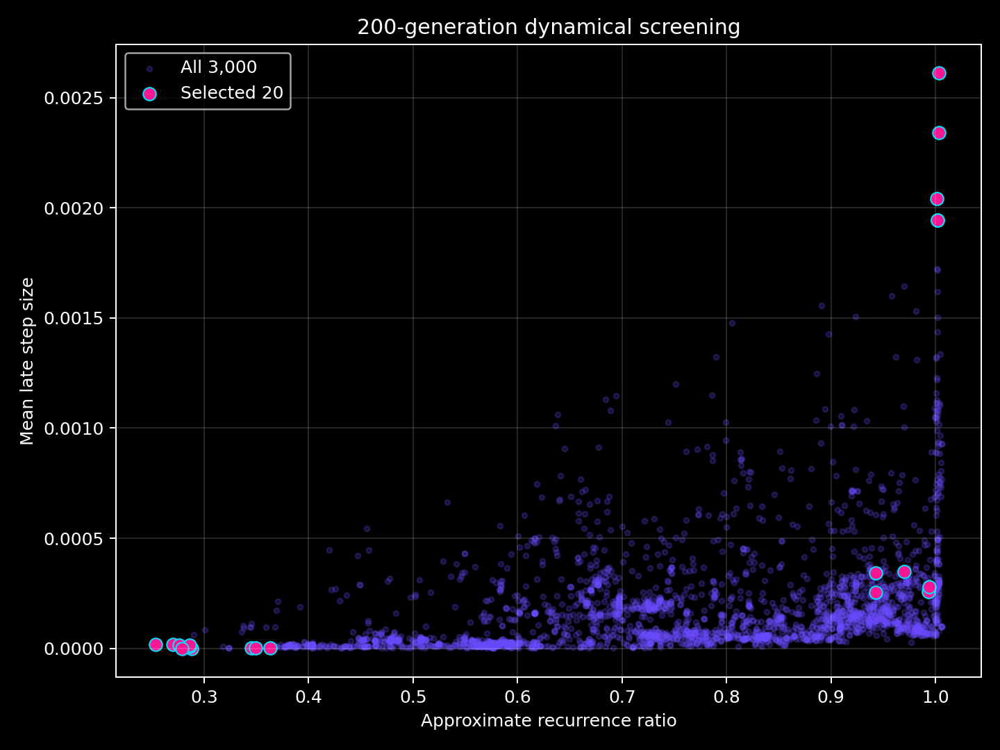

Across all 3,000 trajectories:

- median late motion was 0.000111 state units per generation;
- 99% had late motion below 0.00113;
- the maximum late motion was 0.00261;
- median final-step size was 0.0000067;
- several final-step values reached floating-point zero.

The population is therefore dominated by strong late contraction.

### 4.2 Long transients and attractors

The five most persistent selected trajectories all belonged to the CYP1A2 context. They display an initial rapid decay, a broad secondary pulse around generations 100–120, and then strong contraction.

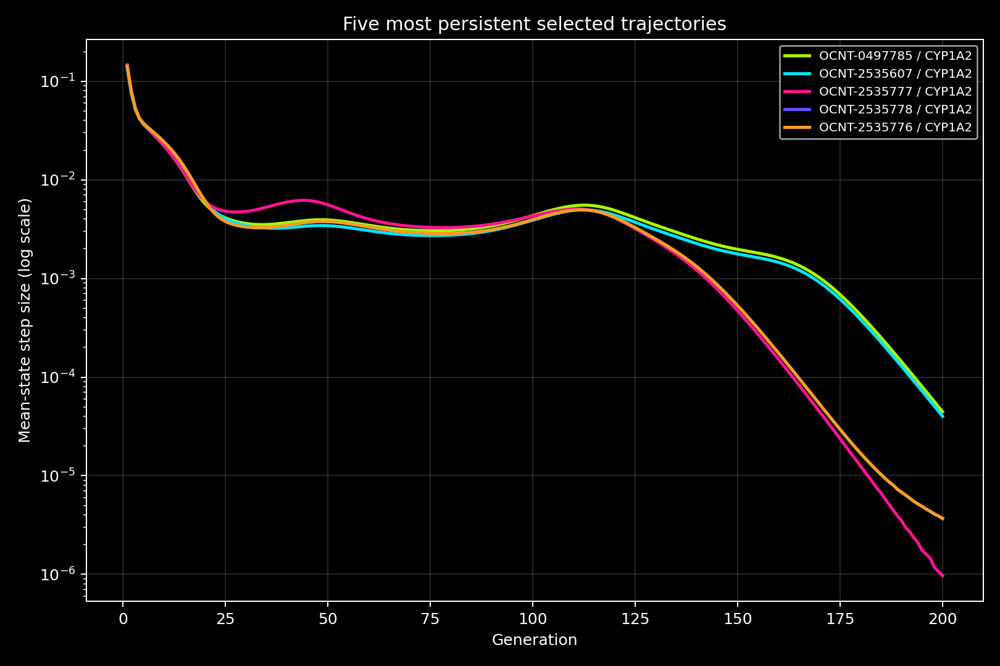

The state-space projections show smooth, curved, non-repeating paths. They resemble a damped excursion through state space followed by approach to a sink, rather than an orbit around a limit cycle.

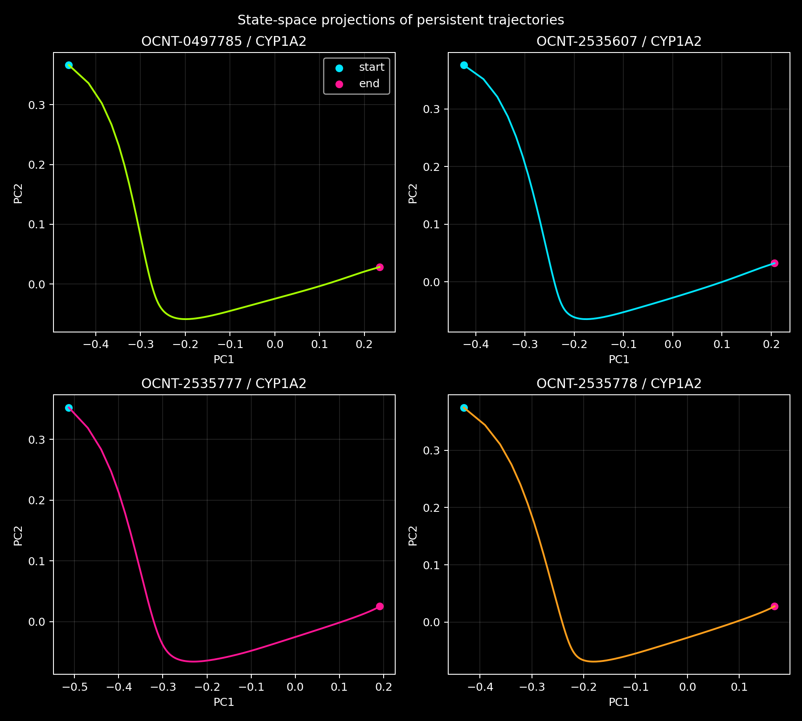

This secondary pulse is scientifically interesting. Information nearly settles, reorganises into another collective mode, and then dissipates. It is best described as a **complex damped transient**.

### 4.3 Oscillators

No sustained oscillator was demonstrated. A genuine oscillator should continue revisiting states with a stable period and non-vanishing amplitude. Here, step sizes ultimately collapse by several orders of magnitude, and the projected paths do not close into repeated loops.

Some spectra and recurrence scores initially looked oscillator-like. The longer 200-generation view resolves their identity: they are finite curved transients approaching sinks.

### 4.4 Perturbation sensitivity and Lyapunov evidence

Each selected trajectory was rerun from an initial atom-state perturbation of magnitude $10^{-5}$. Over generations 1–30, the separation was fitted in logarithmic space:

```math
\lambda_{1:30}=\frac{d}{dt}\log\left(\frac{\delta_t}{\delta_0}\right).
```

All 20 fitted slopes were negative:

- range: **−0.103 to −0.019** per generation;
- mean: **−0.058** per generation;
- median: **−0.058** per generation.

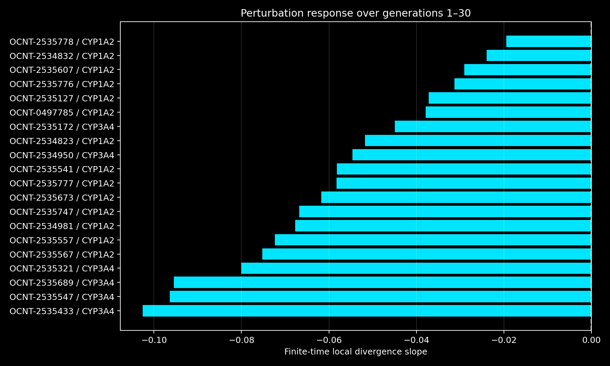

Nearby initial states therefore contract locally. This is consistent with stable attractors and inconsistent with local exponential divergence over the measured interval.

### 4.5 Strange attractors and chaos

No strange attractor or chaotic behaviour was found among the selected trajectories. The evidence points in the opposite direction:

- perturbations contracted rather than expanded;
- late motion tended toward zero;
- state-space paths did not repeatedly fold and stretch;
- apparent recurrence was explained by smooth relaxation;
- no sustained broadband irregular motion remained at late generations.

The conclusion is specific to this learned parameter set, the tested molecules and CYP contexts, the perturbation size, and the 200-generation window.

## 5. Molecular visualisation

The atom activity heatmap shows how individual atoms participate across the complete rollout.

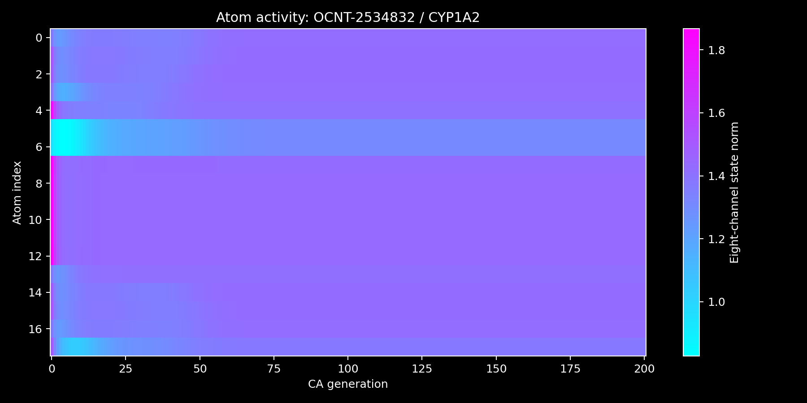

Twenty multi-model PDB files and matching lossless NPZ trajectories are supplied. Each PDB has **202 display states**: generations 0–200 plus the labelled hydrogen coda. Load `load_20_trajectories.pml` in PyMOL and use:

- `gca_next`
- `gca_previous`
- `gca_state 101`
- `gca_play`
- `gca_stop`

## 6. Scientific interpretation

Prototype three demonstrates a useful separation between predictive and dynamical objectives. Extending the rollout revealed clear slow manifolds, secondary transient pulses, and stable sinks, but did not improve pIC50 prediction under the available training budget.

The next productive experiment is therefore targeted rather than simply longer: preserve the 200-generation diagnostic rollout, train the predictive fingerprint on earlier and multi-scale windows, and compare those windows under grouped nested validation. This would test whether late contraction is erasing discriminative information that was present earlier in molecular space-time.
