# Prototype 4 Scientific Report

## Purpose

Prototype 4 tests the inertial reaction–diffusion graph cellular automaton over 500 generations. It asks two separate questions:

1. How accurately does the fitted system predict experimental pIC50 values for molecules withheld by the grouped validation split?
2. Do the learned atom-state trajectories exhibit persistent oscillation, sensitive dependence, recurrence, or convergence toward attractors?

This is a prototype evaluation from one grouped split. It is not the final nested-cross-validation performance estimate.

## Data division

The labelled observations were divided by molecular group so that closely related molecular records remained on the same side of the fitting–validation boundary.

| Use | Observations | Purpose |
|---|---:|---|
| Parameter fitting | 5,216 | Update the Graph-CA and readout parameters |
| Grouped validation | 1,309 | Measure performance on withheld molecular groups |
| Blinded challenge prediction | 3,000 | Predict four CYP values for each of 750 challenge molecules |

The complete validation comparison is in [validation_set_predictions.csv](validation_set_predictions.csv). Its columns contain the molecule identifier, CYP target, experimental pIC50, predicted pIC50, and residual. Here, residual means predicted pIC50 minus experimental pIC50.

The challenge set is blinded: its experimental pIC50 values have not been released. Consequently, a true challenge-test RMSE cannot be calculated locally. The RMSE reported below is the grouped-validation RMSE.

## Hyperparameter selection

The search tested **six configurations of four hyperparameters** at a reduced 125-generation tuning fidelity. The four tuned hyperparameters were:

- Graph-CA learning rate;
- readout learning rate;
- ridge-regression strength; and
- gradient-clipping threshold.

The Graph-CA weight-decay coefficient remained fixed at 0.00001; it was not one of the four tuned hyperparameters.

| Configuration | Graph-CA learning rate | Readout learning rate | Ridge strength | Gradient clipping | Tuning RMSE |
|---|---:|---:|---:|---:|---:|
| C1 | 0.0005 | 0.0015 | 0.0010 | 1.0 | 1.151 |
| C2 | 0.0010 | 0.0030 | 0.0010 | 1.0 | 1.072 |
| **C3 selected** | **0.0020** | **0.0030** | **0.0010** | **1.0** | **1.070** |
| C4 | 0.0010 | 0.0030 | 0.0003 | 1.0 | 1.072 |
| C5 | 0.0010 | 0.0030 | 0.0030 | 1.0 | 1.072 |
| C6 | 0.0010 | 0.0030 | 0.0010 | 2.0 | 1.107 |

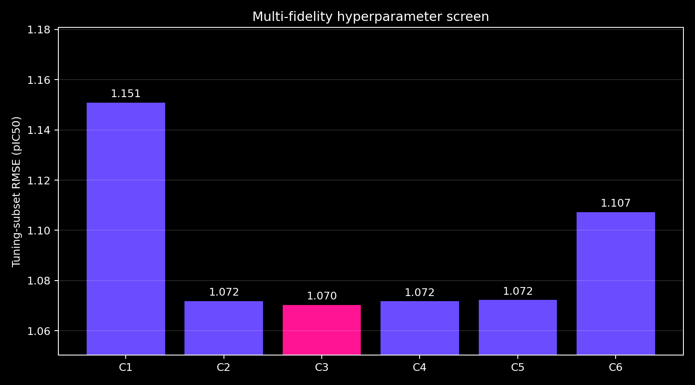

Configuration C3 was then trained at the full 500-generation trajectory length.

## Predictive performance

The final results were:

| Measurement | RMSE in pIC50 units |
|---|---:|
| Parameter-fitting observations | 0.906 |
| Grouped-validation observations | **0.965** |

The prediction plot compares every experimental value with its model prediction. A point on the diagonal represents exact agreement.

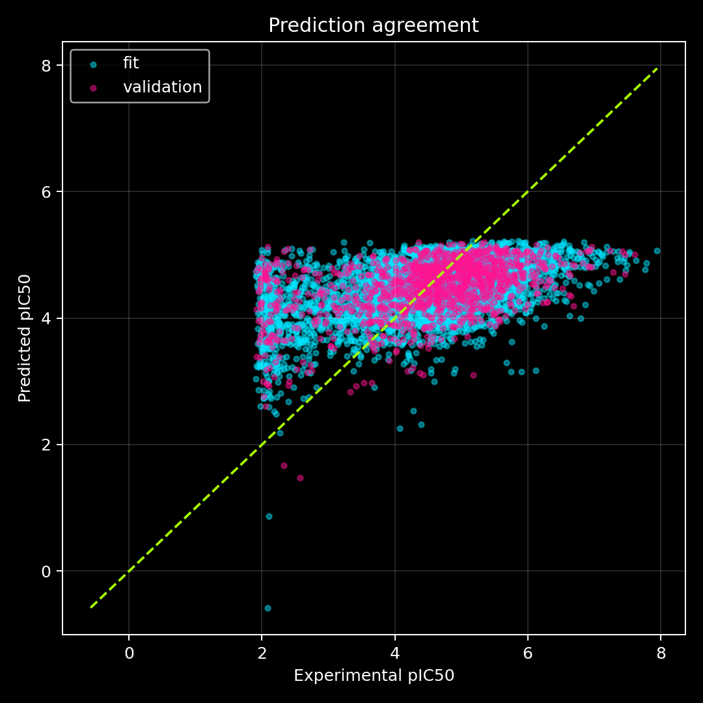

The residual distributions reveal the direction and spread of errors for each CYP target.

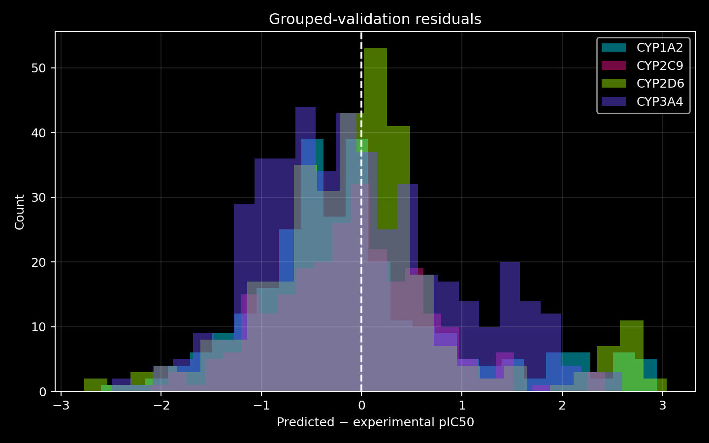

Validation RMSE by target was:

| CYP target | Validation RMSE |
|---|---:|
| CYP1A2 | 1.061 |
| CYP2C9 | 0.766 |
| CYP2D6 | 0.996 |
| CYP3A4 | 0.982 |

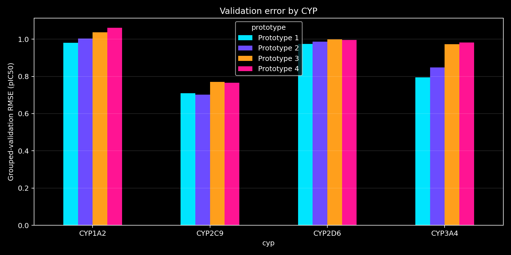

The model completed five training epochs. Its validation RMSE continued to improve through the fifth epoch, reaching 0.965. Therefore five epochs constitute the fixed computational budget used for this prototype; they do not establish that the trainable parameters had fully converged.

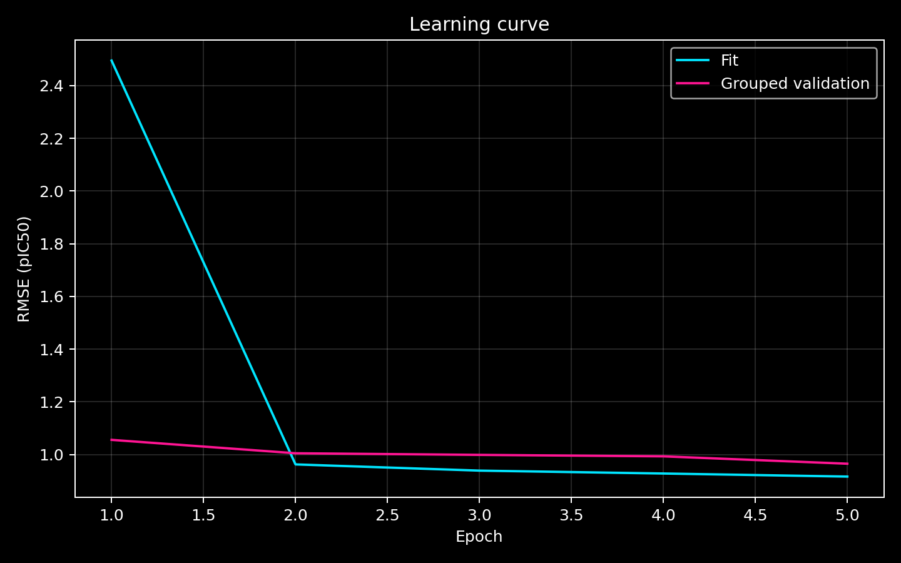

## Comparison with earlier prototypes

| Prototype | Transition rule | Generations | Hyperparameter search | Grouped-validation RMSE |
|---|---|---:|---|---:|
| 1 | Gated residual message passing | 16 | No | **0.869** |
| 2 | Inertial reaction–diffusion | 100 | No | 0.893 |
| 3 | Inertial reaction–diffusion | 200 | Yes | 0.959 |
| 4 | Inertial reaction–diffusion | 500 | Yes | 0.965 |

Lower RMSE is better. Prototype 4 did not improve upon Prototype 1, Prototype 2, or Prototype 3 on this grouped validation split. Increasing the trajectory to 500 generations therefore did not improve prediction under this training budget and hyperparameter search.

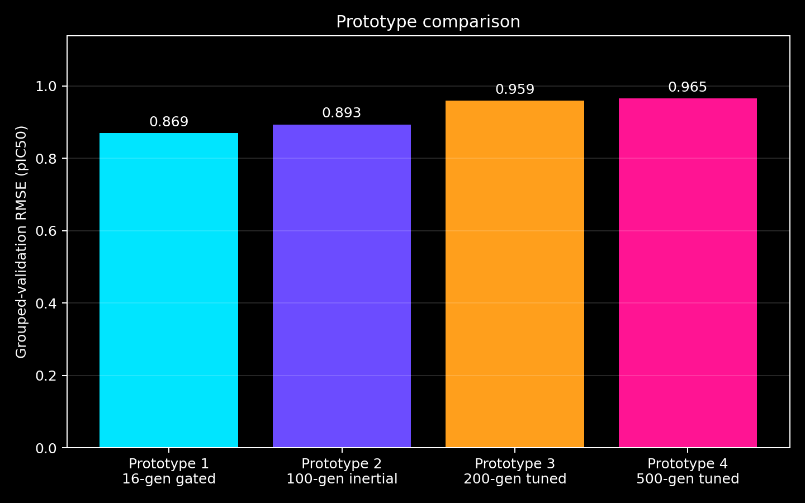

Prototype 4 and Prototype 1 produced correlated, but materially different, blinded predictions. Their Pearson correlation was 0.753 and their mean absolute difference was 0.265 pIC50 units.

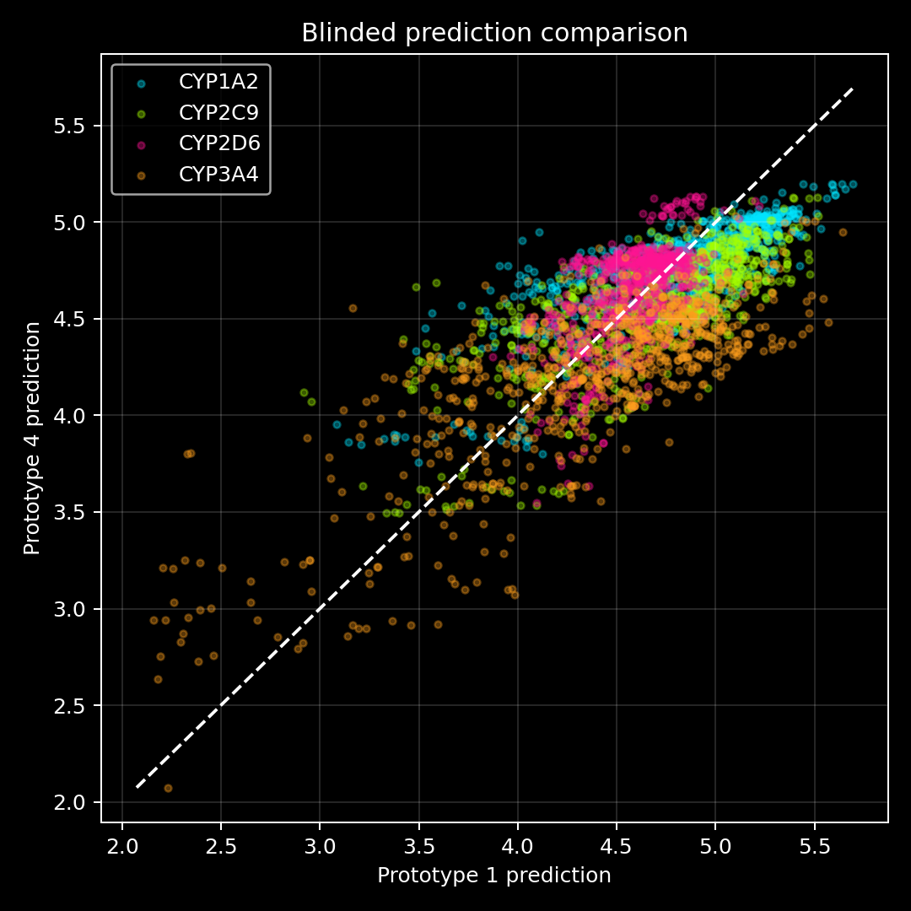

## Dynamical investigation

The 3,000 blinded molecule–CYP trajectories were screened for late motion, recurrence, spectral concentration, transient persistence, and path geometry. Twenty cases were retained for detailed inspection and PyMOL visualisation.

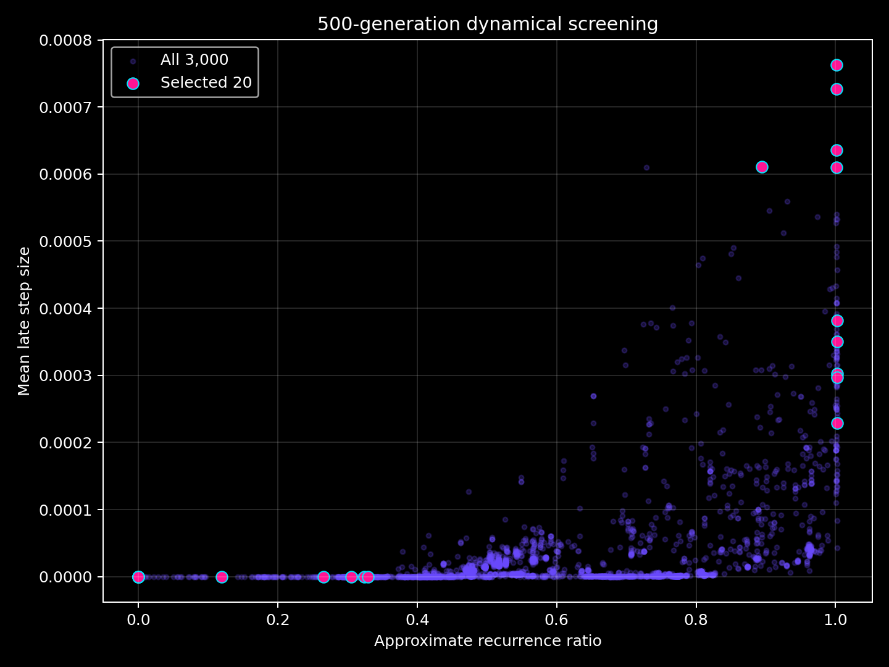

The median late step size across all 3,000 cases was approximately 0.00000364, and the largest was approximately 0.000763. The small late motion shows that most trajectories had become nearly stationary by the end of 500 generations.

The five most persistent selected cases still showed decaying step sizes rather than sustained, constant-amplitude motion.

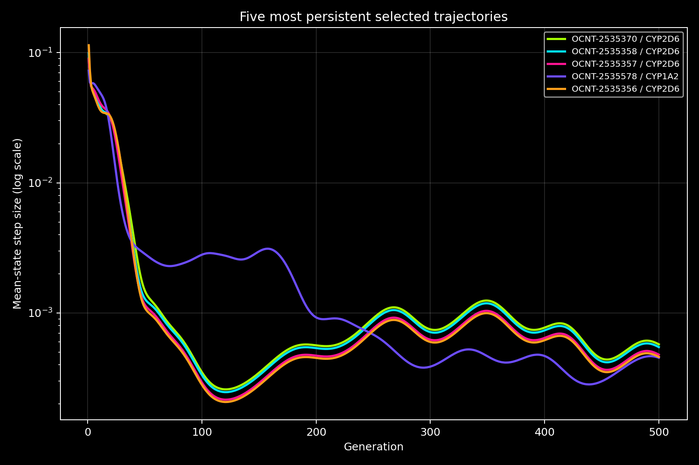

The projected state-space paths also show directed contraction toward terminal regions rather than a repeatedly traversed closed orbit or a bounded, aperiodic strange-attractor geometry.

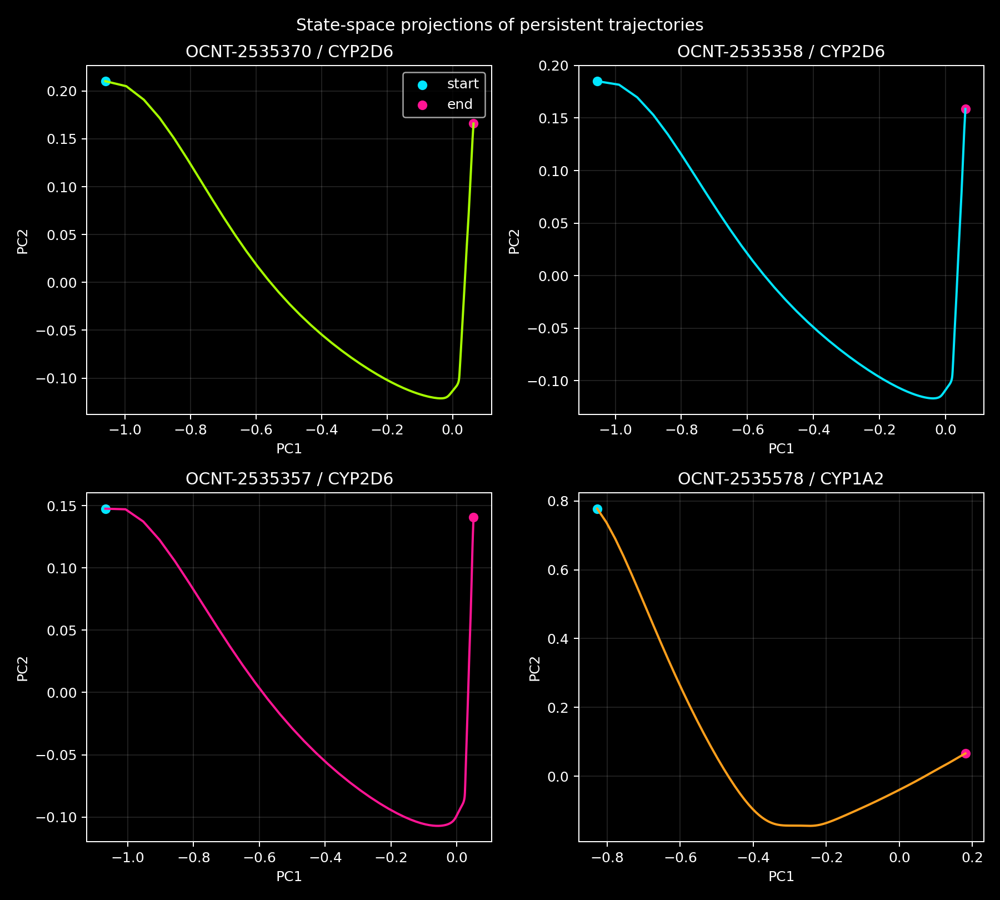

## Perturbation sensitivity

Each selected trajectory was rerun after an initial perturbation of 0.00001. A straight line was fitted to the logarithmic separation over generations 1–30. All twenty fitted slopes were negative:

- mean slope: -0.0604;
- median slope: -0.0618;
- least negative slope: -0.00663; and
- most negative slope: -0.1179.

Negative slopes mean that nearby states contracted rather than separated over this measured interval.

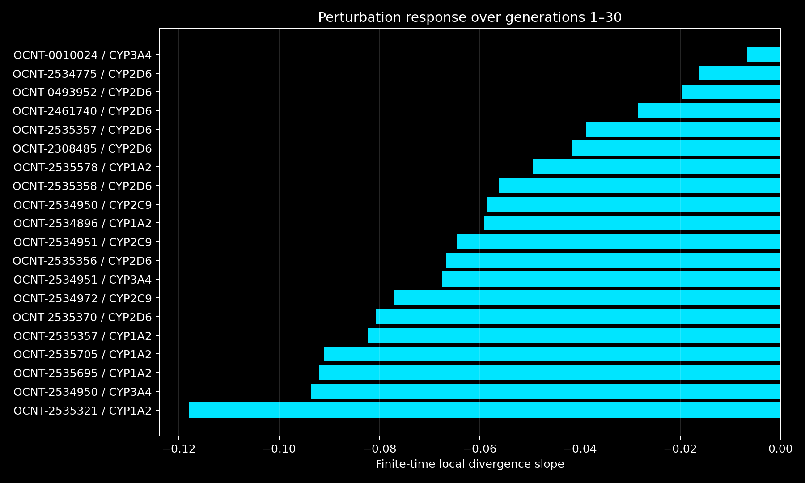

This calculation measures **finite-time local divergence**. It is not a full, repeatedly rescaled, long-time Lyapunov-exponent calculation. It therefore supports a conclusion about local contraction in these twenty cases, but it is not an exhaustive mathematical proof covering every possible initial state.

## Dynamical conclusions

The evidence from this run is most consistent with **stable sinks reached through transients**:

- no selected trajectory showed sustained oscillation;
- no selected trajectory showed persistent positive local divergence;
- no selected trajectory supplied evidence of chaotic behaviour;
- no selected trajectory supplied evidence of a strange attractor; and
- increasing the duration to 500 generations strengthened the evidence for convergence in this trained system.

Some recurrence and spectral screening scores were elevated, but the perturbation results and declining late motion show that these scores should not be interpreted as oscillators or strange attractors. Near-stationary numerical trajectories can also make direction-based curvature statistics unstable; curvature values close to convergence were therefore not used as primary evidence.

## PyMOL visualisation

The `trajectories` directory contains twenty multi-model PDB files. Each file has 502 display states:

- states 1–501 represent Graph-CA generations 0–500; and
- state 502 is the display-only hydrogen coda.

Run [load_20_trajectories.pml](load_20_trajectories.pml) in PyMOL. The corrected controller installs the selected generation's activity into the B-factor field before recolouring, preserving the full temporal colour gradient.

## Principal conclusion

Prototype 4 successfully generated 500-generation molecular space-time trajectories and stable blinded predictions. Its grouped-validation RMSE was **0.965 pIC50 units**. The predictive result was weaker than the earlier prototypes, while the dynamical evidence was clearer: the examined trajectories predominantly contracted toward stable terminal states rather than producing sustained oscillation, strange attractors, or chaos.
