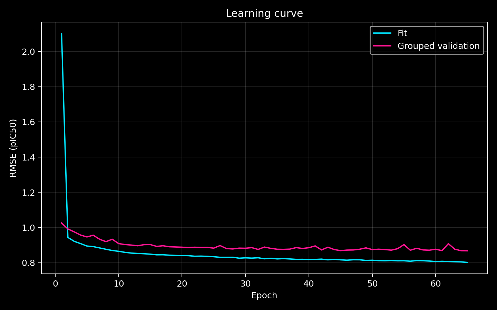
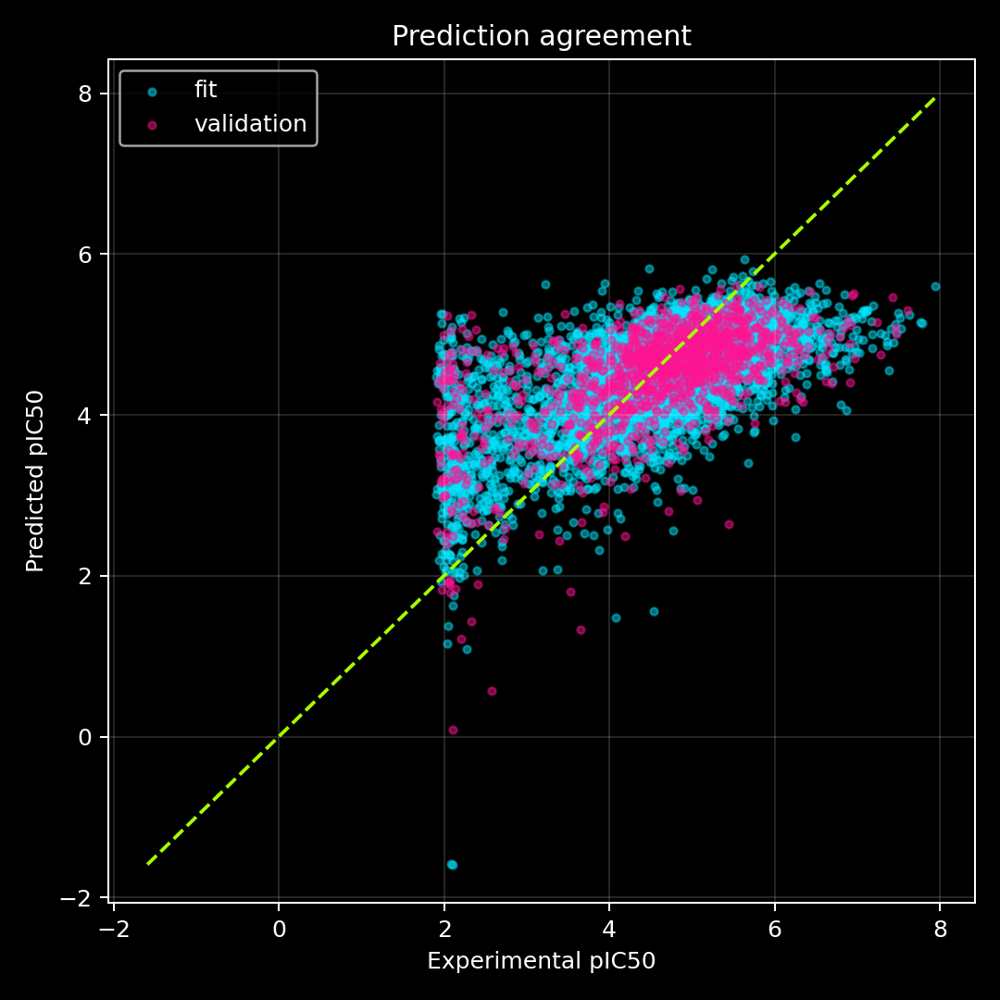
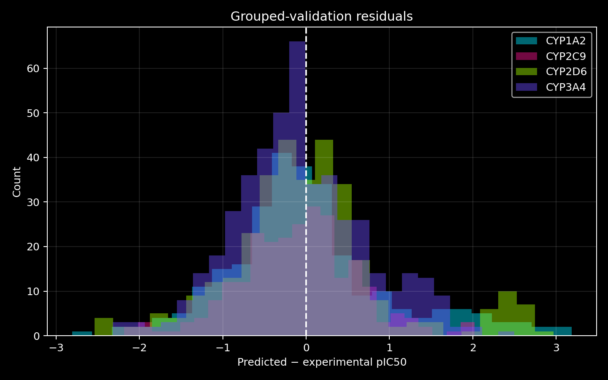
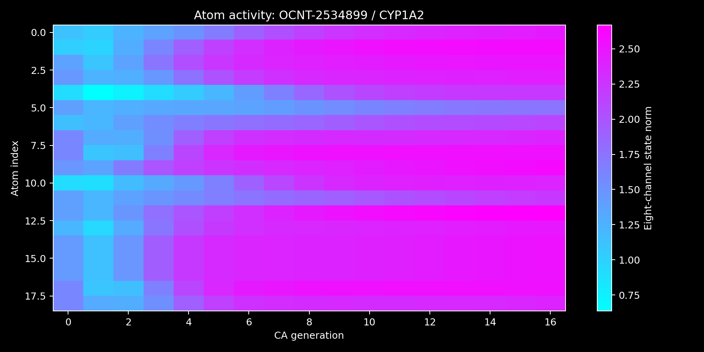

# Scientific report: first graph-CA visual prototype

## What this run demonstrates

This fixed-seed prototype takes the released OpenADMET direct-inhibition training set from SMILES through molecular graphs, graph-cellular-automaton dynamics, pIC50 learning, blinded-set prediction, and atom-level trajectory visualisation.

It is a complete end-to-end rehearsal. Its grouped validation result is informative, while the later production study will use the accepted grouped nested cross-validation and hyperparameter-search design to obtain a stronger performance estimate.

## Data flow

1. All 4,905 training SMILES and 750 blinded SMILES passed parsing and conservative standardisation.
2. Atoms received the accepted fixed chemical properties, including RDKit-defined hydrogen-bond donor and acceptor identities.
3. Bonds carried type, conjugation, ring-membership, and stereochemical information.
4. The shared graph CA evolved eight atom-state channels for 16 updates.
5. The resulting 17 states, including generation zero, produced a 40-component molecular dynamical fingerprint.
6. A shared ridge-regularised linear readout predicted pIC50.
7. CYP identity conditioned the CA, so every blinded molecule received four predictions and four distinct trajectories.

## The prototype split

The split was made by molecular scaffold:

- 3,924 molecules contributed 5,216 observed fit labels;
- 981 chemically separated molecules contributed 1,309 observed validation labels; and
- all observations belonging to a molecule stayed in the same partition.

This asks a more realistic question than a random row split: can the model transfer to different chemical families?

## Overall error

The restored best checkpoint achieved:

- fit RMSE: **0.808 pIC50**;
- grouped-validation RMSE: **0.869 pIC50**; and
- fit-to-validation difference: **0.061 pIC50**.

For $N$ observations, root mean squared error is

```math
\mathrm{RMSE}
=
\sqrt{
\frac{1}{N}
\sum_{i=1}^{N}
\left(\widehat y_i-y_i\right)^2
}.
```

Here $i$ indexes observations, $y_i$ is measured pIC50, $\widehat y_i$ is predicted pIC50, and $N$ is the number of observations included in the calculation.

Squaring makes large mistakes influential. Taking the square root returns the result to pIC50 units. An RMSE of 0.869 means that the typical error scale, with larger errors emphasised, is about 0.87 logarithmic concentration units.

Because pIC50 is base-10 logarithmic, an absolute pIC50 error $|\Delta|$ corresponds to an IC50 concentration ratio of approximately

```math
10^{\lvert\Delta\rvert}.
```

Here $\Delta=\widehat y-y$ is the signed pIC50 residual for one prediction. For $|\Delta|=0.869$, the ratio is approximately $7.4$. This conversion is useful for chemical intuition, although RMSE itself is an aggregate statistic and should not be interpreted as every prediction being wrong by exactly that factor.

## Error by CYP

| CYP | Validation observations | RMSE | MAE | Mean signed error |
|---|---:|---:|---:|---:|
| CYP1A2 | 272 | 0.980 | 0.715 | +0.020 |
| CYP2C9 | 252 | 0.710 | 0.546 | -0.092 |
| CYP2D6 | 325 | 0.975 | 0.687 | +0.003 |
| CYP3A4 | 460 | 0.795 | 0.624 | -0.079 |

Mean absolute error is

```math
\mathrm{MAE}
=
\frac{1}{N}
\sum_{i=1}^{N}
\left|\widehat y_i-y_i\right|.
```

MAE treats every absolute error linearly. Comparing MAE with RMSE reveals whether a smaller number of large errors are exerting extra influence. CYP1A2 and CYP2D6 are the least accurate targets in this run; CYP2C9 is the most accurate.

The signed residual is defined here as

```math
r_i=\widehat y_i-y_i.
```

A positive mean residual indicates slight overprediction; a negative value indicates slight underprediction. All four mean biases are small compared with their RMSE values, so random spread and molecule-specific difficulty matter more than a large uniform offset.

## How to read the figures

### 1. Learning curve



The cyan fit curve falls as the model learns from the fitting subset. The magenta grouped-validation curve measures transfer to held-out chemical scaffolds. Their modest final separation suggests limited overfitting in this run.

The best accepted checkpoint occurred at epoch 45. Training continued to epoch 65 because early stopping required 20 epochs without a validation improvement of at least 0.005 pIC50 RMSE. The saved model was then restored to the epoch-45 checkpoint.

### 2. Prediction agreement



The lime diagonal represents perfect prediction. Points above it are overpredictions; points below it are underpredictions.

The cloud is compressed toward the middle of the pIC50 range. This is **regression toward the mean**: under squared-error training, uncertain examples are pulled toward values that minimise expected squared error. Consequently, very weak inhibitors tend to be predicted too strongly and very strong inhibitors tend to be predicted too weakly. Improving representation, target balance, and model selection may reduce this compression.

### 3. Residual distributions



A residual distribution centred near zero indicates little systematic bias. Its width expresses ordinary prediction uncertainty, while long tails reveal occasional large errors. Separating the distributions by CYP exposes target-specific behaviour hidden by one overall RMSE.

### 4. Atom-activity heatmap



Each row is one heavy atom and each column is one CA state. Colour represents the Euclidean magnitude of that atom's eight-channel state:

```math
a_i^{(t)}
=
\left\|h_i^{(t)}\right\|_2
=
\sqrt{
\sum_{k=1}^{8}
\left(h_{ik}^{(t)}\right)^2
}.
```

This is a magnitude, not a causal attribution. It shows how strongly the learned dynamical state is expressed at an atom; it does not by itself prove that the atom increased or decreased predicted pIC50.

## Blinded predictions

The 750 blinded molecules generated 3,000 predictions:

| CYP | Mean predicted pIC50 | Standard deviation | Minimum | Maximum |
|---|---:|---:|---:|---:|
| CYP1A2 | 4.798 | 0.450 | 3.086 | 5.691 |
| CYP2C9 | 4.668 | 0.464 | 2.918 | 5.518 |
| CYP2D6 | 4.575 | 0.208 | 3.871 | 5.220 |
| CYP3A4 | 4.343 | 0.647 | 2.160 | 5.643 |

The blinded labels have not been supplied, so an honest test-set error cannot yet be calculated. The grouped-validation error is the available estimate for this prototype.

The narrow CYP2D6 prediction spread is a diagnostic signal: this model expresses less molecule-to-molecule variation for CYP2D6 than for the other targets. That agrees with CYP2D6 being one of the harder validation targets and deserves attention during model development.

## What the PDB colour means

Each PDB contains 18 structural states:

- states 1–17 correspond to CA generations 0–16;
- state 18 is the explicitly labelled hydrogen visual coda.

The B-factor column carries the scaled atom-state magnitude for display:

```math
B_i^{(t)}
=
100
\frac{a_i^{(t)}-a_{\min}}
{a_{\max}-a_{\min}}.
```

Scaling is performed independently within each molecule–CYP trajectory. This makes each animation visually expressive. Absolute brightness should therefore be compared over time within one object, while cross-object quantitative comparisons should use the lossless NPZ arrays and their recorded limits.

The PDB B-factor is unrelated to the ridge readout coefficient customarily written as $\beta$. The word “beta” can describe both in different disciplines, so the distinction is essential:

- **PDB B-factor:** the numeric display carrier used by PyMOL;
- **ridge coefficient $\beta$:** a learned weight mapping fingerprint components to predicted pIC50.

## Reproducibility record

- random seed: 1701;
- CA channels: 8;
- CA updates: 16;
- optimiser: Adam;
- CA learning rate: 0.001;
- readout learning rate: 0.003;
- readout L2 coefficient: 0.001;
- CA L2 coefficient: 0.00001;
- global gradient-norm clipping: 1.0;
- maximum epochs: 200;
- early-stopping patience: 20;
- minimum validation improvement: 0.005 pIC50 RMSE.
