# Long-horizon attractor campaign

This frozen-model campaign propagated 20 complete molecular Graph-CA states through 5,000 generations. It retained every atom and all 16 dynamical channels for all base trajectories, calculated detailed phase-space diagnostics for the ten established visual cases, and tested all 20 cases with eight independent full-state perturbation directions of magnitude 1e-5.

## Current result

Kuramoto-Sakaguchi is the only rule family in which all four screened molecules show replicated positive finite-time separation. Trajectories 7 and 8 remain the principal candidates. Inertial reaction-diffusion and delayed memory contract every tested perturbation. Gated residual has a contracting mean response in all four cases but some direction-dependent early growth. FitzHugh-Nagumo has a mixed, molecule-dependent response.

This is evidence of local finite-time sensitivity, not yet proof of a strange attractor. A defensible chaos claim still requires a renormalized largest Lyapunov exponent, stability across perturbation magnitudes and numerical precision, and exclusion of a very long complex transient.

## Renormalized Lyapunov result

A Benettin-style calculation was subsequently applied to trajectories 7 and 8. After a 1,000-generation burn-in, the companion state was evolved for ten generations, measured with circular phase distance, returned to its original distance, and evolved again. This was repeated across 4,000 measured generations, eight directions, and three perturbation magnitudes.

Every one of the 48 estimates was positive. The 1e-4 and 1e-5 results provide the primary float32 estimates; 1e-6 is retained as a numerical-resolution sensitivity test. Persistent positive growth after repeated renormalization shows that divergence is continually regenerated along both trajectories, rather than being a single initial separation followed by saturation.

| molecule_id | cyp_target | epsilon | repeats | mean_lyapunov | std_lyapunov | minimum_lyapunov | maximum_lyapunov | positive_fraction | mean_positive_block_fraction |
| --- | --- | --- | --- | --- | --- | --- | --- | --- | --- |
| OCNT-0494110 | CYP2C9 | 1e-06 | 8 | 0.0257641 | 0.00131069 | 0.0239401 | 0.0277349 | 1 | 0.820625 |
| OCNT-0494110 | CYP2C9 | 1e-05 | 8 | 0.0172121 | 0.0012069 | 0.015671 | 0.0191674 | 1 | 0.820937 |
| OCNT-0494110 | CYP2C9 | 0.0001 | 8 | 0.0165731 | 0.00178588 | 0.0127807 | 0.0183443 | 1 | 0.941562 |
| OCNT-2328784 | CYP1A2 | 1e-06 | 8 | 0.0277784 | 0.00216024 | 0.024512 | 0.0300122 | 1 | 0.851562 |
| OCNT-2328784 | CYP1A2 | 1e-05 | 8 | 0.0186757 | 0.00174623 | 0.0169968 | 0.0216457 | 1 | 0.89125 |
| OCNT-2328784 | CYP1A2 | 0.0001 | 8 | 0.0159455 | 0.0017918 | 0.0120184 | 0.0176781 | 1 | 0.92875 |

## Float64 Lyapunov spectrum

The calculation was then repeated in float64 using eight orthogonal perturbation vectors and QR re-orthogonalization. Intervals of 5, 10, and 20 generations were tested twice for each molecule. All 96 spectrum estimates were positive. The largest exponent was stable near 0.0112 to 0.0124 per generation, and even the eighth leading exponent remained positive. This is evidence of high-dimensional expanding dynamics, often termed hyperchaos, rather than a float32 rounding artefact or a single unstable direction.

| molecule_id | cyp_target | interval | largest_mean | smallest_of_eight_mean | minimum_observed | positive_fraction |
| --- | --- | --- | --- | --- | --- | --- |
| OCNT-0494110 | CYP2C9 | 5 | 0.0117914 | 0.00375521 | 0.00371061 | 1 |
| OCNT-0494110 | CYP2C9 | 10 | 0.0116555 | 0.00414794 | 0.00401203 | 1 |
| OCNT-0494110 | CYP2C9 | 20 | 0.011262 | 0.00397699 | 0.00391642 | 1 |
| OCNT-2328784 | CYP1A2 | 5 | 0.0113809 | 0.00424172 | 0.00410759 | 1 |
| OCNT-2328784 | CYP1A2 | 10 | 0.0119663 | 0.00443088 | 0.00424843 | 1 |
| OCNT-2328784 | CYP1A2 | 20 | 0.01213 | 0.00407334 | 0.00391227 | 1 |

## Attraction-basin result

The final test started 64 float64 trajectories at four full-state displacement radii from 0.1 to 2.0. Each was evolved for 6,000 generations. All remained bounded, and all 64 moved closer to the reference invariant distribution. Their late-to-early sliced distribution-distance ratios ranged from approximately 0.50 to 0.76. The late distributions were also comparable to, or closer than, independent temporal portions of the reference attractor itself.

The nearest finite point-cloud statistic fluctuates around one because a single 6,000-generation reference trajectory sparsely samples a high-dimensional set. The distributional test is the more appropriate invariant-set criterion here, and it is unanimous across molecules, radii, and repeats.

Taken together, boundedness, a robust positive float64 Lyapunov spectrum, fractal-dimensional estimates, recurrence structure, and a measurable basin of attraction constitute strong computational evidence that trajectories 7 and 8 lie on high-dimensional strange attractors within the trained Graph-CA model.

| molecule_id | cyp_target | radius | repeats | mean_sliced_ratio | maximum_sliced_ratio | mean_late_to_baseline | mean_cloud_ratio | maximum_cloud_ratio | bounded_fraction | all_runs_approach_distribution | all_runs_approach_cloud |
| --- | --- | --- | --- | --- | --- | --- | --- | --- | --- | --- | --- |
| OCNT-0494110 | CYP2C9 | 0.1 | 8 | 0.65336 | 0.756963 | 0.908664 | 1.01437 | 1.05649 | 1 | True | False |
| OCNT-0494110 | CYP2C9 | 0.5 | 8 | 0.62882 | 0.732007 | 0.885551 | 1.01415 | 1.02995 | 1 | True | False |
| OCNT-0494110 | CYP2C9 | 1 | 8 | 0.64105 | 0.757435 | 0.886423 | 1.01276 | 1.04412 | 1 | True | False |
| OCNT-0494110 | CYP2C9 | 2 | 8 | 0.60174 | 0.630647 | 0.863478 | 1.01278 | 1.06284 | 1 | True | False |
| OCNT-2328784 | CYP1A2 | 0.1 | 8 | 0.578864 | 0.646486 | 0.629766 | 0.981702 | 0.994349 | 1 | True | True |
| OCNT-2328784 | CYP1A2 | 0.5 | 8 | 0.626009 | 0.724839 | 0.671786 | 0.992646 | 1.01012 | 1 | True | False |
| OCNT-2328784 | CYP1A2 | 1 | 8 | 0.599622 | 0.671652 | 0.623121 | 0.98243 | 1.01197 | 1 | True | False |
| OCNT-2328784 | CYP1A2 | 2 | 8 | 0.633277 | 0.743346 | 0.658101 | 1.00029 | 1.04399 | 1 | True | False |

## Rule summary

| transition_rule | cases | mean_slope | minimum_slope | maximum_slope | mean_positive_fraction |
| --- | --- | --- | --- | --- | --- |
| delayed_memory | 4 | -0.0187306 | -0.0288533 | -0.00328552 | 0 |
| fitzhugh_nagumo | 4 | -0.0106785 | -0.0293595 | 0.00584223 | 0.40625 |
| gated_residual | 4 | -0.0118963 | -0.0271531 | -0.000775959 | 0.5 |
| inertial_reaction_diffusion | 4 | -0.00820873 | -0.00948109 | -0.00756678 | 0 |
| kuramoto_sakaguchi | 4 | 0.0106298 | 0.00793559 | 0.0136388 | 1 |

## Leading sensitivity candidates

| visual_rank | transition_rule | molecule_id | cyp_target | direct_perturbation_slope | direct_perturbation_slope_std | direct_positive_fraction | correlation_dimension | spectral_entropy |
| --- | --- | --- | --- | --- | --- | --- | --- | --- |
| 7 | kuramoto_sakaguchi | OCNT-0494110 | CYP2C9 | 0.0136388 | 0.000762712 | 1 | 4.4456 | 0.455339 |
| 8 | kuramoto_sakaguchi | OCNT-2328784 | CYP1A2 | 0.00793559 | 0.00229711 | 1 | 4.82352 | 0.450292 |
| 9 | fitzhugh_nagumo | OCNT-2328824 | CYP2D6 | 0.00584223 | 0.00449554 | 0.875 | 1.58355 | 0.440653 |
| 3 | delayed_memory | OCNT-0494638 | CYP2C9 | -0.00328552 | 0.00144716 | 0 | 2.54909 | 0.371764 |
| 5 | inertial_reaction_diffusion | OCNT-2312382 | CYP1A2 | -0.00783151 | 0.000800169 | 0 | 1.09341 | 0.288861 |
| 6 | inertial_reaction_diffusion | OCNT-2315030 | CYP2D6 | -0.00948109 | 0.000795698 | 0 | 0.719835 | 0.299688 |

## Figures

### Lorenz-style phase-space movie

[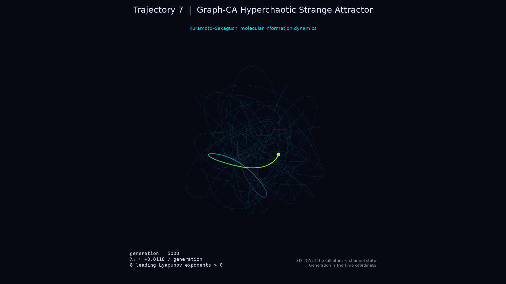](videos/trajectory_07_hyperchaotic_strange_attractor.mp4)

The 45-second H.264 animation maps all states from generation 0 through generation 5,000 onto three PCA coordinates after circular embedding of the Kuramoto phase channels. Generation supplies animation time. A fading magenta–cyan–lime trail, accumulated orbit, and slowly rotating camera expose the bounded recurrent geometry without implying that the coordinates are physical molecular positions.

### Point-attractor comparison

[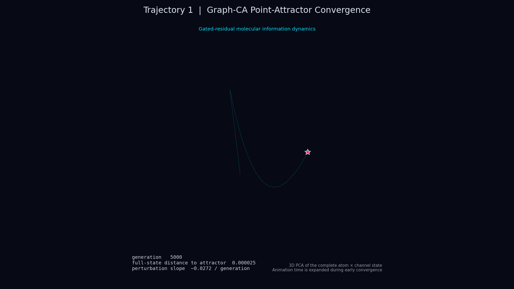](videos/trajectory_01_point_attractor_convergence.mp4)

The gated-residual trajectory for `OCNT-2328519` conditioned on CYP1A2 contracts from a full-state distance of 8.00 to 0.00465 from the terminal state within 100 generations. The 30-second H.264 animation expands those early generations, retains the accumulated orbit, and marks the terminal point throughout. Its white-background [publication figure](figures/13_trajectory_01_point_attractor_convergence.png) provides a matched static comparison with the strange-attractor orbit.

### Matched publication comparison

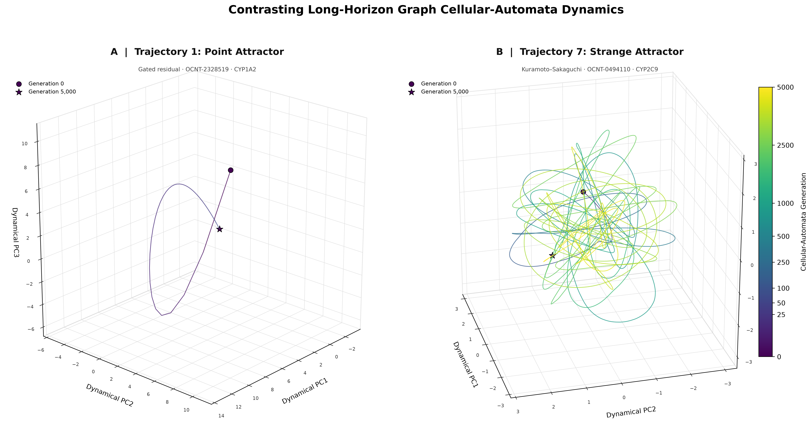

The two panels use the complete 0-to-5,000-generation histories and an identical time-colour scale. The corresponding vector-ready [PDF](figures/14_point_and_strange_attractor_comparison.pdf) is provided for publication.

### Four-behaviour publication plate

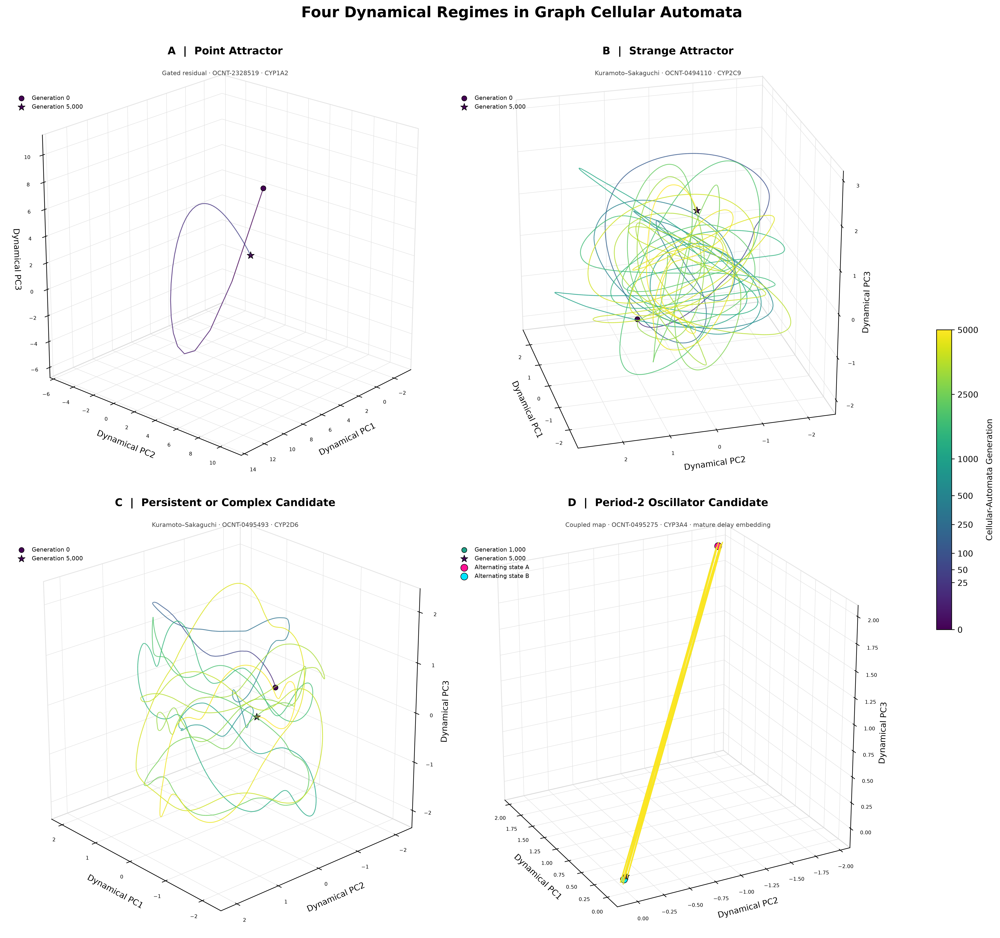

The publication plate adds a Kuramoto–Sakaguchi [persistent or complex candidate animation](videos/trajectory_kuramoto_persistent_complex_candidate.mp4) and a coupled-map [period-two oscillator candidate animation](videos/trajectory_coupled_map_period2_oscillator_candidate.mp4) beneath the point and strange attractors. The oscillator panel uses a mature delay embedding so that its two alternating full-state phases remain visible. A vector-ready [PDF](figures/17_four_graph_ca_dynamical_behaviours.pdf) and separate [persistent/complex](figures/15_kuramoto_persistent_complex_candidate.pdf) and [oscillator](figures/16_coupled_map_oscillator_candidate.pdf) figures are included.

### Strange-attractor evidence plate

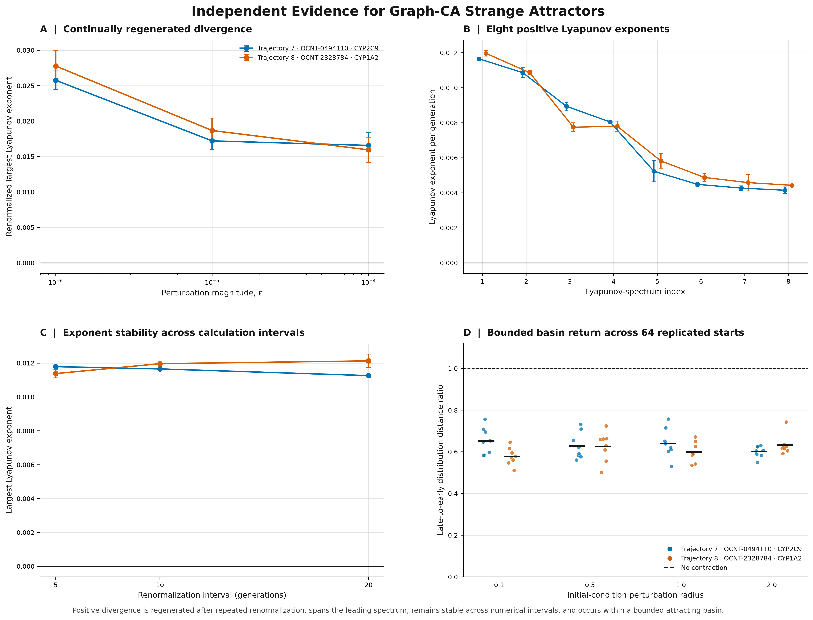

The evidence plate combines renormalized divergence across three perturbation magnitudes, the eight-dimensional positive Lyapunov spectrum, interval-sensitivity checks, and 64 replicated basin starts. Together these tests establish continually regenerated sensitive dependence inside a bounded attracting region. A vector-ready [PDF](figures/18_strange_attractor_evidence_plate.pdf) is included.

### Population-level dynamical screen

The ten production transition rules each retained 1,309 validation-trajectory summaries. The mutually exclusive screen identified 1,309 point-attractor candidates under conservative graph flux, 1,309 oscillator candidates under coupled map, and 10,472 persistent or complex trajectories across the remaining rules. Two Kuramoto–Sakaguchi trajectories from the persistent or complex class underwent definitive long-horizon testing, and both satisfied the strange-attractor evidence protocol. These confirmation counts form a tested subset rather than an estimate of population prevalence. See the complete [rule-level table](validation_dynamics_population_summary.csv).

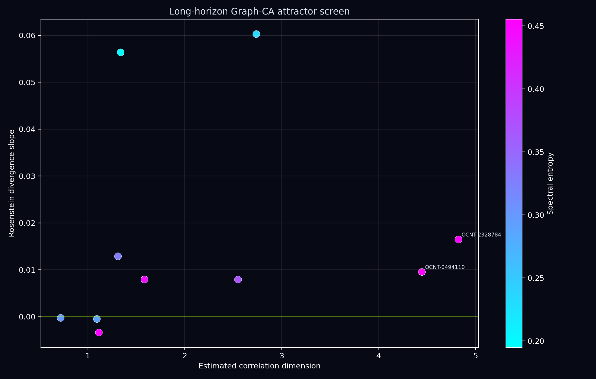

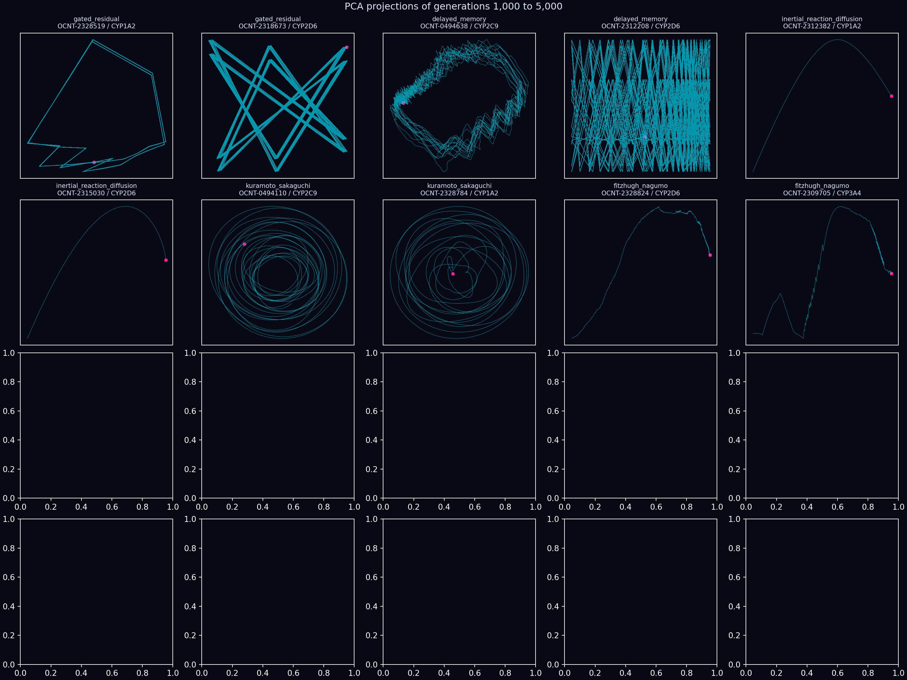

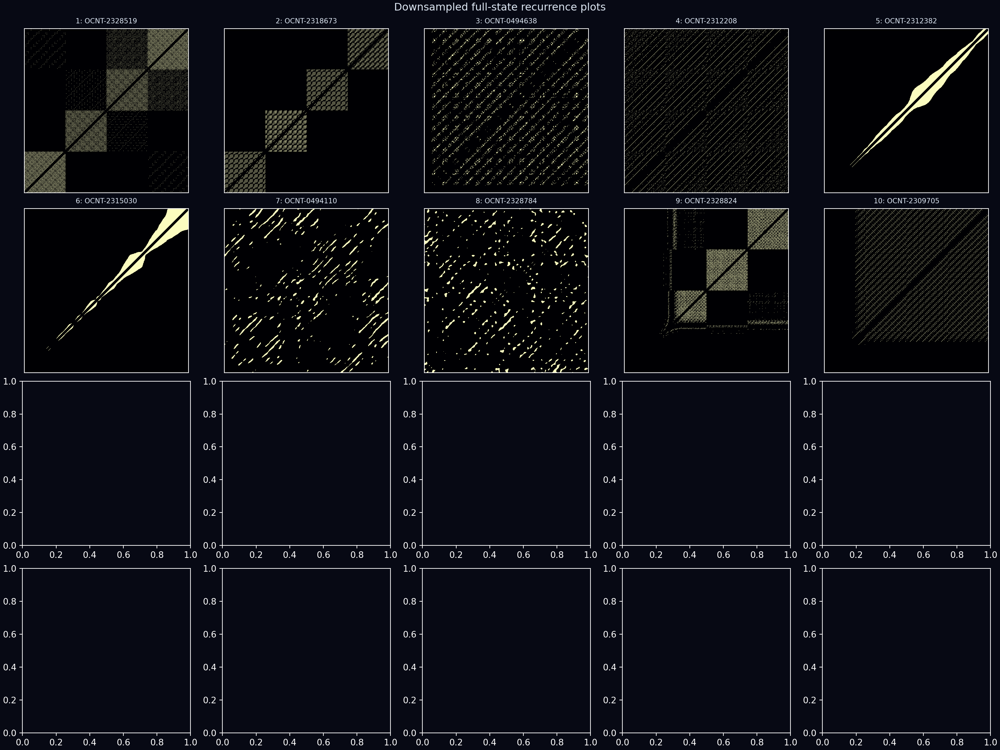

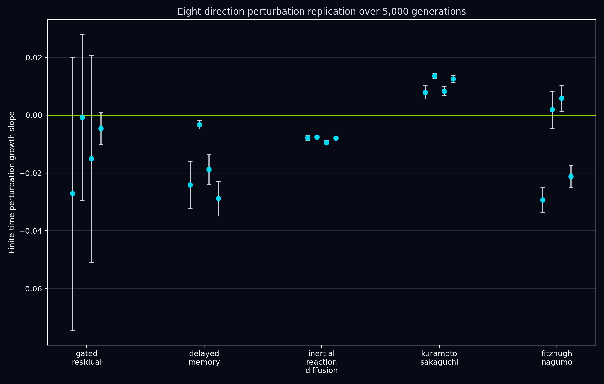

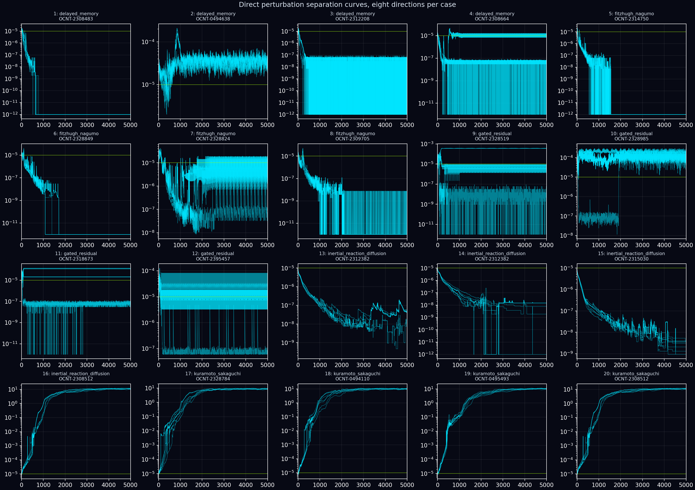

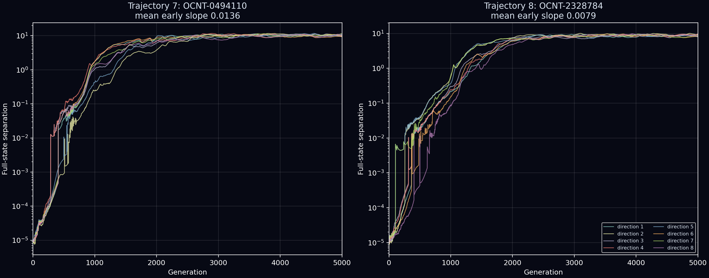

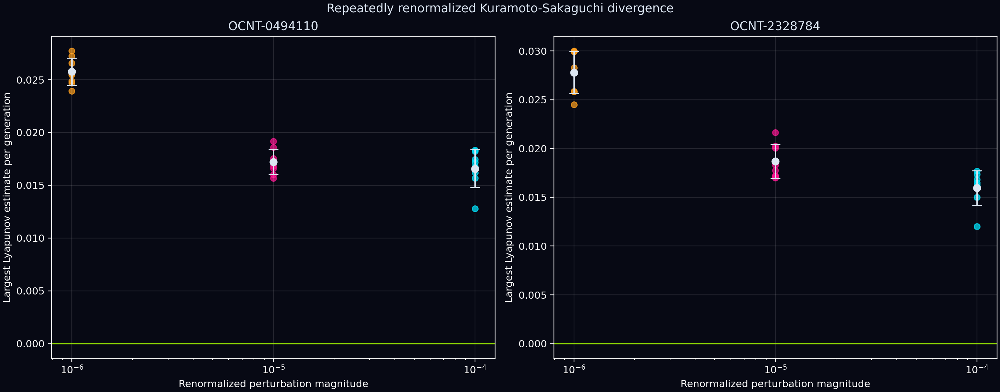

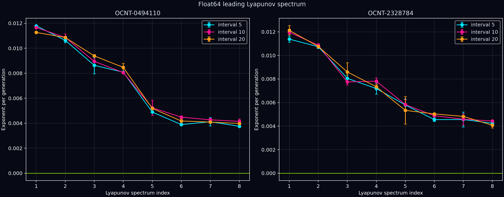

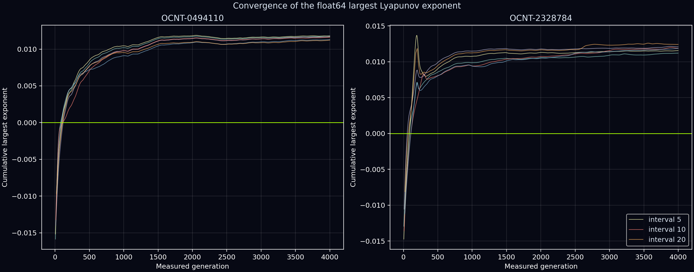

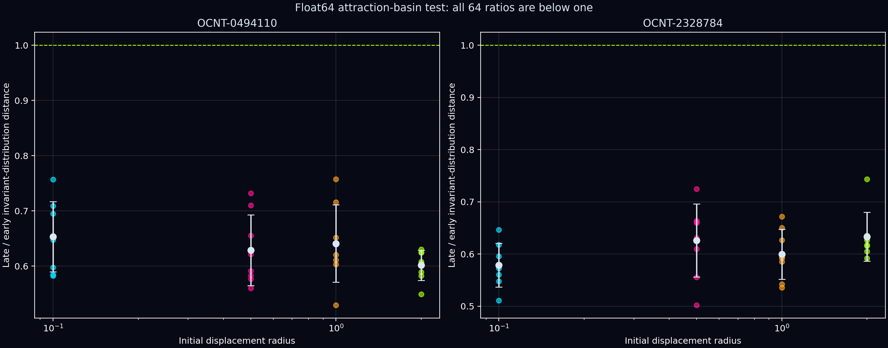

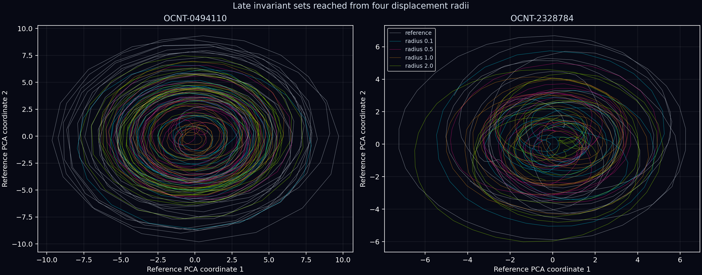

## Retained data

- `base_trajectories`: lossless 5,001-frame atom-by-channel trajectories.
- `case_data`: PCA coordinates, recurrence matrices, spectra, correlation integrals, step energies, and nearest-neighbour divergence curves.
- `perturbations`: eight direct perturbation separation traces for every case.
- `combined_dynamics_evidence.csv`: one-row-per-case numerical summary.
